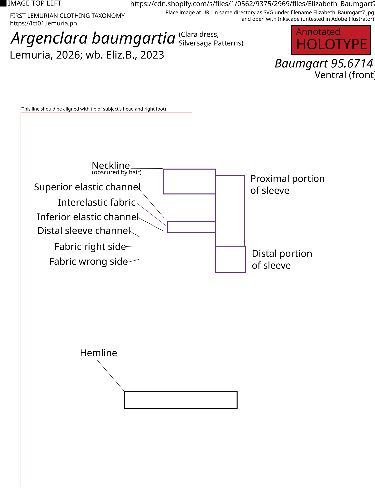
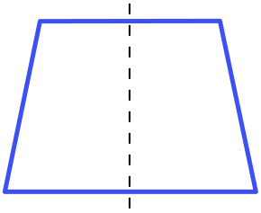
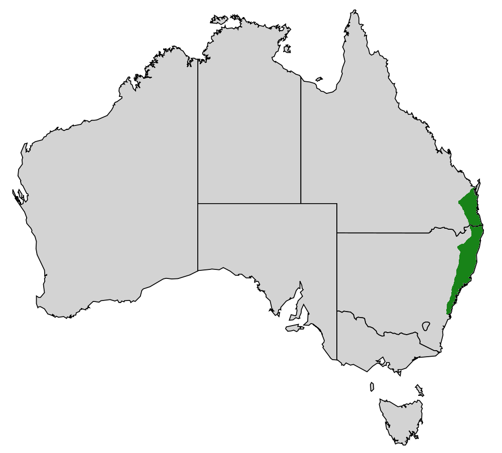

# Background
We intend for this background section pertaining to Jessica Silversaga to be an introduction to her for the entire taxonomy; in future monographs, we plan to refer back to this.

## Jessica Silversaga {#sec-j-silversaga}
Jessica Silversaga (<https://silversagapatterns.com>; Instagram: &commat;[`silversagapatterns`{.hash}](https://instagram.com/silversagapatterns); personal Instagram: &commat;[`jessicasilversaga`{.hash}](https://instagram.com/jessicasilversaga)) is a Swedish photographer, pattern designer, and sewist. She now lives in southern France, and has a cat, Ada [@friendsoftfs_silversaga].

In high school, she took journalism & photography; and in 2005, she graduated with a Bachelor of Photography from the Mid Sweden University.

She became interested in sewing after taking a beginner's sewing class. Most patterns and RTW garments available to her were incompatible with her petite frame and smaller cup size. In her late 20s, Silversaga began taking pattern drafting classes in Stockholm.

In late 2018, she launched the slow fashion RTW label Silversaga [@silversaga_about; @silversaga_instaabout2023]. Many of the patterns now available through Silversaga Patterns were sold RTW during this period. She designed seven collections on a seasonal schedule; autumn/winter (A/W) 2019, 2021, and 2022; and summer/spring (S/S) 2020, 2021, 2022, and 2023. The dresses were preproduced in small batches. Silversaga herself is inconsistent with where; @silversaga_about makes reference to "a skilled atelier in Estonia" while in @silversaga_instaabout2023 she states that all her clothes were "designed and sewn in Sweden".

Due to the COVID-19 pandemic, in September 2023, she discontinued sales of RTW garments and became a pattern-only label [@silversaga2023_closingrtw].

Simon, Jessica's fiancé, joined the company in 2024.

Silversaga's history is split into two primary periods; the slow fashion period (2018&ndash;2023) and pattern period (2023&ndash;present).

### Online presence
Jessica's online presence dates to the early 2000s. WHOIS records show that the domain `silversaga.se` was registered on December 9, 2004. The earliest Wayback Machine captures for her website, <https://silversaga.se> date to 2006, when it was used as a portfolio website for her photography. Based on snapshots, which the Archive took at seemingly random non-consistent intervals, throughout the 2010s she kept a blog in both English and Swedish on the website.

It became an e-commerce website c. 2020, two years into the launch of Silversaga, and with the start of the pattern period, the `silversaga.se` domain became a redirect to <https://silversagapatterns.com>. The delay is likely due to Silversaga's early commercial activities having taken place on Etsy.

Silversaga's online store uses software from Shopify, a Canadian e-commerce company.

The Shopify instances on both `silversaga.se` and `silversagapatterns.com` are the same. As a result, many holotypes from the RTW period survive to 2026. Though the Internet Archive was unable to fully cover all of `silversaga.se`'s product pages, the images in question are still accessible through Shopify's CDN, and can be archived. An example of these retrieved holotypes is *Silversaga 2022.58*, featuring *Argenteleonora candiga natalia* (<https://cdn.shopify.com/s/files/1/0562/9375/2969/products/SilversagaSS2022_58.jpg?v=1649342524>; see @sec-argenteleonora-candiga).

Silversaga also formerly had the Instagram account &commat;[`silversaga.se`](https://instagram.com/silversaga.se), however, it is now private. It has 248 posts and a message stating that the account has been moved to &commat;`silversagapatterns`. There may be early posts on &commat;`silversaga.se` that do not exist on the current &commat;`silversagapatterns`. This likely contains early Silversaga history inaccessible to us at the time of this monograph.

### Patterns
Jessica's total pattern repertoire is around ~200, as of January 2026 [@silversaga_helpmename].

As of April 2026, only 14 of these patterns are available for purchase through Silversaga Patterns. In alphabetical order, they are the
Alma (Almidae),
Amelie (Argenmelidae),
Celeste (Celestidae),
Celine (Celinidae),
Chloe (Helarchloidae),
Clara (Argenclaridae, @sec-argenclaridae),
Eleonora (Argenteleonoridae, @sec-argenteleonoridae; Heleonoridae, @sec-heleonoridae),
Ella (Argenkamellidae and Argentellidae),
Elsa (Argenelsidae),
Emma (Helargemmidae),
Francesca (Francescidae),
Juliette (Juliettidae, @sec-juliettidae),
Mina (Minastolidae),
and Ophelia (Ophelidae).

In this monograph, we cover the Clara, Eleonora, and Juliette.

Some patterns have been discontinued; such as the Cora (Argencoridae, @sec-argencoridae).

In 2025, the five most popular patterns were the
Celine,
Chloe,
Eleonora,
Amelie,
and Ella.

These patterns are sold entirely as PDFs with English-language instructions. Patterns are available in sizes EU 34&ndash;54 UK 6&ndash;26, and US 2&ndash;24.

Many of these patterns date back to the RTW period, while some, such as the Celeste (April 2026), were new when work began on the monograph.

The Eleonora comes in two primary variants, sold as two separate patterns; a sleeved variant, known simply as the Eleonora; and a sleeveless variant, sold as the Sleeveless Eleonora.
We will refer to both as the sleeved and sleeveless Eleonora respectively, for clarity; we use the term Eleonora itself to refer to both patterns collectively.

Jessica tests her patterns in one to three rounds, with a total of anywhere from 40 to 70 testers, ranging from EU sizes 34 to 54. [@silversagafaq]

Based on these figures, we estimate at least 600&ndash;1,050 extant species across the 15 families. For comparison, the LCT-01 had ~300 species across ~70 genera as of the last count conducted in February.

Silversaga's aesthetic is variously described as "romantic minimalism" [@rainey2025], "timeless", and as having "soft romantic silhouettes" [@friendsoftfs_silversaga]. <!-- TODO: gather more reviews of what people call Silversaga, please... --> Silversaga herself frequently uses the adjective "romantic" on many of her product pages; and the title of the root page of the Silversaga Patterns website reads "Clothes Poetry", with a white dove emoji.


```{=latex}
\onecolumn
```

#### Difficulty
Silversaga uses two different scales, 1-4 and 1-5 to rank the difficulty of her patterns. 1 is easy, while 4 or 5 is difficult.

These are denoted by circles on the title page of each pattern, with a name given to each difficulty in italic text below.

#### Table
We present a pattern of 

::: {#tbl-silversaga-patterns}
| Pattern | Difficulty | Release date | Sizes | Cups | LCT-01 taxa | Species count
|---|---|---|---|---|---|---|---|
| Alma | 1 | | EU34&ndash;54 | |
| Amelie | 2 | | EU34&ndash;54 | | 
| Celeste  | 2 | 2026-04-01 | EU34&ndash;54 | | Celestidae (@sec-celestidae)
| Celine | 2 | | EU34&ndash;54
| Chloe | 1 | | EU34&ndash;54
| Clara  | 1 | 2021-04 (RTW); 2023-08-25 (pattern) | EU34&ndash;50 | | Argenclaridae (@sec-argenclaridae)
| Eleonora, sleeved | 3 | | EU34&ndash;54 | | Argenteleonoridae (@sec-argenteleonoridae)
| Eleonora, sleeveless | 3 |  | EU34&ndash;50 | | Heleonoridae (@sec-heleonoridae)
| Ella | 3 | 2025-12-09 (update); 2023 (RTW) | EU34&ndash;54
| Elsa | 2 | | EU32&ndash;54
| Emma | 2 | |  EU34&ndash;50
| Francesca | 2 | |  EU34&ndash;54
| Juliette | 3 | 2023-12-02 | EU34&ndash;50 | | Juliettidae (@sec-juliettidae)
| Mina | ? | 2023-03-01 | EU34&ndash;48
| Ophelia | 2 | | EU34&ndash;50

A table of Silversaga's 15 patterns, with the most pertinent information.
:::

```{=latex}
\twocolumn
```

### Terminology
We will be referring to Jessica Silversaga by her first name throughout the monograph, to better distinguish her from her company, Silversaga Patterns. She also has the person abbreviation *J.Silversaga* (see @sec-person-abbr).

## Biographies
In this section, we include brief biographies of the persons whose garments we cover in the monograph.

For person abbreviations, see @sec-person-abbr, which will contain Instagram links or otherwise short blurbs when they do not warrant a full section.

Most of them are Silversaga's pattern testers. Pattern testers' names were inferred by reading filenames and browsing Instagram, as elaborated on in @sec-materials-and-methods.

<!-- sort these people by last name -->

### Annette {#sec-annette}
**Annette Nicoletti** (Instagram: &commat;[`annette.sews`](https://instagram.com/annette.sews)) is an American sewist from the greater Boston area.
<!-- TODO: Is this really relevant info? Kinda smells like undue emphasis here. Will include if there's more information but will drop it if it doesn't become relevant.

She has Korean descent^[Inferred from the South Korean flag emoji on her Instagram profile.]
-->
As stated on her Instagram profile, she is 170.18 cm (5 ft 7 in) tall. Bust 78.74 cm (31 in), waist 69.85 cm (27.5 in), hip 91.44 cm (36 in).

**Wearer of**: 2 spp.;
Genus *Heleonora*:
*truannettae* (@sec-heleonora-truannettae),
*monokhromos* (@sec-heleonora-monokhromos)

<!--
Lynne is the person's middle name,
Routamaa is the last name but this is less publicly visible
so we sort by B
(and even though we publish the last name,
the title is still Bethany Lynne, so sort by B still)
-->
### Bethany Lynne {#sec-bethany-lynne}
**Bethany Lynne Routamaa** (<https://www.bethanylynnemakes.com/about/>; Instagram: &commat;[`bethanylynne_makes`{.hash}](https://instagram.com/bethanylynne_makes)) is an American sewist from east Texas. She learned sewing and knitting from her mother and grandmother. Though her earliest interests were in painting, she has since diversified to other creative pursuits such as knitting, crocheting, graphic design, quilting, and most taxonomically relevant, sewing. Her earliest me-made garments date back to 2021.

Bethany has now designed her own patterns; such as the Agnes sweater, Homebody apron, and numerous backpacks, sling bags, and tote bags.

During the early pattern period, Bethany won a copy of five patterns from Silversaga (the entire published collection at the time), which led to the start of her interest in Silversaga. Bethany typically makes garments in EU size 36 [@bethany2025].

Her last name, Routamaa, is attested in pattern tester filenames.

**Wearer of**:
*Ac. bethanae* (@sec-argenclara-bethanae),
*Ae. bethanae* (@sec-argenteleonora-bethanae)

### Madeleine Salisbury {#sec-madeleine-salisbury}
**Madeleine Claire Salisbury** (Instagram: &commat;[`made_by_madeleine.claire`{.hash}](https://instagram.com/made_by_madeleine.claire)) is an American sewist, originally from New York, now living in Prague, Czech Republic. Salisbury herself was discovered as part of yet-to-be-published taxonomic work on other patterns; specifically the Traveller coat by Bella Loves Patterns.

As stated on the description of <!-- TODO: WRITE DOWN THE BINOMIAL OF MADELEINE'S 2026-04 ELLA DRESS -->, as of 2026-04-14, Salisbury had a bust of 91.44 in (36 in), waist of 68.58 cm (27 in), and 101.6 cm (40 in) [@salisbury2026_ella].

Salisbury is one of Jessica's pattern testers; she has tested the Eleonora [@salisbury2024_eleonora; @salisbury2024_eleonora2], the Juliette [@salisbury2024]

<!-- TODO: REPLACE THIS PLACEHOLDER! -->
**Wearer of**: N spp.
*Ae. madeleinae* (@sec-argenteleonora-madeleinae),
*Ae. madeleinatra* (@sec-argenteleonora-madeleinatra),
*J. madeleinae* (@sec-julietta-madeleinae)

### Laural Stapleton {#sec-laural-stapleton}
**Laural Stapleton** (<https://www.themakerhaus.com/>; Instagram: &commat;[`themakerhaus`](https://instagram.com/themakerhaus)) is an American sewist and the operator of The Maker Haus, a small pattern label with two patterns, the Edie and the Nadine.

She is one of Silversaga's pattern testers.

In the filenames, we consistently observed the spelling *Laural* for *Laural Stapleton*. *Laural* is not a typo; Stapleton herself uses the spelling *Laural*, ruling out the possibility of a typo on Silversaga's end.

Regardless, we have chosen to abbreviate her by her last name, *Stapleton*, as this is less likely to cause confusion as to the spelling of her first name.

<!-- TODO: Heleonora lauralia -->
**Wearer of**:
*H. lauralia* (@sec-heleonora-lauralia)

## Person abbreviations {#sec-person-abbr}
We define the following new person abbreviations.

* **Alexis.Wr** &mdash; Alexis Wright (Instagram: &commat;[`myysweetsunshine`{.hash}](https://instagram.com/myysweetsunshine/))
* **Anja.S.** &mdash; Anja Scheithauer (Instagram: &commat;[`pureandsew`{.hash}](https://www.instagram.com/pureandsew/))
* **Annette.N.** &mdash; Annette Nicoletti (Instagram: &commat;[`annette.sews`{.hash}](https://instagram.com/annette.sews)). United States: Massachusetts, Greater Boston Area.
* **Aria.W.S.** &mdash; Aria Wright-Shriver (Instagram: &commat;[`sewariasew`{.hash}](https://instagram.com/sewariasew))
* **Ashley.G.** &mdash; Ashley General (Instagram: &commat;[`ashleygeneralhandmade`{.hash}](https://instagram.com/ashleygeneralhandmade/))
* **Beatrice.F.** &mdash; Beatrice Fletcher (Instagram: &commat;[`bea.in.the.making`{.hash}](https://www.instagram.com/bea.in.the.making/))
* **Bethany.L.** &mdash; Bethany Lynne (see @sec-bethany-lynne)
* **E.Grace.J.** &mdash; E. Grace Jones (Instagram: &commat;[`wzrdreams`{.hash}](https://www.instagram.com/wzrdreams)). United States: [New York or New Jersey]. As of 2026-04-16, 177.8 cm (5 ft 10 in) tall; bust 119.38 cm (47 in) [@egjones2023].
* **Eliz.B.** &mdash; Elizabeth Baumgart (Instagram: &commat;[`thatsewliz`{.hash}](https://www.instagram.com/thatsewliz/); also known as Elizabeth Hung). Australia: New South Wales, Sydney. Photographer (Instagram: &commat;[`elizabethhung_`{.hash}](https://www.instagram.com/elizabethhung_/)).
* **Elizabeth.M.** &mdash; Elizabeth McNally (Instagram: &commat;[`seamrippinlizzy`{.hash}](https://www.instagram.com/seamrippinlizzy))
* **Fena.T.** &mdash; Fena Tandriarto (Instagram: &commat;[`fenamakes`{.hash}](https://www.instagram.com/fenamakes/))
* **Gabrielle.Sc.** &mdash; Gabrielle Scollay (Instagram: &commat;[`sustainably.gabrielle`{.hash}](https://www.instagram.com/sustainably.gabrielle/))
* **Garofalo** &mdash; Martina Garofalo (Instagram: &commat;[`margarlab`{.hash}](https://www.instagram.com/margarlab)). Bust 83 cm; waist 66 cm; hip 104 cm (provided on Instagram page). Italy.
* **Hunter-Moon** &mdash; Katie Hunter-Moon (Instagram: &commat;[`katiehuntermoon`{.hash}](https://instagram.com/katiehuntermoon)). United Kingdom: Wales.
* **Ioana.M.** &mdash; Ioana Miron (Instagram: &commat;[`sewing_in_my_genes`{.hash}](https://www.instagram.com/sewing_in_my_genes/)). Bust 86 cm; waist 71 cm; hip 96 cm (provided on Instagram page). 177 cm tall. Canada: Ontario, Toronto.
* **J.Silversaga** &mdash; Jessica Silversaga (see @sec-j-silversaga)
* **Jessa.J.** &mdash; Jessa Jones (Instagram: &commat;[`jessamjones`{.hash}](https://instagram.com/jessamjones/))
* **Juliana.R.** &mdash; Juliana Rucker (Instagram: &commat;[`sew.juliana`{.hash}](https://instagram.com/sew.juliana)); bust 88.9 cm (35 in); waist 71.1 cm (28 in); hips 96.5 cm (38 in); 162.5 cm (5 ft 4 in) tall (provided on Instagram page).
* **Karen.V.H.** &mdash; Karen Van Hoof (Instagram: &commat;[`the_fabric_attic`{.hash}](https://www.instagram.com/the_fabric_attic))
* **Lacy.W.** &mdash; Lacy Wilhoit (Instagram: &commat;[`beauandclover`{.hash}](https://www.instagram.com/beauandclover/))
* **Laura.Dem.** &mdash; Laura Demelin (Instagram: &commat;[`laura.demelin`{.hash}](https://www.instagram.com/laura.demelin); private account). France.
* **Mackenzie.M.** &mdash; Mackenzie Morgan (`W/2026 H2`)
* **Mai** &mdash; Mai Vang
* **Malin.S.** &mdash; Malin Stara (Instagram: &commat;[`angelinlace`{.hash}](https://www.instagram.com/angelinlace/)). Sweden.
* **Manuela.W.** &mdash; Manuela Wilkes (Instagram: &commat;[`the.sew.addict`{.hash}](https://www.instagram.com/the.sew.addict)); bust 34 in (86.3 cm), waist 27 in (68.5 cm), hips 36 in (91.4 cm), 1.60m tall (provided on Instagram page; height from @manuelaw_2023).
* **Megan.B.** &mdash; Megan Bynum (Instagram: &commat;[`dinigooseandbird`{.hash}](https://www.instagram.com/dinigooseandbird))
* **Mel.T.** &mdash; Mel Tesch (Instagram: &commat;[`melt.stitches`{.hash}](https://www.instagram.com/melt.stitches/)); bust 81 cm; waist 65 cm; hip 90 cm (provided on Instagram page). Australia: Queensland, Brisbane.
* **Piola** &mdash; Piola (Instagram: &commat;[`piola.makes`{.hash}](https://instagram.com/piola.makes))
* **Rimfors** &mdash; Tuss Rimfors (Instagram: &commat;[`tussrimfors`{.hash}`](https://www.instagram.com/tussrimfors))
* **Samantha.N.** &mdash; Samantha Newbery (Instagram: &commat;[`frenchseamsam`{.hash}](https://www.instagram.com/frenchseamsam/); &commat;[`snewbs`{.hash}](https://www.instagram.com/snewbs/)). Private accounts.
* **Stapleton** &mdash; Laural<!-- NOT A TYPO! --> Stapleton (first name not a typo; Instagram: &commat;[`themakerhaus`{.hash}](https://instagram.com/themakerhaus); see @sec-laural-stapleton).
* **Stephanie.G.** &mdash; Stephanie Garcia (Instagram: &commat;[`stef.it.seams`{.hash}](https://www.instagram.com/stef.it.seams))
* **Suna.M.** &mdash; Suna Mantori (Instagram: &commat;[`threadbitchbrighton`{.hash}](https://instagram.com/threadbitchbrighton/)); bust 89 cm; waist 75 cm; hip 97 cm (provided on Instagram page). United Kingdom: England, East Sussex, Brighton.
* **Tea.S.** &mdash; Tea Stamenkovic (LejdiTea; Instagram: &commat;[`lejditea`{.hash}](https://www.instagram.com/lejditea/))
* **Theresa.N.** &mdash; Theresa Neef (Instagram: &commat;[`notesonmatter`{.hash}](https://instagram.com/notesonmatter)). United States: Louisiana, New Orleans.

<!-- 
Alexis -- myysweetsunshine
Marta -- cosmia
-->

## Taxonomic remarks {#sec-taxonomic-remarks}

Silversaga was historically a slow fashion RTW label, as explained in @sec-j-silversaga. After the COVID-19 pandemic led to the label transitioning to patterns, the first home-sewn Silversaga garments arose.

The hybrid RTW&ndash;home-sewn nature of the taxonomic record of Silversaga garments leads to a taxonomically interesting situation for the LCT-01.

In the simplest of cases, RTW taxonomy typically maps the design, colorway, and wearer to the genus, species, and subspecies respectively; while sewing patterns map the design, option (or view), and individual sewist to the family, genus, and species [@lemuria_general_2026].

The most reliable morphological character identifying Silversaga garment taxa of RTW origin is the presence of a label reading "Silversaga"; see @sec-silversaga-label.

### Species counts
In this section, we describe Fermi estimates for the possible count of genera and species encompassing Silversaga's patterns.

As established in @sec-patterns, pattern testers alone contribute some 600&ndash;1,050 species to the Silversaga repertoire.

<!-- Instagram hashtag counts

390,claradresspattern
52,celestedresspattern
438,eleonoradresspattern
3,eleonoradresspatternplus
2,eleonoradresspatternfat
-->

### Polyphyletic patterns {#sec-polyphyletic-patterns}
As with Nina Lee's Kew dress, extensively taxonomized in prior monographs published in the *Journal*, some of these patterns are classified polyphyletically, due to the dispersion of their morphological diversity across the higher-level taxa of the LCT-01.

In this case, the two patterns classified polyphyletically are the Eleonora and Ella. The sleeved Eleonora falls under the family Argenteleonoridae (@sec-argenteleonoridae), while the sleeveless Eleonora falls under the family Heleonoridae (@sec-heleonoridae).

### The physical Silversaga label {#sec-silversaga-label}
Invariably, all Silversaga garments from the RTW period worn by third parties feature a label. The label is white, with the word "Silversaga" set in all-caps, with spaced letters, and is positioned on the superiormost medial point of the garment's dorsal interior surface.

The presence of the label is considered a reliable indicator of the garment's origin from Jessica herself, and by extension, possible origin from the RTW period. Whether Jessica attaches these labels to her own garments for daily wear or otherwise personal posession is unknown. As such, it may be used to reliably date a garment in a third party's posession from 2018&ndash;2022, and any garment in Jessica's posession from the early 2000s onward,

### Varieties and forms {#sec-var-and-forms}
<!-- 
maybe the LCT-01 will have a formal code by the time this monograph is finished. who knows, really...
-->

The LCT-01 makes significant use of infrageneric and subspecific taxa, especially in these monographs. We use the subgenus, section, and series, variety, and form in their botanical sense. RTW instances of Silversaga taxa use subspecies. We use the zoological convention for subspecies; unlike botany, we do not use the *subsp.* or *ssp.* particle.

The variety corresponds to individual, often irreversible small variations in the dress, such as fabric modification (e.g. *Argenteleonora bethanae*, @sec-argenteleonora-bethanae; var. *athea* and var. *brunalana*), trimming, or alterations.

The form corresponds to the positioning of the dress on the human body or the status of easily reversible configurations (e.g. button fastening, tied or untied ribbons, or sleeves pulled downward, lateral to the upper arm).

The LCT-01 makes use of the "blessed form" doctrine; for example, a dress such as the Clara can be worn on or off-shoulder. If it were worn off-shoulder, it would be considered part of the class Umerostentida, subclass Alourida; while if it were worn on-shoulder, it would fall in the class Isotrapezia.

Designer intent is that the sleeves are worn on the shoulder, though the product page explicitly acknowledges the off-shoulder configuration (and notes that it is breastfeeding-friendly). As the on-shoulder form is most common, the Argenclaridae are placed within the class Isotrapezia.

### Taxonomic history {#sec-taxonomic-history}
Our lead author discovered Silversaga through the American sewist Madeleine Salisbury (Instagram: &commat;[`made_by_madeleine.claire`](https://instagram.com/made_by_madeleine.claire)).

During the early taxonomization of Jessica's patterns, the LCT-01 began using infrageneric taxa; ranks below genus but above species, such as subgenera and sections, due to the increasing awkwardness of incorporating an increasing amount of characters in the genus name itself. 

<!-- ### Scope of the monograph -->
Originally, we intended for this paper to only cover the Eleonora dress (Argenteleonoridae) and its sleeveless variant (Heleonoridae); but later decided to expand to the other garments within Silversaga's repertoire.

We later narrowed the scope to focus on breadth rather than depth; in this monograph, we describe a small representative sample of anywhere from 5&ndash;20 species from each family, or the entirety of Silversaga's pattern testing gallery; as our team consists solely of one author, who wanted to prevent potential burnout.

<!--
if we can publish this by the start of Me Made May
as an extra nod to the sewing pattern community......
....

However, we exclude the Celeste pattern, as its 16 views and 12 pattern hacks included with the pattern lead to a lower bound for 192 taxa, over 2.5&times; the number of genera in the LCT-01 as last counted c. February 2026, ~75. -->

### Genera abbreviations
We use the following abbreviations for the genera we describe:

* *Ac.* &mdash; *Argenclara*
* *Ae.* &mdash; *Argenteleonora*
* *H.* &mdash; *Heleonora*
* *J.* &mdash; *Julietta*
* *T.* &mdash; *Trunclara*
* *Ta.* &mdash; *Tanaflora*

## Liberty {#sec-liberty}
::: {#fig-liberty-entrance}
.jpg)

Entrance of the Liberty department store in London [@hisgett2010_liberty].
United Kingdom: England, London, Regent Street, around intersections of Maddox and Noel Street. 51° 30′ 49.76″ N, 0° 08′ 26.28″ W (image coordinates).
:::

Liberty (<https://libertylondon.com>) is a British department store on Great Marlborough Street in the West End of London. Liberty sells fashion products and homewares, and most relevant to the monograph, fabrics. One of its collections, the Tana Lawn cotton, represents one of the largest fabric taxa in the fabric taxonomy of the LCT-01, still undeveloped. Some relevant species are described in @sec-tana.

Liberty's website uses the Amplience content management system (<https://amplience.com>), as written in a case study [@amplience_casestudy_liberty], and as inferred from the host `i8.amplience.net` being used to load images.

`amplience.net` does not block retrievals using Wget or cURL, however, it blocks the Wayback Machine for unknown reasons. The Wayback Machine returns the error "Save Page Now could not capture this URL because it was unreachable. If the site is online, it may be blocking access from our service.".
The LCT-01's standard citation practice of providing a SHA2-256 hash and linking both to the original and to the IA is infeasible as a result of this issue.

Amplience provides date information for images through the `x-amp-published` header; retrieving <https://i8.amplience.net/i/liberty/000544799-R124365006-1> using `curl` with the `--head` option returns the header `x-amp-published: Wed, 05 May 2021 14:46:01 GMT`. However, this date information conflicts with the DateOriginal field in the aforementioned image, which claims an original date of `2017-01-24 12:01:26`.

Backup copies of holotype images are available on the lead author's servers. Contact the corresponding author to make a request if the original URL is no longer functional.

## Materials and methods {#sec-materials-and-methods}
### Equipment and software {#sec-equipment-and-software}
The author conducted his research on a computer running Ubuntu 24.04, with the XFCE desktop environment. He used the SHA2-256 algorithms to compute the cryptographic hashes of the photographic specimens he examined for species descriptions. He used Firefox 139.0.4. His monitor is a 55.8 cm (22 in) wide, 30.48 cm (12 in) tall, 63.5 cm (25 in) diagonal monitor, the NVISION S2515-B 25" IPS with a 100Hz refresh rate. He is not colorblind. He is near sighted and wears glasses.

See @fig-sha256sum for `sha256sum`, `ffmpeg`, and `openssl` hashes.


### Specimen locations
Specimens were collected from Silversaga Patterns' website (<https://silversagapatterns.com>); with a focus on the pattern tester galleries. The Silversaga Patterns website uses Shopify as its underlying platform and image storage; EXIF metadata removal is likely consistent with internal Shopify server-side upload processing code.

The Silversaga Patterns account features numerous Instagram stories where Jessica has compiled large numbers of other makes; this represents the largest, albeit second highest-quality source.

This source is considered lower-quality than the Silversaga Patterns website; as explained in @lemuria_kew_2026, Meta's CDN is hostile to reproducibility. Though URLs can be captured by the Internet Archive immediately after generation, the URLs are invariably long, taking up more space in monograph documents.

Silversaga typically names these story groups with the name of the featured pattern followed by a number. However, she has reused multiple pattern&ndash;number combinations; there exists two story groups named Clara 8.

Furthermore, Imginn's interface prevents direct linkage of each individual story to a citable Instagram URL. Thus, we instead used the handles visible within the stories to locate the original Instagram posts containing the species.

<!-- 
Imginn also did not have all accounts available; and because Instagram's interface itself prevents scrolling down by means of a login wall, we were unable to document certain species. Our lead author remains hesitant to create an Instagram account -->

#### Mapping
We publish maps of holotype locations in this monograph. We only include holotype locations in the map with at least city-level precision. These coordinates should be treated as approximate. To further reinforce this, we have placed many of the holotype locations in nearby bodies of water.

In the raw data itself, which we make available, we set a key, `max_precision`, a number corresponding to OpenStreetMap's `admin_level` value. Countries are 2, states and provinces are 4, and counties (in America) are 6. These are not linked to specific OpenStreetMap identifiers for administrative boundaries.

We also set the special value `100` for city-level precision, or in the case of the United States, metro area-level precision.

### Images {#sec-images}
As our lead author had no Instagram account at the start of the monograph, he used Imginn, an online service that allows Instagram to be viewed without an account. He eventually created an Instagram account at &commat;[`lemuriaph`](https://instagram.com/lemuriaph) on April 16, 2026, to access numerous public accounts that were unavailable through Imginn.

Images were hashed with the SHA2-256 algorithms, using the `sha256sum` utility on his system. The versions of the `sha256sum` and `openssl` utilities on his system at the time of the paper are given in @fig-sha256sum.

The images were of exceptionally high quality; resolutions as high as 4000&times;2667 were collected. The majority of the images were in JPG format; some images were stored in the HEIC format.

To check EXIF metadata, ExifTool version 12.76 was used. YouTube videos were retrieved using `yt-dlp` version `2026.03.13.083652`; git commit hash `496c0e4319db4359aebd8d3270b681c890cafa28`{.hash}.

We inferred the approximate dates of some pattern releases, with maximum confidence in the year and month, with absolutely none on the day, by retrieving sitemaps from the Silversaga website, which we include in supplementary data.

<!--
may need a major update if lct01-notes is further
refined during the Silversaga monograph

### `lct01-notes`
During work on this paper, the author created a new tool that automatically generates Quarto template text from structured YAML data. This allows the data to exist in a structured format for future processing with other systems, and further improves standardization. Descriptions and remarks remain human-written; with less administrative and menial work comes the opportunity for more creative work.

A paper dedicated solely to this software has not been started, but may be authored someday. YAML files used to generate the template text are provided with the paper. -->

### Annotations
We also provide annotations of certain holotype images to explain their construction and terms we have coined for reference to specific parts of the dress. We note that these terms will almost certainly differ from sewing terms or the terms used by Jessica in the patterns themselves. For copyright purposes, we only provide these annotations standalone; we include a URL for the original image to allow the user to retrieve and stitch the final annotation themselves.

A mostly abridged guide for viewing these annotations with the original images is as follows:

1. Download the annotation SVG file. <!-- TODO: Provide either a source or data availability section -->
2. Open the SVG file and find a URL in the top right corner. Download that URL and save the image to the same folder as the SVG file.
3. Close and reopen the SVG file to see the final form of the annotation with the image in the background.

As an example, we provide an annotation for *Argenclara baumgartia* in @fig-argenclara-baumgartia.


::: {#fig-argenclara-baumgartia}



A small preview of the raw diagram of *Argenclara baumgartia* (@sec-argenclara-baumgartia). For copyright reasons as stated in the body, the reader should overlay the SVG diagram, distributed separately, over the original image on their own computer using the instructions provided.
:::

::: {#fig-sha256sum fig-env="figure*"}
```
$ sha256sum --version
sha256sum (GNU coreutils) 9.4
Copyright (C) 2023 Free Software Foundation, Inc.
License GPLv3+: GNU GPL version 3 or later <https://gnu.org/licenses/gpl.html>.
This is free software: you are free to change and redistribute it.
There is NO WARRANTY, to the extent permitted by law.

Written by Ulrich Drepper, Scott Miller, and David Madore.
$ openssl --version
OpenSSL 3.5.0 8 Apr 2025 (Library: OpenSSL 3.5.0 8 Apr 2025)
$ sha256sum /usr/bin/sha256sum /usr/bin/openssl
f293048f656688883ee919eb3f4b12926aaa13362de0eb6e3b5716b915b18b35  /usr/bin/sha256sum
724acbe911513d13f52bae0b8969b20336cd8618fc67898a6bf7847bf1a270ad  /usr/bin/openssl
```
A hash of the sha256sum and openssl utilities on the lead author's computer.

```
$ ffmpeg -version
ffmpeg version 6.1.1-3ubuntu5 Copyright (c) 2000-2023 the FFmpeg developers
built with gcc 13 (Ubuntu 13.2.0-23ubuntu3)
configuration: --prefix=/usr --extra-version=3ubuntu5 --toolchain=hardened
  --libdir=/usr/lib/x86_64-linux-gnu --incdir=/usr/include/x86_64-linux-gnu
  --arch=amd64 --enable-gpl --disable-stripping --disable-omx --enable-gnutls
  --enable-libaom --enable-libass --enable-libbs2b --enable-libcaca
  --enable-libcdio --enable-libcodec2 --enable-libdav1d --enable-libflite
  --enable-libfontconfig --enable-libfreetype --enable-libfribidi
  --enable-libglslang --enable-libgme --enable-libgsm --enable-libharfbuzz
  --enable-libmp3lame --enable-libmysofa --enable-libopenjpeg
  --enable-libopenmpt --enable-libopus --enable-librubberband
  --enable-libshine --enable-libsnappy --enable-libsoxr --enable-libspeex
  --enable-libtheora --enable-libtwolame --enable-libvidstab
  --enable-libvorbis --enable-libvpx --enable-libwebp --enable-libx265
  --enable-libxml2 --enable-libxvid --enable-libzimg --enable-openal
  --enable-opencl --enable-opengl --disable-sndio --enable-libvpl
  --disable-libmfx --enable-libdc1394 --enable-libdrm --enable-libiec61883
  --enable-chromaprint --enable-frei0r --enable-ladspa --enable-libbluray
  --enable-libjack --enable-libpulse --enable-librabbitmq --enable-librist
  --enable-libsrt --enable-libssh --enable-libsvtav1 --enable-libx264
  --enable-libzmq --enable-libzvbi --enable-lv2 --enable-sdl2
  --enable-libplacebo --enable-librav1e --enable-pocketsphinx
  --enable-librsvg --enable-libjxl --enable-shared
libavutil      58. 29.100 / 58. 29.100
libavcodec     60. 31.102 / 60. 31.102
libavformat    60. 16.100 / 60. 16.100
libavdevice    60.  3.100 / 60.  3.100
libavfilter     9. 12.100 /  9. 12.100
libswscale      7.  5.100 /  7.  5.100
libswresample   4. 12.100 /  4. 12.100
libpostproc    57.  3.100 / 57.  3.100

$ sha256sum $(which ffmpeg)
ed16af623947494a72e284b6eb8ff225f2da22b38b5d5069c2fd4b4ba3384e41  /usr/bin/ffmpeg
```

`ffmpeg` version and hash on the lead author's computer.
:::

<!--
(((((((Heleonoridae[&&NHX:subtree_root=yes],Helargemmidae[&&NHX:subtree_root=yes],Helarchloidae[&&NHX:subtree_root=yes])Helargenta)Helistola)Scapamanica)Scapunatoria,(((((Argenteleonoridae[&&NHX:subtree_root=yes],
Argenkamellidae[&&NHX:subtree_root=yes])Sueciargenta)Kampylilaimosida)Quaracomorpha,(Argentellidae[&&NHX:subtree_root=yes])Vecostola,((Almidae[&&NHX:subtree_root=yes],Juliettidae[&&NHX:subtree_root=yes],Argenclaridae[&&NHX:subtree_root=yes])Isargenta)Isotrapezia)
Manubristenta))Abtruncusa)Vestimentia)

----
incertae sedis 1

Elsa    -- Argelsidae
Ophelia -- Ophelidae


-- this pattern is going to be
-- a nightmare to taxonomize.
--
-- 16 style views. 12 pattern hacks.
-- 192 cells on the punnett square.
--
Celeste -- Celestia? Celestistola? (order)
           Celestidae (family)

----
incertae sedis 2

Phylum Scapunatoria
Subphylum Scapamanica
Class Camisola
Order Argentisola
Family Francescidae

Francesca  -- Francescidae

----
incertae sedis 3

Amelie    -- Amelidae

-->

```{=latex}
\clearpage
```

## Trees {#sec-trees}
We provide several overview trees of the Silversaga taxa.

```{r}
#| results: asis
#| fig-show: asis
#| message: false

library(treeio)
library(ggtree)
library(ggplot2)
library(ggtreeExtra)
library(dplyr)
library(ggtext)
library(knitr)

text <- "((((((((Heleonora[&&NHX:rank=genus])Heleonoridae[&&NHX:subtree_root=yes],(Helargemmia[&&NHX:rank=genus])Helargemmidae[&&NHX:subtree_root=yes],(Helarchoia[&&NHX:rank=genus])Helarchloidae[&&NHX:subtree_root=yes])Helargenta)Helistola,(((Francesca[&&NHX:rank=genus])Francescidae[&&NHX:subtree_root=yes])Argentisola)Camisola)Scapamanica)Scapunatoria,(((((((Argenteleonora_ariae,Argenteleonora_felicitae,Argenteleonora_madalinae,Argenteleonora_madeleinae,Argenteleonora_madeleinatra,Argenteleonora_mantorae,Argenteleonora_manuelae,Argenteleonora_martae,Argenteleonora_rubra,Argenteleonora_stephania,Argenteleonora_thea,Argenteleonora_veneta)Argenteleonora_subg._Shira,((Argenteleonora_annettae)Argenteleonora_sect._Unilastica,(Argenteleonora_bethanae,Argenteleonora_patriciae,Argenteleonora_katiae)Argenteleonora_sect._Duolastica)Argenteleonora_subg._Elastica)Argenteleonora[&&NHX:rank=genus])Argenteleonoridae[&&NHX:subtree_root=yes],(Argenkamella[&&NHX:rank=genus])Argenkamellidae[&&NHX:subtree_root=yes])Sueciargenta)Kampylilaimosida)Quaracomorpha,((Argentella[&&NHX:rank=genus])Argentellidae[&&NHX:subtree_root=yes])Vecostola,(((Almargenta[&&NHX:rank=genus])Almidae[&&NHX:subtree_root=yes],(Julietta[&&NHX:rank=genus])Juliettidae[&&NHX:subtree_root=yes],((Argenclara_alexae,Argenclara_alexisae,Argenclara_baumgartia,Argenclara_bethanae,Argenclara_caitlinae,Argenclara_cosmia,Argenclara_evae,Argenclara_fenae,Argenclara_gratia,Argenclara_hetheringtonia,Argenclara_jessae,Argenclara_mai,Argenclara_malinae,Argenclara_morgania,Argenclara_teschia,Argenclara_theresae,Argenclara_wilhoitia,(Argenclara_lunatrix,Argenclara_lunatribis)Argenclara_subg._Venaluna,(Argenclara_mantorae)Argenclara_subg._Lacashira)Argenclara[&&NHX:rank=genus],(Trunclara_piolae)Trunclara[&&NHX:rank=genus])Argenclaridae[&&NHX:subtree_root=yes])Isargenta)Isotrapezia)Manubristenta)Abtruncusa)Vestimentia);"

tree <- read.nhx(textConnection(text))

subtree_nodes <- tree@data %>%
  filter(subtree_root == "yes") %>%
  pull(node)

p <- ggtree(tree)

for (n in subtree_nodes) p <- collapse(p, n) + geom_point2(aes(subset=(node==!!n)), shape = 23, size=5, fill='red')

rootTree <- p + geom_tiplab(size = 3) +
  geom_richtext(
    aes(label = label),
    data = td_filter(!isTip),
    size = 2, na.rm = TRUE,
    fill = 'lightblue', label.color = 'white'
  ) + vexpand(1)

fig_height <- function(tr) max(3, min(length(tr@phylo$tip.label) * 0.25, 12))

plots <- list(
  list(p = rootTree, w = 12, h = 8, label = "Overview")
)

format_node_label <- function(label, rank) {
  if (!is.na(rank) && rank == "genus") {
    return(paste0("<i>", gsub("_", " ", label), "</i>"))
  }
  components <- unlist(strsplit(label, "_"))
  if (grepl("subg\\.", label)) {
    new_label <- paste0("<i>",components[1],"</i> subg. <i>",components[3],"</i>")
    return(new_label)
  }
  paste0(gsub("_", " ", label))
}

format_species <- function(label) {
  paste0(gsub("_", " ", label))
}

for (n in subtree_nodes) {
  subtree <- tidytree::tree_subset(tree, n, levels_back = 0)
  if (length(subtree@phylo$tip.label) < 2) next 
  
  root_taxon_node <- as_tibble(tree) |> filter(node == n)
  root_taxon <- root_taxon_node |> pull(label)
  p_sub <- ggtree(subtree) +
    geom_tiplab(size = 3, aes(label = mapply(format_species, label)), fontface = "italic") +
    geom_richtext(
      data = td_filter(!isTip),
      aes(label = mapply(format_node_label, label, rank)),
      size = 2, na.rm = TRUE,
      fill = 'lightblue', label.color = NA
    ) +
    hexpand(0.3) + vexpand(0.5)
  plots[[length(plots) + 1]] <- list(p = p_sub, w = 12, h = fig_height(subtree), label = root_taxon)
}

for (i in seq_along(plots)) {
  p <- plots[[i]]
  chunk <- knitr::knit_expand(
    text = c(
      "```{r fig-{{label}}, fig.env='figure*', fig.height={{h}}, fig.width=8, fig.cap='{{label}}', echo=FALSE}",
      "plots[[{{i}}]]$p",
      "```"
    ),
    i = i,
    h = plots[[i]]$h,
    label = plots[[i]]$label
  )
  cat(knitr::knit(text = chunk, quiet = TRUE))
  cat("\n\n")
}
```


```{=latex}
\clearpage
```

# Descriptions {#sec-descriptions}

## Phylum Manubristenta {#sec-manubristenta}
**Manubristenta** Lemuria, 2026; first public desc.

**Taxonomic placement**: Placed in the kingdom Abtruncusa.

**Diagnosis**: Phenetically, Manubristenta is characterized by the exposure of the skin superficial to the manubrium, the superior (upper) part of the sternum (breastbone), and covered shoulders.

## Class Isotrapezia {#sec-isotrapezia}
**Isotrapezia** Lemuria, 2026; first public desc.

**Taxonomic placement**: Placed in the phylum Manubristenta.

**Diagnosis**: Isotrapezia is characterized by a neckline with a shape resembling an isosceles trapezoid (or trapezium); where the neckline is wider superiorly and narrows inferiorly.

::: {#fig-isosceles-trapezoid}



An illustration of an isosceles trapezoid [@alexandrov_illustration_2007], an idealized geometry of Isotrapezia. 
:::

## Order Isargenta {#sec-isargenta}
**Isargenta** Lemuria, 2026; first public desc.

**Taxonomic placement**: Placed in the class Isotrapezia.

**Identification key**

01
: Ventral medial button row: present (02), absent (03)

02
: See family Juliettidae (@sec-juliettidae). End.

03
: Number of elastic channels: one (04), two (05)

04
: See family Almidae (@sec-almidae). End.

05
: See family Argenclaridae (@sec-argenclaridae). End.

## Family Argenclaridae {#sec-argenclaridae}
**Argenclaridae** Lemuria, 2026; familia nova

**Taxonomic placement**: Placed in the order Isargenta.

**Diagnosis**: Argenclaridae is characterized by an adjustable neckline with elastic channel allowing off/on-shoulder configuration; two elastic channels, one within the inframammary region inferior to the bust (superior elastic channel), and one at the hips, acting as the bodice&ndash;skirt seam. The neckline is asymmetric in height across the two sides of the coronal plane.

Its sleeves are gathered at the proximal end and directly connected to the bodice, voluminous across the upper arm, with a cuff-like^[Cuffs are typically located at the distal end of the sleeve, hence the term "cuff-like" used here.] gather at the elbow, before flaring out and terminating at the medial point between the elbow and wrist.

Its skirt terminates inferior to the knee and features bilateral pockets within the lateral seams.

Phylogenetically, Argenclaridae is characterized by origin from the Clara sewing pattern by Silversaga.

**Remarks**: The Clara originated during the RTW period. It was her best-selling design during the summer/spring 2021 and summer/spring 2022 collections. Preorders began in April 2021.

Silversaga recruited pattern testers for the Clara from August 3 to 7, 2023. She received ~160 applications, an unknown number of which were accepted. On August 25, 2023, the Clara was released.

**Design.** Silversaga cites Victorian chemise dresses as the inspiration for the Clara.

**Identification key**

01
: Garment has skirt (is dress)? Yes (02), no (03)

02
: See genus *Argenclara* (@sec-argenclara). End.

03
: See genus *Trunclara* (@sec-trunclara). End.

**Etymology**: *Argen-*, Silversaga taxa prefix + *Clara* + *-idae*, family suffix.

**Type genus**: *Argenclara*

### Genus *Argenclara* {#sec-argenclara}

<!--
TODO: proofread argenclara

SPECIES FREEZE 2026-04-18
once *Argenclara bethanae* is done we move on to some *Trunclara* spp.

Proofreading concerns
- [ ] 01 Proper year formatting
- [ ] 02 Proper gen. nov., sp. nov., etc.
- [ ] 03 No placeholders
- [ ] 04 Ensure the page field is always specified
- [ ] 05 Check that there are Instagram posts for each
         instance or just explicitly write that there
         is no insta post
- [ ] 06 Full period stop after resolution info (fix the
         holotyper....)
- [ ] 07 General proofreading to find extra concerns for
         later passes

-->

***Argenclara*** Lemuria, 2026; gen. nov.

**Taxonomic placement**: Placed in the family Argenclaridae.

**Diagnosis**: *Argenclara* is the *sensu stricto* genus of the Clara dress. The *Argenclara* are characterized by minimal divergence from the Clara pattern.

**Identification key**

01
: Fabric between elastic channels? Lace (02), solid fabric (03).

02
: See *Argenclara* subg. *Lacashira* (@sec-argenclara-subg-lacashira). End.

03
: Sewn by Katie Hunter-Moon? Yes (04), no (05).

04
: See *Argenclara* subg. *Venaluna* (@sec-argenclara-subg-venaluna). End.

05
: Directly under *Argenclara*. End.

**Etymology**: *Argen-*, Silversaga taxa prefix + *Clara*.

**Type species**: *Argenclara baumgartia*

**Forms**: Two forms apply to *Argenclara* spp.: f. *umerostenta* (off-shoulder) and f. *isotrapezia* (on-shoulder). f. *isotrapezia* is designated as the blessed form for *Argenclara*.

**Distribution**: Worldwide, via paid PDF pattern.
Significant primary material on the Instagram tag `ClaraDressPattern`.

<!-- BEGIN alexae -->
<!-- Template generated with lct01tools and manually filled in by humans! -->
#### *Argenclara alexae* {#sec-argenclara-alexae}
***Argenclara alexae*** Lemuria, 2026; sp. nov.

**Diagnosis**: *Argenclara alexae* is characterized by its fabric, a cotton called "folk" from Merchant and Mills; with a white background and overlapping blue lines in a gingham check-like pattern. 

**Remarks**: See also @begin2023 for Alex's instagram post.

The Royal Mail wall-embedded mailbox on the subject's left proves that the images were taken in the United Kingdom.

**Etymology**: From *Alex* + *-ae*, feminine genitive suffix.

**Specimens examined**

**Photography conditions.** All images were taken outdoors on a sidewalk in daylight conditions, with a red Royal Mail wall-embedded mailbox near the subject. Subject standing underneath vegetation, unknown species in *Fuchsia* Plum. ex L.
<!-- TODO: Photography conditions text for ALL of Argenclara -->

**Holotype**: ***Alex 40.6700AA*** &mdash; Photograph.
3024&times;4032.
Ventral view. Subject on sidewalk. Arms fully adducted.
*Argenclara alexae* wb. Alex.B., 2023.
&copy; Alex Begin or unknown photographer, all rights reserved.
**Page**: @silversaga_clara_gallery;
**SHA2-256**: `75e5aeb22ebb1171a6ca28187e26466af48e21d69f611ef781d5e3bfb92d8211`{.hash};
**Original**: <https://cdn.shopify.com/s/files/1/0562/9375/2969/files/Alex_Begin2.jpg?v=1692902847>;
**IA**: <https://web.archive.org/web/20260414044848/https://cdn.shopify.com/s/files/1/0562/9375/2969/files/Alex_Begin2.jpg?v=1692902847>

***Alex 40.6735AA*** &mdash; Photograph.
3024&times;4032.
Ventral view. Subject on sidewalk. Arms behind torso, resembling "at ease" position.
*Argenclara alexae* wb. Alex.B., 2023.
&copy; Alex Begin or unknown photographer, all rights reserved.
**Page**: @silversaga_clara_gallery;
**SHA2-256**: `494d1719bad12d3c7a47bfa3c9ab93e95c5c3a38c36fb42d38c6f76b7ae37a40`{.hash};
**Original**: <https://cdn.shopify.com/s/files/1/0562/9375/2969/files/Alex_Begin3.jpg?v=1692902839>;
**IA**: <https://web.archive.org/web/20260414044827/https://cdn.shopify.com/s/files/1/0562/9375/2969/files/Alex_Begin3.jpg?v=1692902839>

***Alex 40.6746AA*** &mdash; Photograph.
3024&times;4032.
Angled ventral view. Closer shot compared to first two images. Subject's arms fully adducted.
*Argenclara alexae* wb. Alex.B., 2023.
&copy; Alex Begin or unknown photographer, all rights reserved.
**Page**: @silversaga_clara_gallery;
**SHA2-256**: `ae7e1b8fb9964ffdee8a880c9c11589f33bf1c94bcbd000787ec00ac445779d7`{.hash};
**Original**: <https://cdn.shopify.com/s/files/1/0562/9375/2969/files/Alex_Begin.jpg?v=1692902867>;
**IA**: <https://web.archive.org/web/20260318161535/https://cdn.shopify.com/s/files/1/0562/9375/2969/files/Alex_Begin.jpg?v=1692902867>

<!-- END alexae -->


<!-- BEGIN alexisae -->
<!-- Template generated with lct01tools and manually filled in by humans! -->
#### *Argenclara alexisae* {#sec-argenclara-alexisae}
***Argenclara alexisae*** Lemuria, 2026; sp. nov.

**Diagnosis**: *Argenclara alexisae* is characterized by its solid forest green linen fabric.

**Remarks**: Alexis sewed the dress in a size 38 (88 cm bust), with 3.2 m (3.5 yd; 10.5 ft) of fabric [@wright2023].

**Etymology**: From *Alexis* + *-ae*, feminine genitive suffix.

**Specimens examined**

**Holotype**: ***Wright 17.4019*** &mdash; Photograph.
2668&times;4000.
Ventral view. Outdoor lighting, shallow depth of field.
Subject looking to right. Hair positioned ventrally, obstructing neckline bilaterally. Medial portion remains visible.
Subject's arms fully adducted.
*Argenclara alexisae* wb. Alexis.Wr., 2023.
&copy; Alexis Wright or unknown photographer, all rights reserved.
**Page**: @silversaga_clara_gallery;
**SHA2-256**: `f8fb0cbde9ff4dde8b1949f6dd9c0b68870fd3f5f7cca8ce07a1e10fd048b916`{.hash};
**Original**: <https://cdn.shopify.com/s/files/1/0562/9375/2969/files/Alexis-Wright.jpg?v=1692900295>;
**IA**: <https://web.archive.org/web/20260413155859/https://cdn.shopify.com/s/files/1/0562/9375/2969/files/Alexis-Wright.jpg?v=1692900295>

***Wright 17.4033*** &mdash; Photograph.
3335&times;5000.
Right lateral view. Outdoor lighting, shallow depth of field.
Hair positioned both ventrally and dorsally.
*Argenclara alexisae* wb. Alexis.Wr., 2023.
&copy; Alexis Wright or unknown photographer, all rights reserved.
**Page**: @silversaga_clara_gallery;
**SHA2-256**: `29a9ab040a78a6d44c66d7989e9e5aac04b98ddb62948fd672c0ed1fe110f494`{.hash};
**Original**: <https://cdn.shopify.com/s/files/1/0562/9375/2969/files/Alexis-Wright4.jpg?v=1692900307>;
**IA**: <https://web.archive.org/web/20260318161549/https://cdn.shopify.com/s/files/1/0562/9375/2969/files/Alexis-Wright4.jpg?v=1692900307>

***Wright 17.4076*** &mdash; Photograph.
3335&times;5000.
Ventral view. Outdoor lighting, shallow depth of field.
Subject looking to right. Hair positioned ventrally, obstructing neckline bilaterally. Medial portion remains visible.
Subject's left arm on lateral surface of waist channels. Right arm adducted.
*Argenclara alexisae* wb. Alexis.Wr., 2023.
&copy; Alexis Wright or unknown photographer, all rights reserved.
**Page**: @silversaga_clara_gallery;
**SHA2-256**: `b7144f02712087587be248f698f232b1809c10f148895e8a2c5b152e5c314823`{.hash};
**Original**: <https://cdn.shopify.com/s/files/1/0562/9375/2969/files/Alexis-Wright3.jpg?v=1692900316>;
**IA**: <https://web.archive.org/web/20260413155930/https://cdn.shopify.com/s/files/1/0562/9375/2969/files/Alexis-Wright3.jpg?v=1692900316>

<!-- END alexisae -->


<!-- BEGIN baumgartia -->
<!-- Template generated with lct01tools and manually filled in by humans! -->
#### *Argenclara baumgartia* {#sec-argenclara-baumgartia}
***Argenclara baumgartia*** Lemuria, 2026; sp. nov.

**Diagnosis**: *Argenclara baumgartia* is characterized by its fabric, with dark blue&ndash;black and red floral patterns distributed sparsely across an off-white background.

**Remarks**: Baumgart sewed the dress in size 36 (system unspecified in original post), though she reduced the circumference of the waist channels to 83.82 cm (33 in) [@baumgart2023].

**Etymology**: *Baumgart* + *-ia*. Name inferred from pattern tester filenames.

**Specimens examined**

**Holotype**: ***Baumgart 95.6714*** &mdash; Photograph.
2888&times;3845.
EXIF metadata stripped, consistent with Shopify image processing.
Ventral view.
Subject's hair positioned ventrally, obscuring neckline edges bilaterally. Arms fully adducted.
Indoor lighting, slightly brighter at subject's right. Subject standing against white background on brown floor.
Subject's right foot forward.
*Argenclara baumgartia* wb. Eliz.B., unknown.
&copy; Elizabeth Baumgart or unknown photographer, all rights reserved.
**Page**: @silversaga_clara_gallery;
**SHA2-256**: `5d05d2e61cd68f822183f12b64e96e245def9f728f63340ac880ae47f84f76ee`{.hash};
**Original**: <https://cdn.shopify.com/s/files/1/0562/9375/2969/files/Elizabeth_Baumgart7.jpg?v=1692899766>;
**IA**: <https://web.archive.org/web/20260413155714/https://cdn.shopify.com/s/files/1/0562/9375/2969/files/Elizabeth_Baumgart7.jpg?v=1692899766>

***Baumgart 95.6811*** &mdash; Photograph.
3024&times;4032.
EXIF metadata stripped, consistent with Shopify image processing.
Ventral view.
Subject's hair positioned ventrally. Neckline edges lateral to hair. Arms fully adducted; subject's right foot extended outward, laterally.
Indoor lighting, possible light source from left based on shadows.
Subject standing against gray background on white tiled floor.
*Argenclara baumgartia* wb. Eliz.B., unknown.
&copy; Elizabeth Baumgart or unknown photographer, all rights reserved.
**Page**: @silversaga_clara_gallery;
**SHA2-256**: `6b12e5ea7abf8290dcfee8365b121b0dbddfa907da7ee939e80633faa0de176e`{.hash};
**Original**: <https://cdn.shopify.com/s/files/1/0562/9375/2969/files/Elizabeth_Baumgart6.jpg?v=1692899786>;
**IA**: <https://web.archive.org/web/20260413155726/https://cdn.shopify.com/s/files/1/0562/9375/2969/files/Elizabeth_Baumgart6.jpg?v=1692899786>

***Baumgart 95.7035*** &mdash; Photograph.
2235&times;2984.
EXIF metadata stripped, consistent with Shopify image processing.
Truncated ventral view. Head out of frame.
Subject's hair positioned ventrally, obscuring neckline edges bilaterally. Left arm adducted; right arm on distal gather of sleeve.
Indoor lighting from subject's left; light manifests in pattern of bars, likely consistent with window with bars. <!-- Hopefully not a prison... but we're not writing a dystopian fiction here we are writing a monograph. -->
*Argenclara baumgartia* wb. Eliz.B., unknown.
&copy; Elizabeth Baumgart or unknown photographer, all rights reserved.
**Page**: @silversaga_clara_gallery;
**SHA2-256**: `b1a5b429f1d209595c3c1f7d6c912fff43284b9262a4f26ade99a37ed11fb957`{.hash};
**Original**: <https://cdn.shopify.com/s/files/1/0562/9375/2969/files/Elizabeth_Baumgart4.jpg?v=1692899737>;
**IA**: <https://web.archive.org/web/20260413155709/https://cdn.shopify.com/s/files/1/0562/9375/2969/files/Elizabeth_Baumgart4.jpg?v=1692899737>

<!-- END baumgartia -->


<!-- BEGIN bethanae -->
<!-- Template generated with lct01tools and manually filled in by humans! -->
#### *Argenclara bethanae* {#sec-argenclara-bethanae}
***Argenclara bethanae*** Lemuria, 2026; sp. nov.

**Diagnosis**: *Argenclara bethanae* is characterized by its fabric, a cotton lawn with a black background and large flowers. The flowers feature six petals, a yellow core, and a green leaf. 

**Remarks**: See also [@bethany2025, Clara Dress] for Bethany's blog post, and @bethanyl2024_clara for Bethany's Instagram post regarding the dres.

**Etymology**: From

**Specimens examined**

**Holotype**: ***Bethany 126.4429*** &mdash; Photograph.
1200&times;1600.
Ventral view. Indoors. Skirt extended outward to the left. Arms fully adducted.
Hair positioned dorsally, with slight drape ventrally. Neckline not obscured.
*Argenclara bethanae* wb. Bethany.L., 2024.
&copy; Bethany Lynne or unknown photographer, all rights reserved.
**Page**: ;
**SHA2-256**: `51e9246e21e8fa3efb30d04cc5db51847709a620119a9a5bc0baf956ab55daff`{.hash};
**Original**: <https://www.bethanylynnemakes.com/wp-content/uploads/2025/03/clara-dress-front-2.jpg>;
**IA**: <https://web.archive.org/web/20260417183436/https://www.bethanylynnemakes.com/wp-content/uploads/2025/03/clara-dress-front-2.jpg>

***Bethany 126.4510*** &mdash; Photograph.
1200&times;1600.
Dorsal view. Indoors. Hair tied dorsally. Arm extended slightly outward to left. Right arm possibly in front.
*Argenclara bethanae* wb. Bethany.L., 2024.
&copy; Bethany Lynne or unknown photographer, all rights reserved.
**Page**: ;
**SHA2-256**: `fe1fbea9f7c2964811e5ba71fb73ebbe1fb9320a2f1ce101beb99e9a74b4b25f`{.hash};
**Original**: <https://www.bethanylynnemakes.com/wp-content/uploads/2025/03/clara-dress-back.jpg>;
**IA**: <https://web.archive.org/web/20260417183433/https://www.bethanylynnemakes.com/wp-content/uploads/2025/03/clara-dress-back.jpg>

***Bethany 126.4700*** &mdash; Photograph.
1200&times;1601.
Ventral view. Indoors. Hair tied dorsally. Subject's left arm adducted. Subject's right arm adducted as if reaching for blinds of window.
*Argenclara bethanae* wb. Bethany.L., 2024.
&copy; Bethany Lynne or unknown photographer, all rights reserved.
**Page**: ;
**SHA2-256**: `6b44e0d23753615633eac1493373899b66456424cd96125f72fc01b3dc5c1a98`{.hash};
**Original**: <https://www.bethanylynnemakes.com/wp-content/uploads/2025/03/clara-dress-front.jpg>;
**IA**: <https://web.archive.org/web/20260417183432/https://www.bethanylynnemakes.com/wp-content/uploads/2025/03/clara-dress-front.jpg>

<!-- END bethanae -->


<!-- BEGIN caitlinae -->
<!-- Template generated with lct01tools and manually filled in by humans! -->
#### *Argenclara caitlinae* {#sec-argenclara-caitlinae}
***Argenclara caitlinae*** Lemuria, 2026; sp. nov.

**Diagnosis**: *Argenclara caitlinae* is characterized by its fabric, a navy linen from B&M Fabrics, that is likely black or navy blue; unknown due to lighting conditions.

**Remarks**: See also @caitlind2023 for Caitlin's Instagram post.

**Etymology**: From *Caitlin* + *-ae*, feminine genitive suffix.

**Specimens examined**

**Holotype**: ***Caitlin 40.1873AC*** &mdash; Photograph.
3024&times;4032.
Ventral view. Subject looking slightly downward. Hair positioned ventrally, terminating just short of neckline edges.
Subject interacting with distal edge of left sleeve using right hand.
Outdoor conditions. Sun behind photographer as inferred from shadows.
*Argenclara caitlinae* wb. Caitlin.D., 2023.
&copy; Caitlin.D. or unknown photographer, all rights reserved.
**Photograph locality**: United Kingdom: England, West Yorkshire, Leeds.
**Page**: @silversaga_clara_gallery;
**SHA2-256**: `e11ef025717f86be06b983ced9cd3973cb6a754d5d10b8b421a98310118a3d71`{.hash};
**Original**: <https://cdn.shopify.com/s/files/1/0562/9375/2969/files/CaitlinDPatternTest-09.jpg?v=1692902128>;
**IA**: <https://web.archive.org/web/20260414040234/https://cdn.shopify.com/s/files/1/0562/9375/2969/files/CaitlinDPatternTest-09.jpg?v=1692902128>

***Caitlin 40.1877AC*** &mdash; Photograph.
3024&times;4032.
Dorsal view. Subject looking back at camera. Hair positioned dorsally.
Subject's arms fully adducted.
Outdoor conditions. Sun behind photographer as inferred from shadows.
*Argenclara caitlinae* wb. Caitlin.D., 2023.
&copy; Caitlin.D. or unknown photographer, all rights reserved.
**Page**: @silversaga_clara_gallery;
**SHA2-256**: `58664cf39631ffec4557d3646358111f645d06833a32468bc2f8444a2a3ddf83`{.hash};
**Original**: <https://cdn.shopify.com/s/files/1/0562/9375/2969/files/CaitlinDPatternTest-16.jpg?v=1692902119>;
**IA**: <https://web.archive.org/web/20260318161543/https://cdn.shopify.com/s/files/1/0562/9375/2969/files/CaitlinDPatternTest-16.jpg?v=1692902119>

***Caitlin 40.1879AC*** &mdash; Photograph.
3024&times;4032.
Ventral view. Subject looking slightly upward to her right. Hair positioned dorsally, small strands ventrally, slightly obscuring neckline edges.
Subject's left arm slightly behind skirt. Right arm adducted.
Outdoor conditions. Sun behind photographer as inferred from shadows.
*Argenclara caitlinae* wb. Caitlin.D., 2023.
&copy; Caitlin.D. or unknown photographer, all rights reserved.
**Page**: @silversaga_clara_gallery;
**SHA2-256**: `96e588d9a11367104b28ca3dc0fab741c394c9305fb1da53442a31c254fac98f`{.hash};
**Original**: <https://cdn.shopify.com/s/files/1/0562/9375/2969/files/CaitlinDPatternTest-11.jpg?v=1692902110>;
**IA**: <https://web.archive.org/web/20260414040227/https://cdn.shopify.com/s/files/1/0562/9375/2969/files/CaitlinDPatternTest-11.jpg?v=1692902110>

<!-- END caitlinae -->


<!-- BEGIN cosmia -->
<!-- Template generated with lct01tools and manually filled in by humans! -->
#### *Argenclara cosmia* {#sec-argenclara-cosmia}
***Argenclara cosmia*** Lemuria, 2026; sp. nov.

**Diagnosis**: *Argenclara cosmia* is characterized by its fabric, a double printed gauze with a brown background and small clusters of black dot and teardrop shapes.

**Remarks**: See also @tortajada2023 for Marta's Instagram post.

**Synonyms**:

* *Argenclara tortajada* Lemuria, 2026. Junior synonym. Based on Marta's last name, inferred from pattern tester filenames. We decided to rename the species epithet to *cosmia* based on Marta's Instagram handle during the compilation of the monograph.

**Etymology**: From Marta's Instagram handle, `cosmia`.

**Specimens examined**

**Holotype**: ***Tortajada 39.8104*** &mdash; Photograph.
3456&times;4608.
Ventral view, outdoors.
Subject looking to her right. Hair positioned ventrally, obscuring left neckline area.
*Argenclara cosmia* wb. Marta.T., 2023.
&copy; Marta Tortajada or unknown photographer, all rights reserved.
**Photograph locality**: Spain: Valencia, Jardins del Real^[OpenStreetMap spelling. Instagram post uses the spelling *Jardines del Real* / *Jardines de Viveros*.]
**Page**: @silversaga_clara_gallery;
**SHA2-256**: `73acf0e0447ca2e1893b2ee45c301a30d0712a4e43fa379b51a5e7ec5eddaa4e`{.hash};
**Original**: <https://cdn.shopify.com/s/files/1/0562/9375/2969/files/Marta_Tortajada9.jpg?v=1692901969>;
**IA**: <https://web.archive.org/web/20260318161538/https://cdn.shopify.com/s/files/1/0562/9375/2969/files/Marta_Tortajada9.jpg?v=1692901969>

***Tortajada 39.8175*** &mdash; Photograph.
3150&times;4200.
Angled dorsal view, outdoors. Sun possibly in top-left of image, as inferred from significantly higher exposure.
Subject looking back towards camera. Hair positioned both ventrally and dorsally.
*Argenclara cosmia* wb. Marta.T., 2023.
&copy; Marta Tortajada or unknown photographer, all rights reserved.
**Photograph locality**: Same as *Tortajada 39.8104*.
**Page**: @silversaga_clara_gallery;
**SHA2-256**: `42ebddb381f033932335097c72611151b57f1d9c17668a99d6ea8621a05ebd2c`{.hash};
**Original**: <https://cdn.shopify.com/s/files/1/0562/9375/2969/files/Marta_Tortajada7.jpg?v=1692901934>;
**IA**: <https://web.archive.org/web/20260318161546/https://cdn.shopify.com/s/files/1/0562/9375/2969/files/Marta_Tortajada7.jpg?v=1692901934>

***Tortajada 39.8560*** &mdash; Photograph.
3456&times;4608.
Ventral view, outdoors. Light source, most likely the sun, from subject's right (top left of photograph).
Subject facing slightly downward to her right.
Hair positioned dorsally with significant drape over left shoulder, partially obscuring neckline.
*Nerium oleander* L. in background.
*Argenclara cosmia* wb. Marta.T., 2023.
&copy; Marta Tortajada or unknown photographer, all rights reserved.
**Photograph locality**: Same as *Tortajada 39.8104*.
**Page**: @silversaga_clara_gallery;
**SHA2-256**: `d4fd197e4b33f8243928496e467456a8daf234ed79ba965c844e903f589a8dc7`{.hash};
**Original**: <https://cdn.shopify.com/s/files/1/0562/9375/2969/files/Marta_Tortajada4.jpg?v=1692901891>;
**IA**: <https://web.archive.org/web/20260414035806/https://cdn.shopify.com/s/files/1/0562/9375/2969/files/Marta_Tortajada4.jpg?v=1692901891>
<!-- END cosmia -->


<!-- BEGIN evae -->
<!-- Template generated with lct01tools and manually filled in by humans! -->
#### *Argenclara evae* {#sec-argenclara-evae}
***Argenclara evae*** Lemuria, 2026; sp. nov.

**Diagnosis**: *Argenclara evae* is characterized by its fabric, a solid blue background with sparsely distributed red flowers; likely roses.

**Remarks**: See @eva2024 and @eva2026 for Kate Eva's Instagram posts on *Ac. evae*.

**Etymology**: From *Eva* + *-ae*, feminine genitive suffix.

**Specimens examined**

**Photography conditions.** The photographs were taken within Eva's sewing room, in indoors conditions. An artificial light is present in the room, often emitting yellowish light. *Eva 2024.51321AE* was taken by Eva using a phone and mirror. The 2026 photographs were taken using a tripod [@eva2026_mmmthoughts].

**Holotype**: ***Eva 2024.51321AE*** &mdash; Photograph.
1440&times;1800
Ventral view. Indoor lighting; yellow light from overhead lamp. Window to subject's left, slight shadow cast by legs.
Subject in mirror, holding phone; phone slightly obscures left shoulder. Hair mostly positioned dorsally, with slight ventral presence on left shoulder.
*Argenclara evae* wb. Eva, 2024.
&copy; Kate Eva, 2024, all rights reserved. <!-- She's the one holding the phone in the mirror so it's pretty obvious she's the copyright holder -->
**Page**: @eva2024;
**SHA2-256**: `3dfbce82a5bb8e4fd1cad3b48718d637adef86cda8330db5d5426ddaa7e7a355`{.hash};
**IA**: <https://web.archive.org/web/20260415164826/https://instagram.fmnl35-1.fna.fbcdn.net/v/t51.82787-15/658439210_18092747069157318_2777814582593702200_n.jpg?stp=dst-jpegr_e35_tt6&_nc_cat=100&ig_cache_key=MzM2ODM5NDA4ODU2MDkyNDUyMg%3D%3D.3-ccb7-5&ccb=7-5&_nc_sid=58cdad&efg=eyJ2ZW5jb2RlX3RhZyI6InhwaWRzLjE0NDB4MTgwMC5oZHIuQzMifQ%3D%3D&_nc_ohc=MWhqLyrOfNEQ7kNvwHKg1mD&_nc_oc=AdqWy75IPEYjGMYo1PyMszZWUMG4dZU3ipxM40Bpcl_aWSTt-r0zik9UpmQyv_4rtC8&_nc_ad=z-m&_nc_cid=0&_nc_zt=23&se=-1&_nc_ht=instagram.fmnl35-1.fna&_nc_gid=714neZitmBxwtgr_hgOGKQ&_nc_ss=7a32e&oh=00_Af0dBv7eX7Ku2citXh8S676bFNllmVCTahrh0WFSxENyAQ&oe=69E59276>

***Eva 2026.520.39442*** &mdash; Photograph.
1440&times;1920.
Ventral view. Subject's arms extended out. Skirt flaring outward significantly in manner resembling twirl. Legs crossing.
*Argenclara evae* wb. Eva, 2026.
&copy; Kate Eva, 2026, all rights reserved.
**Page**: @eva2026;
**SHA2-256**: `67896cf2ec98ac0b521346fddf5f29c5f5de39cd3860fcd525d591b5834d076b`{.hash};
**IA**: <https://web.archive.org/web/20260504200743/https://instagram.fmnl35-1.fna.fbcdn.net/v/t51.82787-15/683780806_18581398309024297_5372316129147739442_n.jpg?stp=dst-jpg_e35_tt6&_nc_cat=105&ig_cache_key=Mzg4NzU3NTYzMjcxNjUzOTYwOQ%3D%3D.3-ccb7-5&ccb=7-5&_nc_sid=58cdad&efg=eyJ2ZW5jb2RlX3RhZyI6InhwaWRzLjE0NDB4MTkyMC5zZHIuQzMifQ%3D%3D&_nc_ohc=1WTNJXNme0EQ7kNvwHi6sjz&_nc_oc=AdoBCxA7Eh0UNoPWFhsWInNEYMUO6gO9M_uT-DNY-5dGpCOET5RRBnOhw0eavvzWb6A&_nc_ad=z-m&_nc_cid=0&_nc_zt=23&_nc_ht=instagram.fmnl35-1.fna&_nc_gid=EAEYYrmSwYJpLzy8N2Pk7w&_nc_ss=7a22e&oh=00_Af50N5RjMjFdffmaajo2JJf5hZg-PMWy7Gj75q45mGHMLw&oe=69FED344>

***Eva 2026.520.56290*** &mdash; Photograph.
1440&times;1920.
Ventral view. Subject's head leaning slightly to right. Arms fully adducted. Slight frame truncation at skirt hem.
*Argenclara evae* wb. Eva, 2026.
&copy; Kate Eva, 2026, all rights reserved.
**Page**: @eva2026;
**SHA2-256**: `02eaedc0a5f88a339570332a41b7ab81245278a1410dfb31fc5449c02902d494`{.hash};
**IA**: <https://web.archive.org/web/20260504200744/https://instagram.fmnl35-1.fna.fbcdn.net/v/t51.82787-15/687760142_18581398318024297_1958349817387356290_n.jpg?stp=dst-jpg_e35_tt6&_nc_cat=110&ig_cache_key=Mzg4NzU3NTY0MDQxNzI4NTc3Nw%3D%3D.3-ccb7-5&ccb=7-5&_nc_sid=58cdad&efg=eyJ2ZW5jb2RlX3RhZyI6InhwaWRzLjE0NDB4MTkyMC5zZHIuQzMifQ%3D%3D&_nc_ohc=vH3F4uPhFCgQ7kNvwGG5cvw&_nc_oc=AdoLQaThYR3cY5ooeewwD_qJkgCqzhWUjJN29XAYNl3TSsUl8m8o2QsoqcbLh7Nv9l4&_nc_ad=z-m&_nc_cid=0&_nc_zt=23&_nc_ht=instagram.fmnl35-1.fna&_nc_gid=EAEYYrmSwYJpLzy8N2Pk7w&_nc_ss=7a22e&oh=00_Af4UigA-6le8rn7sgHZkiQObHR-VQbu7ci4s6udwRHv7fw&oe=69FEC8C1>

***Eva 2026.520.71156*** &mdash; Photograph.
1440&times;1920.
Dorsal view. Subject facing right. Arms fully adducted. Shadow from sunlight roughly 270&deg; to subject.
*Argenclara evae* wb. Eva, 2026.
&copy; Kate Eva, 2026, all rights reserved.
**Page**: @eva2026;
**SHA2-256**: `f17b6e90ef15f9feeafd384ed3ed2f0d3d79140fe9d7ba266c683f068093d4e4`{.hash};
**IA**: <https://web.archive.org/web/20260504200748/https://instagram.fmnl35-1.fna.fbcdn.net/v/t51.82787-15/671161059_18581398333024297_8958263499940971156_n.jpg?stp=dst-jpegr_e35_tt6&_nc_cat=102&ig_cache_key=Mzg4NzU3NTY1NDg4NzY1MTg3NQ%3D%3D.3-ccb7-5&ccb=7-5&_nc_sid=58cdad&efg=eyJ2ZW5jb2RlX3RhZyI6InhwaWRzLjE0NDB4MTkyMC5oZHIuQzMifQ%3D%3D&_nc_ohc=3vvNPk9U5YoQ7kNvwGKr11k&_nc_oc=AdotaAdXCpwT2h9w_189c5uVODLZki2U-Dv3NcLc0zqrnns20Yz7anIe2UYU1h334Gk&_nc_ad=z-m&_nc_cid=0&_nc_zt=23&se=-1&_nc_ht=instagram.fmnl35-1.fna&_nc_gid=EAEYYrmSwYJpLzy8N2Pk7w&_nc_ss=7a22e&oh=00_Af5L1a7tqVOsANWc8SwR8hQuCwAnrDN9n1B9QyMvcSOOmQ&oe=69FEE4D8>
<!-- END evae -->


<!-- BEGIN fenae -->
<!-- Template generated with lct01tools and manually filled in by humans! -->
#### *Argenclara fenae* {#sec-argenclara-fenae}
***Argenclara fenae*** Lemuria, 2026; sp. nov.

**Diagnosis**: *Argenclara fenae* is characterized by its fabric, a cyan linen bought secondhand from FabMo, a fabric retailer based in Sunnyvale, California.

**Remarks**: All images of *Ac. fenae* depict Fena wearing the dress off-shoulder. The blessed form for *Argenclara* has the sleeves worn on-shoulder. As such, *Argenclara fenae* is not considered to be within the subclass Alourida Lemuria, 2026; unpublished. Fena sewed the dress in a size 40. See also @fena2023 for Fena's Instagram post.

**Etymology**: From *Fena* + *-ae*, feminine genitive suffix. Pronounced /fɛ.ˈneɪ/, in line with the endonymic pronunciation of "Fena", /ˈfɛ.nə/ (or as described on her Instagram profile, "like *feta*".)

**Specimens examined**

**Photography conditions.** The photographs were likely taken outdoors, in a semi-shaded environment. Directional shadows are visible around Fena in all three images to some extent.

**Holotype**: ***Fena 105.6711AF*** &mdash; Photograph.
2786&times;3715.
Angled ventral view. Subject against wall, arms slightly crossed. Hair positioned dorsally.
*Argenclara fenae* f. *umst.* wb. Fena.T., 2023.
&copy; Fena Tandriarto or unknown photographer, all rights reserved.
**Page**: @silversaga_clara_gallery;
**SHA2-256**: `9c2722262cf0970f1187acf40e72e80c381d0c5a2c03d7e85996a1a574c275ed`{.hash};
**Original**: <https://cdn.shopify.com/s/files/1/0562/9375/2969/files/Fena_tandriarto.jpg?v=1692902195>;
**IA**: <https://web.archive.org/web/2/https://cdn.shopify.com/s/files/1/0562/9375/2969/files/Fena_tandriarto.jpg>

***Fena 105.6734AF*** &mdash; Photograph.
2969&times;3959.
Ventral view. Subject's arms on hair. Hair positioned dorsally.
Narrow depth of field; lantern in background blurry.
*Argenclara fenae* f. *umst.* wb. Fena.T., 2023.
&copy; Fena Tandriarto or unknown photographer, all rights reserved.
**Page**: @silversaga_clara_gallery;
**SHA2-256**: `d91d7bdef693f9123f021b1b970fe856f7bd0e88db91966092026ea62bf295c9`{.hash};
**Original**: <https://cdn.shopify.com/s/files/1/0562/9375/2969/files/Fena_tandriarto6.jpg?v=1692902220>;
**IA**: <https://web.archive.org/web/20260318161539/https://cdn.shopify.com/s/files/1/0562/9375/2969/files/Fena_tandriarto6.jpg?v=1692902220>

***Fena 105.6737AF*** &mdash; Photograph.
2937&times;3915.
Angled ventral view. Subject's left foot forward. Arms mostly adducted. Hair positioned ventrally.
*Argenclara fenae* f. *umst.* wb. Fena.T., 2023.
&copy; Fena Tandriarto or unknown photographer, all rights reserved.
**Page**: @silversaga_clara_gallery;
**SHA2-256**: `052b2c2ca848a660f9279638d9141d675f1c0f834b504a07bdcfe87b8828b49d`{.hash};
**Original**: <https://cdn.shopify.com/s/files/1/0562/9375/2969/files/Fena_tandriarto3.jpg?v=1692902283>;
**IA**: <https://web.archive.org/web/20260318161525/https://cdn.shopify.com/s/files/1/0562/9375/2969/files/Fena_tandriarto3.jpg?v=1692902283>

<!-- END fenae -->

<!-- BEGIN gratia -->
<!-- Template generated with lct01tools and manually filled in by humans! -->
#### *Argenclara gratia* {#sec-argenclara-gratia}
***Argenclara gratia*** Lemuria, 2026; sp. nov.

**Diagnosis**: *Argenclara gratia* is characterized by its fabric, a solid light sky blue rayon&ndash;linen blend.

**Remarks**: We infer the location of the photographs as either the state of New York or New Jersey, based on the One World Trade Center in the far background of the image, located by looking at the wearer's right shoulder from her perspective, then looking left, and viewing the faint skyline.

See also Grace's Instagram post at @egjones2023.

**Etymology**: From Latin *gratia* ("kindness, favor, esteem"), the word from which English *grace* originated.

**Specimens examined**

**Holotype**: ***Grace 15.44320*** &mdash; Photograph.
2316&times;3088.
Ventral view.
EXIF metadata stripped, consistent with Shopify image processing.
Subject facing camera, sunglasses on. Hair positioned ventrally, slightly obscuring left shoulder.
Both hands inside pockets.
Outdoor lighting, roof of building. Sky consistent with golden hour.
*Argenclara gratia* wb. E.Grace.J., 2023.
&copy; E. Grace Jones or unknown photographer, all rights reserved.
**Page**: @silversaga_clara_gallery;
**SHA2-256**: `06623a2b019f575ed54def935c1c7f84c8d3460d59269d1618d0debd3975db65`{.hash};
**Original**: <https://cdn.shopify.com/s/files/1/0562/9375/2969/files/E_Grace_Jones3.jpg?v=1692901801>;
**IA**: <https://web.archive.org/web/20260414035453/https://cdn.shopify.com/s/files/1/0562/9375/2969/files/E_Grace_Jones3.jpg?v=1692901801>

***Grace 15.44710*** &mdash; Photograph.
2316&times;3088.
Ventral view.
EXIF metadata stripped, consistent with Shopify image processing.
Subject facing camera, sunglasses on. Hair positioned ventrally, slightly obscuring left shoulder.
Both hands inside pockets.
Outdoor lighting, roof of building. Sky consistent with golden hour.
*Argenclara gratia* wb. E.Grace.J., 2023.
&copy; E. Grace Jones or unknown photographer, all rights reserved.
**Page**: @silversaga_clara_gallery;
**SHA2-256**: `ff79b27452986e26c7c8b7d4d71fdd8597d0709199400717f4b8894413d9f1c7`{.hash};
**Original**: <https://cdn.shopify.com/s/files/1/0562/9375/2969/files/E_Grace_Jones11.jpg?v=1692901817>;
**IA**: <https://web.archive.org/web/20260414035514/https://cdn.shopify.com/s/files/1/0562/9375/2969/files/E_Grace_Jones11.jpg?v=1692901817>

***Grace 15.44737*** &mdash; Photograph.
2316&times;3088.
Dorsal view.
EXIF metadata stripped, consistent with Shopify image processing.
Subject looking to her left, sunglasses on. Hair positioned dorsally.
Both hands inside pockets.
Outdoor lighting, roof of building. Sky consistent with golden hour.
*Argenclara gratia* wb. E.Grace.J., 2023.
&copy; E. Grace Jones or unknown photographer, all rights reserved.
**Page**: @silversaga_clara_gallery;
**SHA2-256**: `827b1082921f58d7b05b24dc954f3fb0d9a5b42a87a9fd166f77863059e4b012`{.hash};
**Original**: <https://cdn.shopify.com/s/files/1/0562/9375/2969/files/E_Grace_Jones4.jpg?v=1692901809>;
**IA**: <https://web.archive.org/web/20260414035452/https://cdn.shopify.com/s/files/1/0562/9375/2969/files/E_Grace_Jones4.jpg?v=1692901809>

<!-- END gratia -->

<!-- BEGIN hetheringtonia -->
<!-- Template generated with lct01tools and manually filled in by humans! -->
#### *Argenclara hetheringtonia* {#sec-argenclara-hetheringtonia}
***Argenclara hetheringtonia*** Lemuria, 2026; sp. nov.

**Diagnosis**: *Argenclara hetheringtonia* is characterized by its blue, very slightly transparent fabric, with three distinct building designs, a tree, and other flora.

::: {#fig-f-macrophylla}


Natural range of *Ficus macrophylla* Desf. ex Pers. in eastern Australia. The range includes Sydney and Brisbane, the two primary candidates for Hetherington's location. Map by @casliber_english_2018; range according to @dixon_figs_2001. *Ficus macrophylla* has been cultivated outside of its range, which reduces our confidence in our inference of Australia as Hetherington's location.
:::

**Remarks**: We infer that Emily Hetherington is Australian, based on the tree in the background of all three photographs being consistent with *Ficus macrophylla* Desf. ex Pers. This was confirmed when we later discovered Hetherington's Instagram profile, where she self-reports Queensland as her location. Hetherington additionally posted her make to Instagram [@hetherington2023]. Silversaga gallery preferred for reproducibility.

**Etymology**: From *Hetherington* + *-ia*.

**Specimens examined**

**Holotype**: ***Hetherington 240.4350*** &mdash; Photograph.
EXIF metadata stripped, consistent with Shopify image processing.
2250&times;3000
Ventral view.
Outdoor lighting conditions, daytime.
Subject standing in forest, under tree. Left arm adducted. Right hand placed slightly inferior to inferior elastic channel on lateral surface. Right foot forward. Entire dress in frame.
*Argenclara hetheringtonia* wb. E.Heth., 2023.
&copy; Emily Hetherington or unknown photographer, all rights reserved.
**Photograph locality**: Australia: Queensland.
**Page**: @silversaga_clara_gallery;
**SHA2-256**: `43087f0d8acdc4b6a0ad60e46a9880be13e619d46ecfe99c752be3ec03f95c05`{.hash};
**Original**: <https://cdn.shopify.com/s/files/1/0562/9375/2969/files/Emily-Hetherington6.jpg?v=1692903153>;
**IA**: <https://web.archive.org/web/20260414045126/https://cdn.shopify.com/s/files/1/0562/9375/2969/files/Emily-Hetherington6.jpg?v=1692903153>

***Hetherington 240.4717*** &mdash;
Photograph.
2250&times;3000
EXIF metadata stripped, consistent with Shopify image processing.
Dorsal view.
Outdoor lighting conditions, daytime.
Subject standing in forest.
*Argenclara hetheringtonia* wb. E.Heth., 2023.
&copy; Emily Hetherington or unknown photographer, all rights reserved.
**Page**: @silversaga_clara_gallery;
**SHA2-256**: `096ee14282ece7e61f33e23efc7cd4ad1d33241ae9e90bb845ee49ce7ca0d774`{.hash};
**Original**: <https://cdn.shopify.com/s/files/1/0562/9375/2969/files/Emily-Hetherington4.jpg?v=1692903178>;
**IA**: <https://web.archive.org/web/20260318161545/https://cdn.shopify.com/s/files/1/0562/9375/2969/files/Emily-Hetherington4.jpg?v=1692903178>

***Hetherington 240.5670*** &mdash; Photograph.
2250&times;3000
EXIF metadata stripped, consistent with Shopify image processing.
Ventral view.
Outdoor lighting conditions, daytime.
Subject standing in forest.
*Argenclara hetheringtonia* wb. E.Heth., 2023.
&copy; Emily Hetherington or unknown photographer, all rights reserved.
**Page**: @silversaga_clara_gallery;
**SHA2-256**: `b7dc17222f0e049c44a8ac18854ce419d9d3ec7c423ff6970b51cb46e5a21036`{.hash};
**Original**: <https://cdn.shopify.com/s/files/1/0562/9375/2969/files/Emily-Hetherington9.jpg?v=1692903165>;
**IA**: <https://web.archive.org/web/20260414045117/https://cdn.shopify.com/s/files/1/0562/9375/2969/files/Emily-Hetherington9.jpg?v=1692903165>
<!-- END hetheringtonia -->


<!-- BEGIN jessae -->
<!-- Template generated with lct01tools and manually filled in by humans! -->
#### *Argenclara jessae* {#sec-argenclara-jessae}
***Argenclara jessae*** Lemuria, 2026; sp. nov.

**Diagnosis**: *Argenclara jessae* is characterized by its solid brown fabric.

**Remarks**: See also @jones2023 for Jones's Instagram post.

**Etymology**: From *Jessa* + *-ae*, feminine genitive suffix.

**Specimens examined**

**Holotype**: ***Jones 28.1741*** &mdash; Photograph.
2316&times;3088
Ventral view.
Semi-outdoors environment; subject under roof, on patio.
Subject's arms adducted and in bilateral pockets. Hair positioned dorsally. Bilateral earrings. Neckline not obscured.
*Argenclara jessae* wb. Jessa.J., 2023.
&copy; Jessa Jones or unknown photographer, all rights reserved.
**Page**: @silversaga_clara_gallery;
**SHA2-256**: `4a5a1a52a6d65719e0643ddcc9c16b09e613f6ef63bd26f783fcb7523421ea8d`{.hash};
**Original**: <https://cdn.shopify.com/s/files/1/0562/9375/2969/files/Jessa_Jones5.jpg?v=1692900432>;
**IA**: <https://web.archive.org/web/20260318161532/https://cdn.shopify.com/s/files/1/0562/9375/2969/files/Jessa_Jones5.jpg?v=1692900432>

***Jones 28.1835*** &mdash; Photograph.
2967&times;3956
Ventral view.
Semi-outdoors environment; subject under roof, on patio. Other houses in background.
Subject's arms adducted and in bilateral pockets. Hair positioned dorsally. Bilateral earrings. Neckline not obscured.
*Argenclara jessae* wb. Jessa.J., 2023.
&copy; Jessa Jones or unknown photographer, all rights reserved.
**Page**: @silversaga_clara_gallery;
**SHA2-256**: `4fb548d548ba2a2da09871e7f8777913fafc45a9e3f8a627f5d7265ec2e750ef`{.hash};
**Original**: <https://cdn.shopify.com/s/files/1/0562/9375/2969/files/Jessa_Jones2.jpg?v=1692900418>;
**IA**: <https://web.archive.org/web/20260318161556/https://cdn.shopify.com/s/files/1/0562/9375/2969/files/Jessa_Jones2.jpg?v=1692900418>

***Jones 28.1837*** &mdash; Photograph.
2316&times;3088
Ventral view.
Semi-outdoors environment; subject under roof, on patio.
Subject's left arm on patio railing. Right arm not visible.
Sleeves worn lateral to upper arm, as off-shoulder.
*Argenclara jessae* f. *umst.* wb. Jessa.J., 2023.
&copy; Jessa Jones or unknown photographer, all rights reserved.
**Page**: @silversaga_clara_gallery;
**SHA2-256**: `56e72cc47563229110332b014fc9404a14a3ef29d1d47cdf10354b550177dde5`{.hash};
**Original**: <https://cdn.shopify.com/s/files/1/0562/9375/2969/files/Jessa_Jones4.jpg?v=1692900426>;
**IA**: <https://web.archive.org/web/20260413160055/https://cdn.shopify.com/s/files/1/0562/9375/2969/files/Jessa_Jones4.jpg?v=1692900426>

<!-- END jessae -->


<!-- BEGIN mai -->
<!-- Template generated with lct01tools and manually filled in by humans! -->
#### *Argenclara mai* {#sec-argenclara-mai}
***Argenclara mai*** Lemuria, 2026; sp. nov.

**Diagnosis**: *Argenclara mai* is characterized by its fabric, a light mocha background with clusters of white flowers.

**Remarks**: We infer the year as 2023 based on the other rounds of pattern testing conducted by Silversaga.

The photographs appear to have been taken at a two-story residential structure, with Mai in the shadow of another building behind the photographer. The ground has significant overexposure.

**Etymology**: From Mai Vang's first name, *Mai*.

**Specimens examined** 

**Holotype**: ***Vang 25.4050*** &mdash; Photograph.
2209&times;3031.
Ventral view.
Hair positioned dorsally.
Slight motion blur on left arm. Right arm fully adducted.
*Argenclara mai* wb. Mai, 2023.
&copy; Mai Vang or unknown photographer, all rights reserved.
**Page**: @silversaga_clara_gallery;
**SHA2-256**: `44b249a15c5640ab762cba2c929ec502e61174c94d0397696a1315dae02948c4`{.hash};
**Original**: <https://cdn.shopify.com/s/files/1/0562/9375/2969/files/Mai_Vang3.jpg?v=1692901558>;
**IA**: <https://web.archive.org/web/20260318161528/https://cdn.shopify.com/s/files/1/0562/9375/2969/files/Mai_Vang3.jpg?v=169290155>

***Vang 25.4085*** &mdash; Photograph.
1967&times;2622.
Ventral view.
Hair positioned dorsally.
Subject's arms fully adducted.
*Argenclara mai* wb. Mai, 2023.
&copy; Mai Vang or unknown photographer, all rights reserved.
**Page**: @silversaga_clara_gallery;
**SHA2-256**: `836057f9419577ddb9e1991e9e166067f59757e1ffadd033922f6d81228521a7`{.hash};
**Original**: <https://cdn.shopify.com/s/files/1/0562/9375/2969/files/Mai_Vang2.jpg?v=1692901378>;
**IA**: <https://web.archive.org/web/20260413160700/https://cdn.shopify.com/s/files/1/0562/9375/2969/files/Mai_Vang2.jpg?v=169290137>

<!-- END mai -->

<!-- BEGIN malinae -->
<!-- Template generated with lct01tools and manually filled in by humans! -->
#### *Argenclara malinae* {#sec-argenclara-malinae}
***Argenclara malinae*** Lemuria, 2026; sp. nov.

**Diagnosis**: *Argenclara malinae* is characterized by its fabric, a quilt cotton from Selfmade.com; featuring white flowers on a red background.

**Remarks**: Malin's Instagram post documenting the make is available at @stara2023.

**Etymology**: From *Malin* + *-ae*, feminine genitive suffix.

**Specimens examined**

**Holotype**: ***Stara 10.19448*** &mdash; Photograph.
2000&times;3008.
Ventral view.
Outdoors, daytime lighting.
*Argenclara malinae* f. *umst.* wb. Malin.S., YEAR.
&copy; Malin Stara or unknown photographer, all rights reserved.
**Page**: @silversaga_clara_gallery;
**SHA2-256**: `a4fdf3d5536e9a4b6095495adb3a5dbbd53151a258f307af84076cb669acacc2`{.hash};
**Original**: <https://cdn.shopify.com/s/files/1/0562/9375/2969/files/Malin_Stara2.jpg?v=1692899533>;
**IA**: <https://web.archive.org/web/20260318161551/https://cdn.shopify.com/s/files/1/0562/9375/2969/files/Malin_Stara.jpg?v=1692899512>

***Stara 10.19571*** &mdash; Photograph.
2000&times;3008.
METADATAFROMHOLOTYPER
*Argenclara malinae* wb. Malin.S., YEAR.
&copy; Malin Stara or unknown photographer, all rights reserved.
**Page**: @silversaga_clara_gallery;
**SHA2-256**: `683db976955ab01c92c32a6d6f9f5ae7cfb3bd539c3de91dd15b09ee43fd87b4`{.hash};
**Original**: <https://cdn.shopify.com/s/files/1/0562/9375/2969/files/Malin_Stara3.jpg?v=1692899523>;
**IA**: <https://web.archive.org/web/20260413154853/https://cdn.shopify.com/s/files/1/0562/9375/2969/files/Malin_Stara3.jpg?v=1692899523>

***Stara 10.19780*** &mdash; Photograph.
2000&times;3008.
METADATAFROMHOLOTYPER
*Argenclara malinae* wb. Malin.S., YEAR.
&copy; Malin Stara or unknown photographer, all rights reserved.
**Page**: @silversaga_clara_gallery;
**SHA2-256**: `00ea6fbd28dc593ecb14d05eeee1c9c99a27f2b3bdc28c5027c409cf3fefde5c`{.hash};
**Original**: <https://cdn.shopify.com/s/files/1/0562/9375/2969/files/Malin_Stara.jpg?v=1692899512>;
**IA**: <https://web.archive.org/web/20260413154851/https://cdn.shopify.com/s/files/1/0562/9375/2969/files/Malin_Stara.jpg?v=1692899512>
<!-- END malinae -->


<!-- BEGIN morgania -->
<!-- Template generated with lct01tools and manually filled in by humans! -->
#### *Argenclara morgania* {#sec-argenclara-morgania}
***Argenclara morgania*** Lemuria, 2026; sp. nov.

**Diagnosis**: *Argenclara morgania* is characterized by its fabric, a light turquoise floral pattern on a white background.

**Description**:

**Remarks**: We had great difficulty attempting to identify the wearer of *Argenclara morgania*. Numerous people named Mackenzie Morgan exist; and Silversaga's Instagram posts featuring Morgan did not include a tag for Morgan's Instagram account, if it even exists.

**Etymology**: From *Morgan* + *-ia*.

**Specimens examined**

**Holotype**: ***Morgan 13.57610*** &mdash; Photograph.
3024&times;4032.
Ventral view.
Outdoors, daytime lighting. Subject on wooden walkway with forest in background. No confident correspondence to botanical taxa.
*Argenclara morgania* wb. Mackenzie.M., unknown.
&copy; Mackenzie Morgan or unknown photographer, all rights reserved.
**Page**: @silversaga_clara_gallery;
**SHA2-256**: `e0ec8f3ea200032ac9876d2add05b755ab2e270d9403e9c864cdf1a370b7255e`{.hash};
**Original**: <https://cdn.shopify.com/s/files/1/0562/9375/2969/files/Mackenzie_Morgan2.jpg?v=1692899387>;
**IA**: <https://web.archive.org/web/20260413154134/https://cdn.shopify.com/s/files/1/0562/9375/2969/files/Mackenzie_Morgan2.jpg?v=1692899387>

***Morgan 13.57633*** &mdash; Photograph.
3024&times;4032.
Ventral view.
Outdoors, daytime lighting. Subject in darker lighting compared to background.
Subject looking to her right, slightly downward.
Hair positioned dorsally with slight drape on right side, laterally, obscuring right edge of neckline and shoulder. Small strands of hair ventral.
Subject walking on wooden deck with forest in background.
*Argenclara morgania* f. *umst.* wb. Mackenzie.M., unknown.
&copy; Mackenzie Morgan or unknown photographer, all rights reserved.
**Page**: @silversaga_clara_gallery;
**SHA2-256**: `35b3dead3e28d030388c6b98c68ad887ceec48a694d31b8c303f5bbce88a8462`{.hash};
**Original**: <https://cdn.shopify.com/s/files/1/0562/9375/2969/files/Mackenzie_Morgan4.jpg?v=1692899416>;
**IA**: <https://web.archive.org/web/20260413154325/https://cdn.shopify.com/s/files/1/0562/9375/2969/files/Mackenzie_Morgan4.jpg?v=1692899416>

***Morgan 13.57635*** &mdash; Photograph.
2670&times;4032.
Ventral view.
Outdoors, daytime lighting.
Subject looking to her right, slightly downward.
Hair positioned dorsally.
Subject standing behind large wooden door. Significant overexposure in top-right of image.
*Argenclara morgania* wb. Mackenzie.M., unknown.
&copy; Mackenzie Morgan or unknown photographer, all rights reserved.
**Page**: @silversaga_clara_gallery;
**SHA2-256**: `41f388c08711c703345b4dc1985d2d2442db8e24078d48557fc89240dc1a2f17`{.hash};
**Original**: <https://cdn.shopify.com/s/files/1/0562/9375/2969/files/Mackenzie_Morgan.jpg?v=1692899399>;
**IA**: <https://web.archive.org/web/20260318161547/https://cdn.shopify.com/s/files/1/0562/9375/2969/files/Mackenzie_Morgan.jpg?v=1692899399>

***Morgan 13.58900*** &mdash; Photograph.
3024&times;4032.
Ventral view.
Outdoors, daytime lighting.
Subject looking to her right, roughly level. Hair positioned ventrally, tied and draped over left shoulder, slightly obscuring small portion of neckline.
Subject on floor of building, between two pillars. Photographer not visible in reflection of doors.
*Argenclara morgania* wb. Mackenzie.M., unknown.
&copy; Mackenzie Morgan or unknown photographer, all rights reserved.
**Page**: @silversaga_clara_gallery;
**SHA2-256**: `055b991913d5e646615a42f4fb7f6f54cf5cae30a55d54e1f168ebe24c54e874`{.hash};
**Original**: <https://cdn.shopify.com/s/files/1/0562/9375/2969/files/Mackenzie_Morgan7.jpg?v=1692899408>;
**IA**: <https://web.archive.org/web/20260413154331/https://cdn.shopify.com/s/files/1/0562/9375/2969/files/Mackenzie_Morgan7.jpg?v=1692899408>

<!-- END morgania -->

<!-- BEGIN teschia -->
<!-- Template generated with lct01tools and manually filled in by humans! -->
#### *Argenclara teschia* {#sec-argenclara-teschia}
***Argenclara teschia*** Lemuria, 2026; sp. nov.

**Diagnosis**: *Argenclara teschia* is characterized by its fabric, a white&ndash;slight gray/teal gingham pattern.

**Etymology**: From *Tesch* + *-ia*.

**Specimens examined**

**Holotype**: ***Tesch 50.6700*** &mdash; Photograph.
2464&times;3280.
Ventral view. Subject's arms extended.
Hair positioned entirely dorsally, likely tied. Neckline not obscured.
Indoor lighting conditions. White wall in background; subject near corner. Unknown potted plant in background; no known correspondence to botanical taxa.
*Argenclara teschia* wb. Mel.T., YEAR.
&copy; Mel Tesch or unknown photographer, all rights reserved.
**Page**: @silversaga_clara_gallery;
**SHA2-256**: `fa16c0ff27e6d724e68ee3dbd256f6f4a58ec619d0f6bcae428ff1041bee9baa`{.hash};
**Original**: <https://cdn.shopify.com/s/files/1/0562/9375/2969/files/Mel_Tesch9.jpg?v=1692900615>;
**IA**: <https://web.archive.org/web/20260413160342/https://cdn.shopify.com/s/files/1/0562/9375/2969/files/Mel_Tesch9.jpg?v=1692900615>

***Tesch 50.6751*** &mdash; Photograph.
2464&times;3280.
Ventral view. Subject's arms adducted. Right leg extended laterally.
Hair positioned entirely dorsally, likely tied. Neckline not obscured.
Indoor lighting conditions. White wall in background; subject near corner. Unknown potted plant in background; no known correspondence to botanical taxa.
*Argenclara teschia* wb. Mel.T., YEAR.
&copy; Mel Tesch or unknown photographer, all rights reserved.
**Page**: @silversaga_clara_gallery;
**SHA2-256**: `29dcddcfefe145527f57e15d271c5191265044f02cf6240f864fe3ecb7dc3db8`{.hash};
**Original**: <https://cdn.shopify.com/s/files/1/0562/9375/2969/files/Mel_Tesch3.jpg?v=1692900601>;
**IA**: <https://web.archive.org/web/20260413160343/https://cdn.shopify.com/s/files/1/0562/9375/2969/files/Mel_Tesch3.jpg?v=1692900601>

***Tesch 50.6790*** &mdash; Photograph.
2464&times;3280.
Ventral view, slightly angled. Subject's arms mostly adducted.
Hair positioned entirely dorsally, likely tied. Neckline not obscured.
Indoor lighting conditions. White wall in background; subject near corner. Unknown potted plant in background; no known correspondence to botanical taxa.
*Argenclara teschia* wb. Mel.T., YEAR.
&copy; Mel Tesch or unknown photographer, all rights reserved.
**Page**: @silversaga_clara_gallery;
**SHA2-256**: `4b8768b4ad2ec6fd9a36f039e2b2bd9b1c4af1899c130990ea8ca515cb94c309`{.hash};
**Original**: <https://cdn.shopify.com/s/files/1/0562/9375/2969/files/Mel_Tesch4.jpg?v=1692900608>;
**IA**: <https://web.archive.org/web/20260318161557/https://cdn.shopify.com/s/files/1/0562/9375/2969/files/Mel_Tesch4.jpg?v=1692900608>

<!-- END teschia -->

<!-- BEGIN theresae -->
<!-- Template generated with lct01tools and manually filled in by humans! -->
#### *Argenclara theresae* {#sec-argenclara-theresae}
***Argenclara theresae*** Lemuria, 2026; sp. nov.

**Diagnosis**: *Argenclara theresae* is characterized by its fabric, solid black, 100% cotton shirting from JoAnn Fabrics. It was cut in a size 36 based on Theresa's bust measurement. It lacks pockets. The sleeve was lengthened by 1 in (2.54 cm).

**Remarks**: See also @theresa_n_2023 for Theresa's original Instagram post.

**Etymology**: From *Theresa* + *-ae*, feminine genitive suffix.

**Specimens examined**

**Holotype**: ***Theresa 23.2818AT*** &mdash; Photograph.
3294&times;4118
Ventral view.
Indoors. Window to subject's right, fully open, daytime conditions. Hair positioned dorsally, likely tied. Neckline not obscured.
Subject's head slanted very slightly right. Arms fully adducted.
*Argenclara theresae* wb. Theresa.N., 2023.
&copy; Theresa Neef or unknown photographer, all rights reserved.
**Page**: @silversaga_clara_gallery;
**SHA2-256**: `78d1a33a0b23d4314740fc039d87737ed1857f0e658e8d097a9c9ba42893fdd3`{.hash};
**Original**: <https://cdn.shopify.com/s/files/1/0562/9375/2969/files/Theresa_Neef5.jpg?v=1692902728>;
**IA**: <https://web.archive.org/web/20260414043552/https://cdn.shopify.com/s/files/1/0562/9375/2969/files/Theresa_Neef5.jpg?v=1692902728>

***Theresa 23.3092AT*** &mdash; Photograph.
2410&times;3012
Ventral view.
Indoors. Window to subject's right, fully open, daytime conditions. Hair positioned dorsally, likely tied. Neckline not obscured.
Hands placed on wall. Zoomed out view.
*Argenclara theresae* wb. Theresa.N., 2023.
&copy; Theresa Neef or unknown photographer, all rights reserved.
**Page**: @silversaga_clara_gallery;
**SHA2-256**: `28ec362d9a28844d2df2d72fcf0c702b8da2370286109b928bd4d4239642b319`{.hash};
**Original**: <https://cdn.shopify.com/s/files/1/0562/9375/2969/files/Theresa_Neef6.jpg?v=1692902719>;
**IA**: <https://web.archive.org/web/20260414043523/https://cdn.shopify.com/s/files/1/0562/9375/2969/files/Theresa_Neef6.jpg?v=1692902719>

***Theresa 23.3091AT*** &mdash; Photograph.
2733&times;3416
Truncated angled ventral view.
Indoors. Window to subject's right, fully open, daytime conditions. Hair positioned dorsally, likely tied. Neckline not obscured.
Arms placed on lateral portions of ventral surface, inferior to inferior waist channel.
*Argenclara theresae* wb. Theresa.N., 2023.
&copy; Theresa Neef or unknown photographer, all rights reserved.
**Page**: @silversaga_clara_gallery;
**SHA2-256**: `05634dfb5036b41fa05ddf16bea8ab12915adfc7b0dc3d02de3641af459009d7`{.hash};
**Original**: <https://cdn.shopify.com/s/files/1/0562/9375/2969/files/Theresa_Neef.jpg?v=1692902739>;
**IA**: <https://web.archive.org/web/20260414043538/https://cdn.shopify.com/s/files/1/0562/9375/2969/files/Theresa_Neef.jpg?v=1692902739>

<!-- END theresae -->


<!-- BEGIN wilhoitia -->
<!-- Template generated with lct01tools and manually filled in by humans! -->
#### *Argenclara wilhoitia* {#sec-argenclara-wilhoitia}
***Argenclara wilhoitia*** Lemuria, 2026; sp. nov.

**Diagnosis**: *Argenclara wilhoitia* is characterized by its plain pink fabric.

**Etymology**: From *Wilhoit* + *-ia*.

**Specimens examined**

**Holotype**: ***Wilhoit 34.1870*** &mdash; Photograph.
1500&times;1518
EXIF metadata stripped, consistent with Shopify image processing.
Angled ventral view.
Subject facing to her left, as if walking. Hair positioned ventrally, draped to subject's right, obscuring right neckline edge. Left hand position unknown. Right hand on hair.
Outdoors. Mid-day. Grass field surrounded by trees. Botanical identification impossible due to plants being out of focus.
*Argenclara wilhoitia* wb. Lacy.W., unknown.
&copy; Lacy Wilhoit or unknown photographer, all rights reserved.
**Page**: ;
**SHA2-256**: `3c9df8f8fe22fa80202e14b52d74ea6da2f784b342db0785d7077783a0fad483`{.hash};
**Original**: <https://cdn.shopify.com/s/files/1/0562/9375/2969/files/Lacy_Wilhoit9.jpg?v=1692902602>;
**IA**: <https://web.archive.org/web/20260318161536/https://cdn.shopify.com/s/files/1/0562/9375/2969/files/Lacy_Wilhoit9.jpg?v=1692902602>

***Wilhoit 34.1957*** &mdash; Photograph.
1512&times;2016
EXIF metadata stripped, consistent with Shopify image processing.
Truncated ventral view. Hair positioned dorsally. Both hands placed on lateral surfaces inferior to inferior elastic channel.
Outdoors. Mid-day. Grass field surrounded by trees. Botanical identification impossible due to plants being out of focus.
*Argenclara wilhoitia* wb. Lacy.W., unknown.
&copy; Lacy Wilhoit or unknown photographer, all rights reserved.
**Page**: ;
**SHA2-256**: `b6eb6e4e302b59b3ffd06d38a0c29f94c771eabe60fba54b40a5c85a761107f9`{.hash};
**Original**: <https://cdn.shopify.com/s/files/1/0562/9375/2969/files/Lacy_Wilhoit.jpg?v=1692902593>;
**IA**: <https://web.archive.org/web/20260414045606/https://cdn.shopify.com/s/files/1/0562/9375/2969/files/Lacy_Wilhoit.jpg?v=1692902593>

***Wilhoit 34.3771*** &mdash; Photograph.
1424&times;1594
EXIF metadata stripped, consistent with Shopify image processing.
Truncated dorsal view. Hair positioned ventrally, likely tied; neckline fully visible.
Subject's arms adducted.
Outdoors. Mid-day. Grass field surrounded by trees. Botanical identification impossible due to plants being out of focus.
*Argenclara wilhoitia* wb. Lacy.W., unknown.
&copy; Lacy Wilhoit or unknown photographer, all rights reserved.
**Page**: ;
**SHA2-256**: `3f12a5b413540f5622d6c0b96c491d0b271bcd24ccaf349bd6d2bb469521d371`{.hash};
**Original**: <https://cdn.shopify.com/s/files/1/0562/9375/2969/files/Lacy_Wilhoit1.jpg?v=1692902608>;
**IA**: <https://web.archive.org/web/20260414045612/https://cdn.shopify.com/s/files/1/0562/9375/2969/files/Lacy_Wilhoit1.jpg?v=1692902608>

<!-- END wilhoitia -->


<!-- BEGIN Venaluna -->
<!-- Template generated with lct01tools and manually filled in by humans! -->
### *Argenclara* subg. *Venaluna* {#sec-argenclara-subg-venaluna}
***Argenclara* subgenus *Venaluna*** Lemuria, 2026; subgen. nov.

**Diagnosis**: *Argenclara* subg. *Venaluna* is phylogenetically characterized by having been sewn by Katie Hunter-Moon.

**Etymology**: Portmanteau of Latin *venatrix* ("hunter") + *luna* ("moon").

**Remarks**: We choose *Argenclara lunatribis* as the type species due to its non-toile state.

<!-- replace taxon with the name of the rank! -->
**Type species**: *Argenclara lunatribis*

<!-- BEGIN lunatribis -->
<!-- Template generated with lct01tools and manually filled in by humans! -->
#### *Argenclara lunatribis* {#sec-argenclara-lunatribis}
***Argenclara lunatribis*** Lemuria, 2026; sp. nov.

**Diagnosis**: *Argenclara lunatribis* is characterized by its fabric, light pink flowers and green leaves on a black background.

**Remarks**:

**Etymology**: From *lunatrix* + Latin *bis* ("twice"), as it is Hunter-Moon's second make.

**Specimens examined**

**Holotype**: ***Hunter-Moon 25.17665*** &mdash; Photograph.
1184&times;1776.
EXIF metadata stripped, consistent with Shopify image processing.
Ventral view.
Subject looking to her left. Light source from her left; indoor white lighting. Motion blur from left hand holding bouquet of flowers.
*Argenclara lunatribis* wb. Hunter-Moon, unknown.
&copy; Katie Hunter-Moon or unknown photographer, all rights reserved.
**Page**: @silversaga_clara_gallery;
**SHA2-256**: `a471730cb1e901428ce5707f3dba2dad285622f5a89ac073b9d341b37534c57c`{.hash};
**Original**: <https://cdn.shopify.com/s/files/1/0562/9375/2969/files/Katie_Hunter-Moon5.jpg?v=1692901633>;
**IA**: <https://web.archive.org/web/20260413161010/https://cdn.shopify.com/s/files/1/0562/9375/2969/files/Katie_Hunter-Moon5.jpg?v=1692901633>

***Hunter-Moon 25.17803*** &mdash; Photograph.
1184&times;1776.
EXIF metadata stripped, consistent with Shopify image processing.
Subject looking to her right. Light source from her left; indoor white lighting. Slight motion blur. Left hand in pocket; right hand holding flower.
Window behind white curtain.
*Argenclara lunatribis* wb. Hunter-Moon, unknown.
&copy; Katie Hunter-Moon or unknown photographer, all rights reserved.
**Page**: @silversaga_clara_gallery;
**SHA2-256**: `29d6079a9afa851f21e905d87dac3b8992706c8eef6309b697b38a02baac7515`{.hash};
**Original**: <https://cdn.shopify.com/s/files/1/0562/9375/2969/files/Katie_Hunter-Moon3.jpg?v=1692901618>;
**IA**: <https://web.archive.org/web/20260318161529/https://cdn.shopify.com/s/files/1/0562/9375/2969/files/Katie_Hunter-Moon3.jpg?v=1692901618>

***Hunter-Moon 25.17921*** &mdash; Photograph.
1184&times;1776.
EXIF metadata stripped, consistent with Shopify image processing.
Ventral view.
Subject looking to her right. Light source from her left; indoor white lighting. Less motion blur. Left hand on lateral side of waist. Right hand holding bouquet of yellow flowers.
*Argenclara lunatribis* wb. Hunter-Moon, unknown.
&copy; Katie Hunter-Moon or unknown photographer, all rights reserved.
**Page**: @silversaga_clara_gallery;
**SHA2-256**: `f14e1e300c1c0018d781c7f43b744bd0a19be81526ae21d82624277728cfa17c`{.hash};
**Original**: <https://cdn.shopify.com/s/files/1/0562/9375/2969/files/Katie_Hunter-Moon4.jpg?v=1692901626>;
**IA**: <https://web.archive.org/web/20260318161550/https://cdn.shopify.com/s/files/1/0562/9375/2969/files/Katie_Hunter-Moon4.jpg?v=1692901626>

<!-- END lunatribis -->


<!-- BEGIN lunatrix -->
<!-- Template generated with lct01tools and manually filled in by humans! -->
#### *Argenclara lunatrix* {#sec-argenclara-lunatrix}
***Argenclara lunatrix*** Lemuria, 2026; sp. nov.

**Diagnosis**: *Argenclara lunatrix* is characterized by its solid white fabric, slightly transparent.

**Remarks**: *Argenclara lunatrix* was likely sewn as a toile (muslin). The same or similar images were published on Instagram [@huntermoon2023]. The holotypes available through the Silversaga website are preferred for reproducibility and higher quality.

**Etymology**: Portmanteau of Latin *luna* ("moon") + *venatrix*, feminine form of *venator* ("hunter").

**Specimens examined**

**Holotype**: ***Hunter-Moon 23.4877*** &mdash; Photograph.
2926&times;4389.
EXIF metadata stripped, consistent with Shopify image processing.
Ventral view.
Subject standing on coast.
Outdoors lighting conditions, possibly dawn or dusk from color of sky, consistent with golden hour.
Hair positioned ventrally, slightly draped on subject's right shoulder.
United Kingdom, Wales.
*Argenclara lunatrix* wb. Hunter-Moon, 2023.
&copy; Katie Hunter-Moon or unknown photographer, 2023, all rights reserved.
**Page**: @silversaga_clara_gallery;
**SHA2-256**: `6c8f53d040ffb38e67e3e790b0fd2d4e09468d6770f25bffa1bf75906908c039`{.hash};
**Original**: <https://cdn.shopify.com/s/files/1/0562/9375/2969/files/Katie_Hunter-Moon6.jpg?v=1692899662>;
**IA**: <https://web.archive.org/web/20260318161530/https://cdn.shopify.com/s/files/1/0562/9375/2969/files/Katie_Hunter-Moon6.jpg?v=1692899662>

***Hunter-Moon 23.4901*** &mdash; Photograph.
2926&times;4389.
EXIF metadata stripped, consistent with Shopify image processing.
Dorsal view.
Subject standing on coast.
Outdoors lighting conditions, possibly dawn or dusk based on color of sky, consistent with golden hour.
Subject walking amongst rocks. Wind blowing dress and hair to subject's left.
United Kingdom, Wales.
*Argenclara lunatrix* wb. Hunter-Moon, 2023.
&copy; Katie Hunter-Moon or unknown photographer, 2023, all rights reserved.
**Page**: @silversaga_clara_gallery;
**SHA2-256**: `c51095fc15911c1706298a2922f7b9fe028ea729d49864b33158dd473716b78d`{.hash};
**Original**: <https://cdn.shopify.com/s/files/1/0562/9375/2969/files/Katie_Hunter-Moon7.jpg?v=1692899670>;
**IA**: <https://web.archive.org/web/20260318161528/https://cdn.shopify.com/s/files/1/0562/9375/2969/files/Katie_Hunter-Moon7.jpg?v=1692899670>

***Hunter-Moon 23.5361*** &mdash; Photograph.
2926&times;4389.
EXIF metadata stripped, consistent with Shopify image processing.
Dorsal view.
Subject standing on coast.
Outdoors lighting conditions, possibly dawn or dusk based on color of sky, consistent with golden hour.
Subject walking amongst rocks, facing in the direction of the water.
United Kingdom, Wales.
*Argenclara lunatrix* wb. Hunter-Moon, 2023.
&copy; Katie Hunter-Moon or unknown photographer, 2023, all rights reserved.
**Page**: @silversaga_clara_gallery;
**SHA2-256**: `14345281caae7a41cd86d0abe77c71ff04b8727b00fe6f089e8558a293a3f8ef`{.hash};
**Original**: <https://cdn.shopify.com/s/files/1/0562/9375/2969/files/Katie_Hunter-Moon13.jpg?v=1692899685>;
**IA**: <https://web.archive.org/web/20260413155350/https://cdn.shopify.com/s/files/1/0562/9375/2969/files/Katie_Hunter-Moon13.jpg?v=1692899685>

<!-- END lunatrix -->
<!-- END Venaluna -->

<!-- BEGIN Lacashira -->
<!-- Template generated with lct01tools and manually filled in by humans! -->
### *Argenclara* subg. *Lacashira* {#sec-argenclara-subg-lacashira}
***Argenclara* subgenus *Lacashira*** Lemuria, 2026; subgen. nov.

**Diagnosis**: *Argenclara* subg. *Lacashira* is characterized by the presence of lace in the insert between the superior and interior waist channels.

**Etymology**: From *Laca*, pseudo-Latin form of *lace* + *shira*, pseudo-Latin form of *shirr*.

<!-- replace taxon with the name of the rank! -->
**Type species**: *Argenclara mantorae*

<!-- BEGIN mantorae -->
<!-- Template generated with lct01tools and manually filled in by humans! -->
#### *Argenclara mantorae* {#sec-argenclara-mantorae}
***Argenclara mantorae*** Lemuria, 2026; sp. nov.

**Diagnosis**: *Argenclara mantorae* is characterized by its fabric, a viscose&ndash;tencel blend from MeetMILK fabric, with a subtle gingham check pattern, and by the usage of lace fabric as a trim at the distal edges of the sleeve, as the primary fabric between the waist channels, and as another trim at the inferior end of the skirt.

**Description**:

**Remarks**: See also @mantori2023 for Suna's Instagram post.

**Etymology**: From *Mantori* + *-ae*, feminine genitive suffix.

**Specimens examined**

**Photography conditions.** 
White curtain in background. Light source from subject's left.

**Holotype**: ***Mantori 19.3097*** &mdash; Photograph.
2667&times;4000.
Ventral view.
Hair positioned ventrally. Most strands terminating on subject's left side, with small single strand on right side. Neckline shoulder edges not obscured.
Subject's left arm placed on skirt, on lateral surface just inferior to inferior elastic channel. Right arm extended out of frame.
Neckline stretched to roughly scapula level, with ~10&ndash;25% of shoulder area exposed.
*Argenclara mantorae* wb. Suna.M., 2023.
&copy; Suna Mantori or unknown photographer, all rights reserved.
**Page**: ;
**SHA2-256**: `6e25bd7c36ed209ccaa5fe6f73be80c74ffa2b1485ff97e1a3b69ef78c83ee2b`{.hash};
**Original**: <https://cdn.shopify.com/s/files/1/0562/9375/2969/files/Suna-Mantori6.jpg?v=1692899267>;
**IA**: <https://web.archive.org/web/20260318161553/https://cdn.shopify.com/s/files/1/0562/9375/2969/files/Suna-Mantori6.jpg?v=1692899267>

***Mantori 19.1761*** &mdash; Photograph.
2771&times;4000.
Dorsal view.
Hair positioned ventrally, with small strands draping dorsally, neckline not significantly obscured.
Subject's left arm placed on superior portion of skirt.
Right arm extends out of frame.
Neckline stretched to roughly scapula level, with ~10&ndash;25% of shoulder area exposed.
*Argenclara mantorae* wb. Suna.M., 2023.
&copy; Suna Mantori or unknown photographer, all rights reserved.
**Page**: ;
**SHA2-256**: `df7a021014cdf4cbe8e2d3e8c4405c62a2252120d2b87561441a556f9bc5ac2a`{.hash};
**Original**: <https://cdn.shopify.com/s/files/1/0562/9375/2969/files/Suna-Mantori5.jpg?v=1692899286>;
**IA**: <https://web.archive.org/web/20260318161541/https://cdn.shopify.com/s/files/1/0562/9375/2969/files/Suna-Mantori5.jpg?v=1692899286>

***Mantori 19.1823*** &mdash; Photograph.
2667&times;4000.
Ventral view.
Hair positioned ventrally, draping laterally, neckline not significantly obscured.
Subject's left arm placed on skirt, on lateral surface just inferior to inferior elastic channel.
Neckline stretched to roughly scapula level, with ~10&ndash;25% of shoulder area exposed.
*Argenclara mantorae* wb. Suna.M., 2023.
&copy; Suna Mantori or unknown photographer, all rights reserved.
**Page**: ;
**SHA2-256**: `a58e3f4d81d66735aa8c1a25e8aceb19d45547ef4a1245b71209b66f6228c2ef`{.hash};
**Original**: <https://cdn.shopify.com/s/files/1/0562/9375/2969/files/Suna-Mantori.jpg?v=1692899248>;
**IA**: <https://web.archive.org/web/20260413153422/https://cdn.shopify.com/s/files/1/0562/9375/2969/files/Suna-Mantori.jpg?v=1692899248>

<!-- END mantorae -->
<!-- END Lacashira -->
<!-- END Argenclara -->

<!-- BEGIN Trunclara -->
<!-- Template generated with lct01tools and manually filled in by humans! -->
### Genus *Trunclara* {#sec-trunclara}
***Trunclara*** Lemuria, 2026; gen. nov.

**Diagnosis**: *Trunclara* is distinguished from *Argenclara* by the lack of a skirt.

**Etymology**: From *trun-*, suffix for tops (bodice-only versions of dresses, without skirts), from medical New Latin *truncus* ("torso, trunk") + *Clara*.

<!-- replace taxon with the name of the rank! -->
**Type species**: *Trunclara piolae*

<!-- BEGIN piolae -->
<!-- Template generated with lct01tools and manually filled in by humans! -->
#### *Trunclara piolae* {#sec-trunclara-piolae}
***Trunclara piolae*** Lemuria, 2026; sp. nov.

**Diagnosis**: *Trunclara piolae* is characterized by its fabric, a lightweight olive green linen.

**Etymology**: From *Piola* + *-ae*, feminine genitive suffix.

**Specimens examined**

**Photography conditions.** Ventral view. Outdoors. Wooden exterior of house in background, subject on wooden floor. No apparent direction of sun or light source.

**Holotype**: ***Piola 2024.12778.20*** &mdash; Photograph.
1440&times;1800.
Ventral view.
Subject's left arm on lateral surface inferior to inferior elastic channel.
Hair positioned dorsally, neckline not obscured.
*Trunclara piolae* wb. Piola, 2024.
&copy; Piola or unknown photographer, all rights reserved.
**Page**: @piola2024;
**SHA2-256**: `0e25ef36b7f713a6e85b2de1dc7694fdb8c51aedf2529bb39e2bc9bb8b8eabf3`{.hash};
**IA**: <https://web.archive.org/web/20260418164650/https://instagram.fmnl35-1.fna.fbcdn.net/v/t51.82787-15/651032635_17935612314033315_7469322359039305818_n.jpg?stp=dst-jpg_e35_tt6&_nc_cat=101&ig_cache_key=MzM1ODQ0OTUwMTkzOTQ4MzQyOA%3D%3D.3-ccb7-5&ccb=7-5&_nc_sid=58cdad&efg=eyJ2ZW5jb2RlX3RhZyI6InhwaWRzLjE0NDB4MTgwMC5zZHIuQzMifQ%3D%3D&_nc_ohc=AYf-jm9P3HsQ7kNvwFL0D_N&_nc_oc=AdrHG_Bgwhx8FsyO4rzTOYDtFZF5GL-bNW1Ree12JXbaml96lKiMkIdVeOtSA9WgU-s&_nc_ad=z-m&_nc_cid=0&_nc_zt=23&_nc_ht=instagram.fmnl35-1.fna&_nc_gid=BZsiCw5W7XYL3ytgUQOkGw&_nc_ss=7a32e&oh=00_Af00k_G602S0zFFm7tgwy7GPoBx44yt2XLaqs5O4EzXunQ&oe=69E9722F>

***Piola 2024.12778.27*** &mdash; Photograph.
1440&times;1800.
Ventral view.
Subject slightly slanted to the right. Right arm off the ground. Arms mostly adducted.
Hair positioned dorsally, neckline not obscured.
*Trunclara piolae* wb. Piola, 2024.
&copy; Piola or unknown photographer, all rights reserved.
**Page**: @piola2024;
**SHA2-256**: `47a1d8b64aef3d5cabb6aed3eae4b5a161a27127d0e8237946074150f3b162e5`{.hash};
**IA**: <https://web.archive.org/web/20260418164651/https://instagram.fmnl35-1.fna.fbcdn.net/v/t51.82787-15/654634402_18171473422396408_4043238219587882316_n.jpg?stp=dst-jpg_e35_tt6&_nc_cat=102&ig_cache_key=MzM1ODQ0OTUwMTkzMTEwMzQ1OA%3D%3D.3-ccb7-5&ccb=7-5&_nc_sid=58cdad&efg=eyJ2ZW5jb2RlX3RhZyI6InhwaWRzLjE0NDB4MTgwMC5zZHIuQzMifQ%3D%3D&_nc_ohc=dNAodqjLhEgQ7kNvwEN1OiH&_nc_oc=AdoD8ufAp18Su2PY3dtau-gCmiUvjd3Ti231-xkNk1wzFUJuqJFP2LueoIGGy4KEcEM&_nc_ad=z-m&_nc_cid=0&_nc_zt=23&_nc_ht=instagram.fmnl35-1.fna&_nc_gid=BZsiCw5W7XYL3ytgUQOkGw&_nc_ss=7a32e&oh=00_Af3N-u7yPQ9Zvr8nAYTIMeFUZKUXDoZ9IX3ziZpW-s2jgQ&oe=69E96F85>

***Piola 2024.12778.41*** &mdash; Photograph.
1440&times;1800.
Ventral view.
Hair positioned dorsally, neckline not obscured.
Both hands placed on lateral surfaces inferior to inferior elastic channel.
*Trunclara piolae* wb. Piola, 2024.
&copy; Piola or unknown photographer, all rights reserved.
**Page**: @piola2024;
**SHA2-256**: `077511bc1d8f2d5c073b42b4b09e004cff72da9012c1559319851c2a1a607c2a`{.hash};
**IA**: <https://web.archive.org/web/20260418164654/https://instagram.fmnl35-1.fna.fbcdn.net/v/t51.82787-15/656867146_18038961785568678_4270797345592559343_n.jpg?stp=dst-jpg_e35_tt6&_nc_cat=105&ig_cache_key=MzM1ODQ0OTUwMjE5MTEzMjI1OA%3D%3D.3-ccb7-5&ccb=7-5&_nc_sid=58cdad&efg=eyJ2ZW5jb2RlX3RhZyI6InhwaWRzLjE0NDB4MTgwMC5zZHIuQzMifQ%3D%3D&_nc_ohc=M4PsMyJEpvIQ7kNvwHBQ-8j&_nc_oc=AdoP12JnF5qciPXDO2TAeCpNFsnxpDOtkxIhfZRYy8F0AssIlJEogXaSnIqFnoisNuc&_nc_ad=z-m&_nc_cid=0&_nc_zt=23&_nc_ht=instagram.fmnl35-1.fna&_nc_gid=BZsiCw5W7XYL3ytgUQOkGw&_nc_ss=7a32e&oh=00_Af3cZfjFxVOcrwtVNI0hjtItD5ropnXzVMAQpDMmnMxNug&oe=69E98966>

<!-- END piolae -->
<!-- END Trunclara -->

## Family Juliettidae {#sec-juliettidae}
**Juliettidae** Lemuria, 2026; familia nova

**Taxonomic placement**: Placed in the order Isargenta.

**Diagnosis**: Juliettidae is characterized by an adjustable neckline with elastic channel allowing off/on-shoulder configuration, a ventral medial button row of ~18 buttons, pleats at the waist, and voluminous balloon sleeves with proximal gathers and terminates in a distal elastic cuff at the wrist.

Discontinuous belt near transpyloric plane with ventral medial tie, wedge-shaped ends at edges, typically draped medially along skirt, often obscuring ventral medial button row.

Skirt with A-line flare, terminating superior to ankle (maxi-length), optional bilateral pockets. Ventral medial slit inferior to ventral medial button row.

Optional hidden snap at inferior portion of skirt, inferior to ventral medial button row. Information second-hand from pattern through @annette2023_juliette.

**Remarks**: After a month off work, on November 6, 2023, Silversaga began recruiting pattern testers for the Juliette [@silversaga2023_juliettetest]. She closed applications on November 14, 2023. On December 2, 2023, the Juliette was released.

The belt, with its ventral medial tie, is often draped over the ventral medial button row in many holotype images, which can prevent accurate counts of the number of buttons.

**Design.** Jessica cites the peasant dress as inspiration for the Juliette.

**Making.** Silversaga recommends a lightweight structured fabric, including but not limited to cotton, linen, and some blends. Silversaga designed the dress to be cut from 130 cm (51 in) wide fabric. Estimated fabric use, low estimates: 4.45 m (57,850 cm2) at EU34, 5.65 m at EU50 (73,450 cm2).

**Etymology**: *Juliette* + *-idae*, family suffix.

**Type genus**: *Julietta* Lemuria, 2026; gen. nov.

<!-- BEGIN Julietta -->
<!-- Template generated with lct01tools and manually filled in by humans! -->
### Genus *Julietta* {#sec-genus-julietta}
***Julietta*** Lemuria, 2026; gen. nov.

**Diagnosis**: *Julietta* is the *sensu stricto* genus of Juliettidae. *Julietta* is characterized by origin from the Juliette pattern with minimal divergence.

**Etymology**: *Juliette* + *-a* to Latinize it.

**Type species**: *Julietta alexisae*

<!-- BEGIN alexisae -->
<!-- Template generated with lct01tools and manually filled in by humans! -->
#### *Julietta alexisae* {#sec-julietta-alexisae}
***Julietta alexisae*** Lemuria, 2026; sp. nov.

**Diagnosis**: *Julietta alexisae* is characterized by its fabric, a solid black lyocelle from Blackbird Fabrics. 3.6 m (4 yd) used. Size EU38. Black buttons, unknown reflective material. Four thread holes within central inset. Button hole alignment in plus shape relative to vertical direction. Buttons on wearer's right.

**Remarks**: See also @alexis2023_juliette01 for Wright's Instagram post.

The positioning of the ventral medial tie obscured significant portions of the ventral medial button row.

**Etymology**: From *Alexis* + *-ae*, feminine genitive suffix.

**Specimens examined**

**Holotype**: ***Alexis 2023.178.86867*** &mdash; Photograph.
2668&times;4000.
Ventral view.
Outdoors, daytime lighting conditions. Vegetation in background. No direct sunlight on subject.
Hair positioned ventrally, lateral to chin, bilaterally, obscuring significant portion of neckline. 
Subject's left arm placed on left lateral surface of ventral medial belt. Right arm adducted.
First button obscured by hair.
Buttons 2&ndash;6 visible.
Buttons inferior to 6th button obscured by ventral medial tie.
Inferiormost four buttons of ventral medial button row unfastened. 
*Julietta alexisae* wb. Alexis.Wr., 2023.
&copy; Alexis Wright or unknown photographer, 2023, all rights reserved.
**Page**: @silversaga_juliette_gallery;
**SHA2-256**: `7bf0708c7b0609e81f51ab5af1e952ee4613adc57465b693263a45b8de58b13c`{.hash};
**Original**: <https://cdn.shopify.com/s/files/1/0562/9375/2969/files/Alexis_Wright4.jpg?v=1701386867>;
**IA**: <https://web.archive.org/web/20260318171516/https://cdn.shopify.com/s/files/1/0562/9375/2969/files/Alexis_Wright4.jpg?v=1701386867>

***Alexis 2023.178.86880*** &mdash;
Photograph.
2668&times;4000.
Left lateral view.
Outdoors, daytime lighting conditions. Vegetation in background. No direct sunlight on subject.
Hair draped lateral to head, bilaterally. Ventral neckline obscured by angle. Dorsal neckline obscured by hair.
Subject's left arm presumably positioned ventrally. Right arm entirely invisible.
No buttons visible.
*Julietta alexisae* wb. Alexis.Wr., 2023.
&copy; Alexis Wright or unknown photographer, 2023, all rights reserved.
**Page**: @silversaga_juliette_gallery;
**SHA2-256**: `dbe4ef0faac8c38de61a87151e3edd3db071be9ad62d3efca1af67d8d232f927`{.hash};
**Original**: <https://cdn.shopify.com/s/files/1/0562/9375/2969/files/Alexis_Wright5.jpg?v=1701386880>;
**IA**: <https://web.archive.org/web/20260318171521/https://cdn.shopify.com/s/files/1/0562/9375/2969/files/Alexis_Wright5.jpg?v=1701386880>

***Alexis 2023.178.39088*** &mdash; Photograph.
2668&times;4000.
Ventral view.
Outdoors, daytime lighting conditions. Vegetation in background. No direct sunlight on subject.
Hair draped lateral to head, bilaterally. Lateral portions of neckline obscured.
Left arm extended outward, holding skirt. Right arm mostly adducted.
Ventral medial button row on bodice entirely visible.
Inferior portions of ventral medial button row unfastened; portions of subject's right lower leg visible.
*Julietta alexisae* wb. Alexis.Wr., 2023.
&copy; Alexis Wright or unknown photographer, 2023, all rights reserved.
**Page**: @silversaga_juliette_gallery;
**SHA2-256**: `54a91d9be59850d9439dad9e9ff2d94e0ef71731440477fec8855184185229bf`{.hash};
**Original**: <https://cdn.shopify.com/s/files/1/0562/9375/2969/files/Alexis_Wright14.jpg?v=1701439088>;
**IA**: <https://web.archive.org/web/20260318171434/https://cdn.shopify.com/s/files/1/0562/9375/2969/files/Alexis_Wright14.jpg?v=1701439088>

***Alexis 2023.178.IG159*** &mdash; Instagram post. `C0UmN01v8hB`. @alexis2023_juliette01. Eight photographs, numbered 01&ndash;08 from left to right.

***Alexis 2023.178.IG159.01*** &mdash; Photograph. Identical in content to *Alexis 2023.178.86867*. Dispreferred due to image quality and reproducibility issues.

***Alexis 2023.178.IG159.02*** &mdash; Photograph. 

***Alexis 2023.178.IG159.03*** &mdash; Photograph. 

***Alexis 2023.178.IG159.04*** &mdash; Photograph. 

***Alexis 2023.178.IG159.05*** &mdash; Photograph. 

***Alexis 2023.178.IG159.06*** &mdash; Photograph. 

***Alexis 2023.178.IG159.07*** &mdash; Photograph. 

***Alexis 2023.178.IG159.08*** &mdash; Photograph. 

<!-- END alexisae -->

<!-- BEGIN annettae -->
<!-- Template generated with lct01tools and manually filled in by humans! -->
#### *Julietta annettae* {#sec-julietta-annettae}
***Julietta annettae*** Lemuria, 2026; sp. nov.

**Diagnosis**: *Julietta annettae* is characterized by its fabric, a Robert Kaufman hunter green plaid (tartan) fabric (SB-13110D17-29; @sb_13110d17_29) from Gather Here (stylized gather_here). Size EU36 ("updated" according to @annette2023_juliette). Ventral medial button row. Circular buttons, black and slight stone gray color. Two thread holes, thread line horizontal.

**Remarks**: See also @annette2023_juliette for Annette's Instagram post, and @annette2023_juliette_reel for an Instagram reel.

With regards to the placement of the buttons, the semi-unfastened state was likely only exhibited during a single photoshoot. All three photographs are from the same photoshoot.

**Etymology**: From *Annette* + *-ae*, feminine genitive suffix.

**Specimens examined**

**Holotype**: ***Annette 2023.15.6104*** &mdash; Photograph.
2736&times;3648.
Ventral view.
Outdoors, daytime lighting conditions. White brick wall in background on top of concrete wall base. Leaves on ground.
Hair tied dorsally, no obscuration of neckline (as inferred from visible tie on other images.)
Subject's left arm extended outwards holding skirt. Right arm presumably adducted.
*Julietta annettae* wb. Annette.N., 2023.
&copy; Annette Nicoletti or unknown photographer, 2023, all rights reserved.
**Page**: @annette2023_juliette;
**SHA2-256**: `23f3a7a90853215376dd8468c9e8fdcfb8a274b5c3cb0b7d02fcd6ee5b87842b`{.hash};
**Original**: <https://cdn.shopify.com/s/files/1/0562/9375/2969/files/annette_nicoletti_-_annette.sews_04.jpg?v=1701387007>;
**IA**: <https://web.archive.org/web/20260318171444/https://cdn.shopify.com/s/files/1/0562/9375/2969/files/annette_nicoletti_-_annette.sews_04.jpg?v=1701387007>

***Annette 2023.15.6709*** &mdash; Photograph.
2736&times;3648.
Outdoors, daytime lighting conditions. White brick wall in background on top of concrete wall base. Leaves on ground.
Hair tied dorsally (visible dorsal tie, same fabric as *Julietta annettae*; unclassified), no obscuration of neckline.
Second and third buttons partially unfastened. Second button ~15% receded into buttonhole, 50% receded into buttonhole.
Fourth buttons obscured by ventral medial tie.
Subject's arms fully adducted.
*Julietta annettae* wb. Annette.N., 2023.
&copy; Annette Nicoletti or unknown photographer, 2023, all rights reserved.
**Page**: @annette2023_juliette;
**SHA2-256**: `d57a3026ea65eab0ddde3cefd6772f293dc7740794cda331d0ee5f30a6e285f9`{.hash};
**Original**: <https://cdn.shopify.com/s/files/1/0562/9375/2969/files/annette_nicoletti_-_annette.sews_06.jpg?v=1701387040>;
**IA**: <https://web.archive.org/web/20260318171529/https://cdn.shopify.com/s/files/1/0562/9375/2969/files/annette_nicoletti_-_annette.sews_06.jpg?v=1701387040>

***Annette 2023.15.6834*** &mdash; Photograph.
2736&times;3648.
Outdoors, daytime lighting conditions. White brick wall in background on top of concrete wall base. Leaves on ground.
Hair tied dorsally (visible dorsal tie, same fabric as *Julietta annettae*; unclassified), no obscuration of neckline.
Subject's left arm extended, holding skirt out. Right arm adducted, also holding skirt.
*Julietta annettae* wb. Annette.N., 2023.
&copy; Annette Nicoletti or unknown photographer, 2023, all rights reserved.
**Page**: @annette2023_juliette;
**SHA2-256**: `7dec17a4ae90b852f3fe9244b3e6bcebe3ce865d3489568c31edf701c97cfc25`{.hash};
**Original**: <https://cdn.shopify.com/s/files/1/0562/9375/2969/files/annette_nicoletti_-_annette.sews_07.jpg?v=1701387048>;
**IA**: <https://web.archive.org/web/20260318171531/https://cdn.shopify.com/s/files/1/0562/9375/2969/files/annette_nicoletti_-_annette.sews_07.jpg?v=1701387048>

<!-- END annettae -->

<!-- BEGIN ariae -->
<!-- Template generated with lct01tools and manually filled in by humans! -->
#### *Julietta ariae* {#sec-julietta-ariae}
***Julietta ariae*** Lemuria, 2026; sp. nov.

**Diagnosis**: *Julietta ariae* is characterized by its fabric, a slub linen rayon blend from JoAnn, dyed twice in "woodland" from Rit dye; the resulting color is light forest green. It deviates from the pattern with a ventral medial row of only 12 buttons, and sleeves 1 in (2.54 cm) shorter. Yellow buttons, unknown reflective material; four thread holes.

**Remarks**: Aria only sewed 12 buttons due to either her energy levels or button supply having depleted. She remarks that the dress, despite its lower button count, has not significantly spread apart such as to constitute a wardrobe malfunction; and that she may decide to retain the button count of 12. See @aria2026_juliettaariae for Aria's original Instagram post.

**Etymology**: From *Aria* + *-ae*, feminine genitive suffix.

**Specimens examined**

**Photography conditions.** All photographs appear to have been taken in outdoor lighting conditions, with no apparent direction of sunlight. Taken in the backyard of a house. Unknown plant in background, closest possible match to *Corylus avellana* L. (hazel, common hazel, European hazel). The subject's hair is positioned ventrally; it bilaterally drapes over the bodice, obscuring the ventral medial button row. First, second, third, and fourth buttons unfastened; buttons from fifth button onward fastened.

**Holotype**: ***Aria 2023.190.371*** &mdash; Photograph.
3072&times;4080.
Ventral view. Subject facing to her right. Arms bilaterally placed on lateral surfaces of belt.
*Julietta ariae* wb. Aria.W.S., 2023.
&copy; Aria Wright-Shriver or unknown photographer, 2023, all rights reserved.
**Page**: @silversaga_juliette_gallery;
**SHA2-256**: `b3a390776b67fcad7b0393afc15b8ec9f5a0bea7b2988941527d79440a955841`{.hash};
**Original**: <https://cdn.shopify.com/s/files/1/0562/9375/2969/files/PXL_20231128_183137499.MP_2.jpg?v=1701443004>;
**IA**: <https://web.archive.org/web/20260318171518/https://cdn.shopify.com/s/files/1/0562/9375/2969/files/PXL_20231128_183137499.MP_2.jpg?v=1701443004>

***Aria 2023.190.390*** &mdash; Photograph.
3072&times;4080.
Ventral view. Subject's arms extended outward.
*Julietta ariae* wb. Aria.W.S., 2023.
&copy; Aria Wright-Shriver or unknown photographer, 2023, all rights reserved.
**Page**: @silversaga_juliette_gallery;
**SHA2-256**: `fa8a2ccfef0a1fcb25617a412facca624dc369abc0bf6a4b58d84c4d75c3c8ee`{.hash};
**Original**: <https://cdn.shopify.com/s/files/1/0562/9375/2969/files/PXL_20231128_183113426.MP_1_2.jpg?v=1701442982>;
**IA**: <https://web.archive.org/web/20260318171450/https://cdn.shopify.com/s/files/1/0562/9375/2969/files/PXL_20231128_183113426.MP_1_2.jpg?v=1701442982>

***Aria 2023.190.464*** &mdash; Photograph.
3072&times;4080.
Ventral view. Subject facing to her right. Arms bilaterally placed on lateral surfaces of belt.
*Julietta ariae* wb. Aria.W.S., 2023.
&copy; Aria Wright-Shriver or unknown photographer, 2023, all rights reserved.
**Page**: @silversaga_juliette_gallery;
**SHA2-256**: `5e43a1273d5c3b6891b6c1775f3faee83e67db18f3d4640e2c57a521c640e330`{.hash};
**Original**: <https://cdn.shopify.com/s/files/1/0562/9375/2969/files/PXL_20231128_183131504.MP_3.jpg?v=1701443020>;
**IA**: <https://web.archive.org/web/20260318171502/https://cdn.shopify.com/s/files/1/0562/9375/2969/files/PXL_20231128_183131504.MP_3.jpg?v=1701443020>

<!-- END ariae -->
<!-- BEGIN baumgartia -->
<!-- Template generated with lct01tools and manually filled in by humans! -->
#### *Julietta baumgartia* {#sec-julietta-baumgartia}
***Julietta baumgartia*** Lemuria, 2026; sp. nov.

**Diagnosis**: *Julietta baumgartia* is characterized by its fabric, a navy blue cotton broadcloth of unknown origin; the presence of triangles at the inferior edge of the skirt; while its ventral medial button row features white buttons made of an unknown reflective material, with two thread holes. The thread lines of the buttons are highly variable.

**Remarks**: Baumgart remarks that the inferior edge triangles were accidental; she had forgotten to attach the skirt pieces before cutting. She remarked how similar situations often occur in vintage garments. See [@baumgart2023_juliette] for Baumgart's Instagram post.

**Etymology**: From *Baumgart* + *-ia*.

**Specimens examined**

**Photography conditions.** Just as with *Ac. baumgartia*, *J. baumgartia* was taken in the same room, as can be inferred from the floor visible in *Baumgart 2023.10485.176*. A window is to her right in *176* and *338*, through which the sun shines intensely, causing underexposure on the left side of the dress due to dynamic range adjustments. *662* is a tighter crop, though the shadow to her left still leads to underexposure. The pixels within *176* are significantly grainier than the other two.

**Holotype**: ***Baumgart 2023.10485.176*** &mdash; Photograph.
2457&times;3276.
Ventral view. Subject facing to her right. Arms extending skirt outward bilaterally.
*Julietta baumgartia* wb. Eliz.B., 2023.
&copy; Elizabeth Baumgart or unknown photographer, 2023, all rights reserved.
**Page**: @silversaga_juliette_gallery;
**SHA2-256**: `207c0cfa360576362fe8232d81f9cb0aae2f1fa96231846f971d2b07e0b6ad4f`{.hash};
**Original**: <https://cdn.shopify.com/s/files/1/0562/9375/2969/files/Thatsewliz_juliette_2.jpg?v=1701443357>;
**IA**: <https://web.archive.org/web/20260318171435/https://cdn.shopify.com/s/files/1/0562/9375/2969/files/Thatsewliz_juliette_2.jpg?v=1701443357>

***Baumgart 2023.10485.338*** &mdash; Photograph.
2454&times;3272.
Ventral view. Subject facing to her right. Arms extending skirt outward bilaterally; right arm significantly further out. Ventral medial tie drapes diagonally, allowing view of the skirt portion of the ventral medial button row. Button material reflecting sunlight.
*Julietta baumgartia* wb. Eliz.B., 2023.
&copy; Elizabeth Baumgart or unknown photographer, 2023, all rights reserved.
**Page**: @silversaga_juliette_gallery;
**SHA2-256**: `03d56f9f6cf7b736ceccd54c72a294c766c52f29c976901e99a08b0a36078337`{.hash};
**Original**: <https://cdn.shopify.com/s/files/1/0562/9375/2969/files/Thatsewliz_juliette_3.jpg?v=1701443374>;
**IA**: <https://web.archive.org/web/20260318171537/https://cdn.shopify.com/s/files/1/0562/9375/2969/files/Thatsewliz_juliette_3.jpg?v=1701443374>

***Baumgart 2023.10485.662*** &mdash; Photograph.
3024&times;4032.
Truncated ventral view. Subject facing to her right. Arms bilaterally placed on lateral surfaces inferior to belt. Belt tied and draping diagonally, leaving ventral medial button row unobscured.
*Julietta baumgartia* wb. Eliz.B., 2023.
&copy; Elizabeth Baumgart or unknown photographer, 2023, all rights reserved.
**Page**: @silversaga_juliette_gallery;
**SHA2-256**: `3d8d498f08d53f2b7da895b2d3b35626be39236e327407a5ea3f6fdb782d6fe8`{.hash};
**Original**: <https://cdn.shopify.com/s/files/1/0562/9375/2969/files/Thatsewliz_juliette_7.jpg?v=1701443394>;
**IA**: <https://web.archive.org/web/20260318171437/https://cdn.shopify.com/s/files/1/0562/9375/2969/files/Thatsewliz_juliette_7.jpg?v=1701443394>

<!-- END baumgartia -->

<!-- BEGIN julianae -->
<!-- Template generated with lct01tools and manually filled in by humans! -->
#### *Julietta julianae* {#sec-julietta-julianae}
***Julietta julianae*** Lemuria, 2026; sp. nov.

**Diagnosis**: *Julietta julianae* is characterized by its fabric, an orange&ndash;yellow gold fabric with a pattern of two parallel vertical white lines running 90&deg; in a diagonal grid; and its ventral medial button row, consisting of buttons on the wearer's right. Buttons circular, two thread holes, primarily horizontal thread line. Possible white thread. Reflectivity unknown. Subtle black&ndash;brown&ndash;gray marks, faint, across button surface.

**Remarks**: Rucker remarked that the color of the dress varies by lighting conditions; stating that it ranges between "yellow gold" and "orange". From the lead author's monitor configuration and visual system (as detailed in @sec-equipment-and-software), *J. julianae* appears to have an orange fabric.

**Etymology**: From *Juliana* + *-ae*, feminine genitive suffix.

**Specimens examined**

**Photography conditions.** All four photographs appear to have been taken indoors, with a curtain to Rucker's left.

**Holotype**: ***Juliana 2023.501.4871*** &mdash; Photograph.
2316&times;3088.
Slightly truncated ventral view; hemline not visible. Subject facing to her left. Left arm adducted; right arm extends outward with hand placed on right lateral surface. Hair positioned ventrally, obscuring right eye and lateral edges of neckline. Inferiormost button visible; one of subject's legs extended outward and exposed, inferior to inferiormost button.
*Julietta julianae* wb. Juliana.R., 2023.
&copy; Juliana Rucker or unknown photographer, 2023, all rights reserved.
**Page**: @juliana_r_2023_juliette;
**SHA2-256**: `2507e6feb4683cfb225e56638859eb71fff9d701ac7a8908e2274c9b2493699a`{.hash};
**Original**: <https://cdn.shopify.com/s/files/1/0562/9375/2969/files/Juliana_Rucker3.jpg?v=1701387296>;
**IA**: <https://web.archive.org/web/20260318171509/https://cdn.shopify.com/s/files/1/0562/9375/2969/files/Juliana_Rucker3.jpg?v=1701387296>

***Juliana 2023.501.4880*** &mdash; Photograph.
2316&times;3088.
Truncated ventral view. Subject facing to her left. Left sleeve fully visible. Right sleeve truncated from image. Hair positioned ventrally, obscuring lateral edges of neckline.
*Julietta julianae* wb. Juliana.R., 2023.
&copy; Juliana Rucker or unknown photographer, 2023, all rights reserved.
**Page**: @juliana_r_2023_juliette;
**SHA2-256**: `58dd7e05316d46c6219cfcb678572c26a1f19384d9b4ef52ec77da13d9e939fb`{.hash};
**Original**: <https://cdn.shopify.com/s/files/1/0562/9375/2969/files/Juliana_Rucker4.jpg?v=1701387289>;
**IA**: <https://web.archive.org/web/20260318171451/https://cdn.shopify.com/s/files/1/0562/9375/2969/files/Juliana_Rucker4.jpg?v=1701387289>

***Juliana 2023.501.4930*** &mdash; Photograph.
2316&times;3088.
Dorsal view. Subject facing to her left. Arms positioned ventrally. Hair positioned dorsally, obscuring dorsal portion of neckline.
*Julietta julianae* wb. Juliana.R., 2023&copy; Juliana Rucker or unknown photographer, 2023, all rights reserved.
**Page**: @juliana_r_2023_juliette;
**SHA2-256**: `630f728ba214b482c2a7536501038165d1c1e8ddf5089a157814bc3eb94324be`{.hash};
**Original**: <https://cdn.shopify.com/s/files/1/0562/9375/2969/files/Juliana_Rucker2.jpg?v=1701387305>;
**IA**: <https://web.archive.org/web/20260318171522/https://cdn.shopify.com/s/files/1/0562/9375/2969/files/Juliana_Rucker2.jpg?v=1701387305>

***Juliana 2023.501.4937*** &mdash; Photograph.
2316&times;3088.
Lateral view. Right sleeve extends out towards camera; right arm placed between lateral and dorsal surface of dress, somewhat inferior to belt.
*Julietta julianae* wb. Juliana.R., 2023.
&copy; Juliana Rucker or unknown photographer, 2023, all rights reserved.
**Page**: @juliana_r_2023_juliette;
**SHA2-256**: `90041e59149cfd9bb57792f2e0aac1a851c507b00aa0048cdfe4037220a95a21`{.hash};
**Original**: <https://cdn.shopify.com/s/files/1/0562/9375/2969/files/Juliana_Rucker.jpg?v=1701387312>;
**IA**: <https://web.archive.org/web/20260318171532/https://cdn.shopify.com/s/files/1/0562/9375/2969/files/Juliana_Rucker.jpg?v=1701387312>

<!-- END julianae -->
<!-- BEGIN mantorae -->
<!-- Template generated with lct01tools and manually filled in by humans! -->
#### *Julietta mantorae* {#sec-julietta-mantorae}
***Julietta mantorae*** Lemuria, 2026; sp. nov.

**Diagnosis**: *Julietta mantorae* is characterized by its fabric, a black broderie anglaise, with small portions of lace in a repeating pattern; consisting of flower-like structures and small lines, near which a triangular pattern of three holes is situated repeatedly; and its ventral medial button row, located on the right. Circular buttons, two thread holes, likely black thread, thread line mostly horizontal.

**Synonyms**: *Julietta sunae* Lemuria, 2026; sp. nov.; (in earlier versions)

**Remarks**: See @mantori2023_juliette for Suna's original Instagram post.

**Etymology**: From *Mantori* + *-ae*, feminine genitive suffix

**Specimens examined**

**Photography conditions.** The photographs were taken outdoors in daytime, possibly in a backyard. Significant foliage near the subject. No apparent source of light. Suna's Instagram post images appear to show the dress in a false navy-blue-like color, possibly due to application of filters. As usual, the images from Silversaga's pattern tester gallery are preferred for reproducibility.

**Holotype**: ***Mantori 2023.531.1321*** &mdash; Photograph.
2667&times;4000.
Ventral view. Subject facing camera. Subject's left arm extended outward holding skirt; slight motion blur. Right arm fully adducted.
*Julietta mantorae* wb. Suna.M., 2023.
&copy; Suna Mantori or unknown photographer, all rights reserved.
**Page**: @silversaga_juliette_gallery;
**SHA2-256**: `98330235abd42fdd5ebb2f6c823b21fac2d5b2cfa7637bb9e00862be2c64e020`{.hash};
**Original**: <https://cdn.shopify.com/s/files/1/0562/9375/2969/files/Suna_Mantori4_c22c175f-b871-4743-be69-735db4c411e7.jpg?v=1701388530>;
**IA**: <https://web.archive.org/web/20260318171512/https://cdn.shopify.com/s/files/1/0562/9375/2969/files/Suna_Mantori4_c22c175f-b871-4743-be69-735db4c411e7.jpg?v=1701388530>

***Mantori 2023.531.1495*** &mdash; Photograph.
2667&times;4000.
Truncated ventral view. Subject facing slightly to right. Left arm positioned ventrally medially over skirt. Right arm fully adducted.
*Julietta mantorae* wb. Suna.M., 2023.
&copy; Suna Mantori or unknown photographer, all rights reserved.
**Page**: @silversaga_juliette_gallery;
**SHA2-256**: `562585e06be5343e4b9d12d0b2b569851c9e034801b858a17c0d9570c2c10b52`{.hash};
**Original**: <https://cdn.shopify.com/s/files/1/0562/9375/2969/files/Suna_Mantori5_b7b61902-5692-45e4-9587-f9b50fbfdfbf.jpg?v=1701388668>;
**IA**: <https://web.archive.org/web/20260318171442/https://cdn.shopify.com/s/files/1/0562/9375/2969/files/Suna_Mantori5_b7b61902-5692-45e4-9587-f9b50fbfdfbf.jpg?v=1701388668>

***Mantori 2023.531.2356*** &mdash; Photograph.
2667&times;4000.
Dorsal view. Subject facing slightly to left. Both arms mostly adducted. Slight motion blur in inferior regions of skirt.
*Julietta mantorae* wb. Suna.M., &copy; Suna Mantori or unknown photographer, all rights reserved.
**Page**: @silversaga_juliette_gallery;
**SHA2-256**: `058f2754f5aeebf4293e95fdf15ffa4bc105acec1259e286f5d68a60111bc0be`{.hash};
**Original**: <https://cdn.shopify.com/s/files/1/0562/9375/2969/files/Suna_Mantori2_8e307661-3e4d-4459-8853-8e5e64956c65.jpg?v=1701388688>;
**IA**: <https://web.archive.org/web/20260318171453/https://cdn.shopify.com/s/files/1/0562/9375/2969/files/Suna_Mantori2_8e307661-3e4d-4459-8853-8e5e64956c65.jpg?v=1701388688>

<!-- END mantorae -->

<!-- BEGIN manuelae -->
<!-- Template generated with lct01tools and manually filled in by humans! -->
#### *Julietta manuelae* {#sec-julietta-manuelae}
***Julietta manuelae*** Lemuria, 2026; sp. nov.

**Diagnosis**: *Julietta manuelae* is characterized by its fabric, a black linen viscose mix bought from JoAnn Fabrics.

**Description**:

**Remarks**: See @manuelaw_2023 for Manuela's original Instagram post.

**Etymology**: From *Manuela* + *-ae*.

**Specimens examined**

**Photography conditions.** All three photographs were taken in an indoor environment. The subject was facing a white door with three-column windows; of which five rows are visible in the photographs. Manuela's hair terminates around the level of her chin and did not obscure the neckline in all photographs.

**Holotype**: ***Manuela 2023.150.4290*** &mdash; Photograph.
2574&times;3772.
Ventral view. Subject facing towards door to her right. Subject's left arm on right lateral surface of dress. Left arm adducted.
*Julietta manuelae* wb. Manuela.W., 2023.
&copy; Manuela Wilkes or unknown photographer, 2023, all rights reserved.
**Page**: @silversaga_juliette_gallery;
**SHA2-256**: `13124b7b8b8b68bac1bb1dd0e55ead47cae52e3d3670ed6da5318616b2402f27`{.hash};
**Original**: <https://cdn.shopify.com/s/files/1/0562/9375/2969/files/Manuela_Wilkes5.jpg?v=1701439688>;
**IA**: <https://web.archive.org/web/20260318171454/https://cdn.shopify.com/s/files/1/0562/9375/2969/files/Manuela_Wilkes5.jpg?v=1701439688>

***Manuela 2023.150.6738*** &mdash; Photograph.
2456&times;3057.
Truncated ventral view. Subject facing towards door to her left. Subject's left arm extended outwards holding skirt. Subject's right arm also holding skirt, though it is more adducted than the left arm.
*Julietta manuelae* wb. Manuela.W., 2023.
&copy; Manuela Wilkes or unknown photographer, 2023, all rights reserved.
**Page**: @silversaga_juliette_gallery;
**SHA2-256**: `23e564dc30e656bfe788102338d8059a61ccffdf65b9372f4b8c17b1242f950b`{.hash};
**Original**: <https://cdn.shopify.com/s/files/1/0562/9375/2969/files/Manuela_Wilkes2.jpg?v=1701439738>;
**IA**: <https://web.archive.org/web/20260318171447/https://cdn.shopify.com/s/files/1/0562/9375/2969/files/Manuela_Wilkes2.jpg?v=1701439738>

***Manuela 2023.150.5167*** &mdash; Photograph.
2762&times;3683.
Slightly truncated dorsal view. Inferior portions of skirt invisible; superior surface of subject's head out of frame. Subject's left arm occluded by torso. Subject's right arm on hair.
*Julietta manuelae* wb. Manuela.W., 2023.
&copy; Manuela Wilkes or unknown photographer, 2023, all rights reserved.
**Page**: @silversaga_juliette_gallery;
**SHA2-256**: `0c20c1f785c73cb591a04b6c437401769bcdb3b820a56e2f583d8e64a4cea6bd`{.hash};
**Original**: <https://cdn.shopify.com/s/files/1/0562/9375/2969/files/Manuela_Wilkes7.jpg?v=1701439758>;
**IA**: <https://web.archive.org/web/20260318171519/https://cdn.shopify.com/s/files/1/0562/9375/2969/files/Manuela_Wilkes7.jpg?v=1701439758>

<!-- END manuelae -->

<!-- BEGIN oliwiae -->
<!-- Template generated with lct01tools and manually filled in by humans! -->
#### *Julietta oliwiae* {#sec-julietta-oliwiae}
***Julietta oliwiae*** Lemuria, 2026; sp. nov.

**Diagnosis**: *Julietta oliwiae* is characterized by its fabric, a dark stone gray solid fabric, and its significantly narrower ventral waist belt. Its ventral medial button row consists of 18 buttons on the left. Circular buttons, black, unknown reflective material. Two thread holes. Horizontal threadline.

**Remarks**: *1150*, the holotype, shows that the belt may have been tied dorsally. Jarosz did not post about the Juliette dress on her Instagram. 

**Etymology**: From *Oliwia* (Polish-language spelling of *Olivia*, not a typo) + *-ae*, feminine genitive suffix.

**Specimens examined**

**Photography conditions.** The photographs were taken indoors, with sunlight appearing to originate behind the camera, shining on Jarosz, possibly consistent with the location of a window. The photographs are consistently 3024&times;4032.

**Holotype**: ***Oliwia 2023.76.1150*** &mdash; Photograph.
3024&times;4032.
Angled ventral view. Subject facing to right relative to camera. Arms fully adducted.
*Julietta oliwiae* wb. Oliwia.J., 2023&copy; Oliwia Jarosz or unknown photographer, 2023, all rights reserved.
**Page**: @silversaga_juliette_gallery;
**SHA2-256**: `6cdc5a9feb6210fbfb5d4fc92084cd875df54d163140d19a183d02883168f217`{.hash};
**Original**: <https://cdn.shopify.com/s/files/1/0562/9375/2969/files/Oliwia_Jarosz4.jpg?v=1701443238>;
**IA**: <https://web.archive.org/web/20260318171504/https://cdn.shopify.com/s/files/1/0562/9375/2969/files/Oliwia_Jarosz4.jpg?v=1701443238>

***Oliwia 2023.76.1190*** &mdash; Photograph.
3024&times;4032.
Ventral view. Subject's arms on head.
*Julietta oliwiae* wb. Oliwia.J., 2023&copy; Oliwia Jarosz or unknown photographer, 2023, all rights reserved.
**Page**: @silversaga_juliette_gallery;
**SHA2-256**: `a5ddbe7b18fdc11945328a4ac17e8aa9c5df6f7d76e61fe887b2b1c6e94e63db`{.hash};
**Original**: <https://cdn.shopify.com/s/files/1/0562/9375/2969/files/Oliwia_Jarosz3.jpg?v=1701443217>;
**IA**: <https://web.archive.org/web/20260318171528/https://cdn.shopify.com/s/files/1/0562/9375/2969/files/Oliwia_Jarosz3.jpg?v=1701443217>

***Oliwia 2023.76.1415*** &mdash; Photograph.
3024&times;4032.
Ventral view. Subject's arms fully adducted.
*Julietta oliwiae* wb. Oliwia.J., 2023&copy; Oliwia Jarosz or unknown photographer, 2023, all rights reserved.
**Page**: @silversaga_juliette_gallery;
**SHA2-256**: `46a2561e68111316d057e196de07df1a840f8bf583e4fdb1142fefa1f2cc62ab`{.hash};
**Original**: <https://cdn.shopify.com/s/files/1/0562/9375/2969/files/Oliwia_Jarosz.jpg?v=1701443201>;
**IA**: <https://web.archive.org/web/20260318171526/https://cdn.shopify.com/s/files/1/0562/9375/2969/files/Oliwia_Jarosz.jpg?v=1701443201>

<!-- END oliwiae -->

<!-- BEGIN plettia -->
<!-- Template generated with lct01tools and manually filled in by humans! -->
#### *Julietta plettia* {#sec-julietta-plettia}
***Julietta plettia*** Lemuria, 2026; sp. nov.

**Diagnosis**: *Julietta plettia* is characterized by its fabric, a floral fabric consisting of yellow, light red (not pink), and gray flowers on a white background, and a ventral medial button row on the left. Placket narrow; button holes not visible. Buttons circular, unknown white reflective material; two thread holes, thread line mostly horizontal.

**Remarks**: Silversaga did not tag Plett in her post about the Juliette.

**Etymology**: From *Plett* + *-ia*.

**Specimens examined**

**Photography conditions.** The dress was photographed indoors, in a room with white walls and a wooden floor, and a white curtain to the subject's left, in daylight conditions. The photographs are blurry and prevent a clear view of the fabric.

**Holotype**: ***Plett 2023.15.9309*** &mdash; Photograph.
2667&times;4000.
Ventral view. Subject's arms fully adducted. Hair positioned dorsally with slight drape on shoulders. Minor occlusion of neckline.
*Julietta plettia* wb. Isabel.P., 2023.
&copy; Isabel Plett or unknown photographer, 2023, all rights reserved.
**Page**: @silversaga_juliette_gallery;
**SHA2-256**: `4845e0ef272a026b75de68123afa57df91ccec07671040d712176e250f635401`{.hash};
**Original**: <https://cdn.shopify.com/s/files/1/0562/9375/2969/files/Isabel_Plett6.jpg?v=1701389104>;
**IA**: <https://web.archive.org/web/20260318171446/https://cdn.shopify.com/s/files/1/0562/9375/2969/files/Isabel_Plett6.jpg?v=1701389104>

***Plett 2023.15.9781*** &mdash; Photograph.
2667&times;4000.
Ventral view. Subject's arms extended slightly outward, holding out skirt. Subject facing slightly to her right.
*Julietta plettia* wb. Isabel.P., 2023.
&copy; Isabel Plett or unknown photographer, 2023, all rights reserved.
**Page**: @silversaga_juliette_gallery;
**SHA2-256**: `139038fa1f37b062b9f3b8cc3607446d5ee31e8be69965cbfa6fef0f1a73ce96`{.hash};
**Original**: <https://cdn.shopify.com/s/files/1/0562/9375/2969/files/Isabel_Plett5.jpg?v=1701389126>;
**IA**: <https://web.archive.org/web/20260318171534/https://cdn.shopify.com/s/files/1/0562/9375/2969/files/Isabel_Plett5.jpg?v=1701389126>

***Plett 2023.15.4029*** &mdash; Photograph.
3635&times;5452.
Lateral view. Subject's left arm adducted. Right arm occluded by body. Blurry and unfocused on subject.
*Julietta plettia* wb. Isabel.P., 2023.
&copy; Isabel Plett or unknown photographer, 2023, all rights reserved.
**Page**: @silversaga_juliette_gallery;
**SHA2-256**: `a9a00ae912bf01b88327cc85c35c9554ceb49cda4ab558dadcf749b33811103f`{.hash};
**Original**: <https://cdn.shopify.com/s/files/1/0562/9375/2969/files/Isabel_Plett7.jpg?v=1701389146>;
**IA**: <https://web.archive.org/web/20260318171441/https://cdn.shopify.com/s/files/1/0562/9375/2969/files/Isabel_Plett7.jpg?v=1701389146>

<!-- END plettia -->


<!-- BEGIN plihalia -->
<!-- Template generated with lct01tools and manually filled in by humans! -->
#### *Julietta plihalia* {#sec-julietta-plihalia}
***Julietta plihalia*** Lemuria, 2026; sp. nov.

**Diagnosis**: *Julietta plihalia* is characterized by its fabric, a Tana Lawn fabric from Liberty, with a black-and-white floral pattern print (*incertae sedis* in the unranked taxon Tana; see @sec-tana). Its ventral medial button row consists of black circular buttons with two thread holes, of variable threadline orientation across the row. Dress made in size 36. Hem shortened 3 in (7.62 mm <!-- This is not a paper about guns. No. No. Ignore it. -->).

**Remarks**: See @plihal2023 for Plihal's original Instagram post. The pattern of the fabric makes observation of the dress's pleats and features difficult.

**Etymology**: From *Plihal* + *-ia*.

**Specimens examined**

**Photography conditions.** The photographs were taken in daylight, against a white wall with the subject standing on grass. Shadow patterns on the wall are consistent with vegetation, possibly trees.

**Holotype**: ***Plihal 2023.5607.118*** &mdash; Photograph.
2475&times;4032.
Ventral view. Subject's hair positioned ventrally, obscuring lateral edges of neckline. Subject's left arm adducted in pockets, right arm similarly adducted. Subject facing forward, slightly leaning downwards to her right.
*Julietta plihalia* wb. Paige.P., 2023.
&copy; Paige Plihal or unknown photographer, 2023, all rights reserved.
**Page**: @silversaga_juliette_gallery;
**SHA2-256**: `3a986a6d0319be5b260059a5231006a75268eeb14965079fd1458b235326cc05`{.hash};
**Original**: <https://cdn.shopify.com/s/files/1/0562/9375/2969/files/Paige_Plihal.jpg?v=1701443097>;
**IA**: <https://web.archive.org/web/20260318171540/https://cdn.shopify.com/s/files/1/0562/9375/2969/files/Paige_Plihal.jpg?v=1701443097>

***Plihal 2023.5607.196*** &mdash; Photograph.
2534&times;3783.
Ventral view, zoomed out.
Significant portions of subject's face occluded by hair.
*Julietta plihalia* wb. Paige.P., 2023.
&copy; Paige Plihal or unknown photographer, 2023, all rights reserved.
**Page**: @silversaga_juliette_gallery;
**SHA2-256**: `c995b3511b1d17ceaf36f6dcbd43a3fe0c4a83cc182825feb7faf1edfd6eddfa`{.hash};
**Original**: <https://cdn.shopify.com/s/files/1/0562/9375/2969/files/Paige_Plihal3.jpg?v=1701443123>;
**IA**: <https://web.archive.org/web/20260318171459/https://cdn.shopify.com/s/files/1/0562/9375/2969/files/Paige_Plihal3.jpg?v=1701443123>

<!-- END plihalia -->


<!-- BEGIN samanthae -->
<!-- Template generated with lct01tools and manually filled in by humans! -->
#### *Julietta samanthae* {#sec-julietta-samanthae}
***Julietta samanthae*** Lemuria, 2026; sp. nov.

**Diagnosis**: *Julietta samanthae* is characterized by its fabric, an unknown material, depicting multiple types of flowers against a white background, with consistent spacing between each flower; and consistently sized flowers in arbitrary rotations. Its ventral medial button row is made of an unknown material; most possibly a light copper-like reflective material or fabric-covered, and is located on the left of the dress.

**Remarks**: Newbery's Instagram accounts are private. Her last name was inferred from filenames.

**Etymology**: From *Samantha* + *-ae*, feminine genitive suffix.

**Specimens examined**

**Photography conditions.** The photographs may have been taken in mild fog. Narrow depth of field centered on subject. The neckline of *J. samanthae* is low enough such that the upper portion of a tattooed moon is visible, which may be useful for wearer identification for other holotypes. In both photographs, Newbery has her hair worn ventrally; lateral to her head, bilaterally

**Holotype**: ***Newbery 2023.158.3048*** &mdash; Photograph.
3024&times;4032.
Ventral view. Subject's arms extended outward slightly, holding skirt.
*Julietta samanthae* wb. Sam.Ne., 2023.
&copy; Samantha Newbery or unknown photographer, 2023, all rights reserved.
**Page**: @silversaga_juliette_gallery;
**SHA2-256**: `74dd5bd51df906fd4c314b8405e152116091354741419b6664adfecd4258476d`{.hash};
**Original**: <https://cdn.shopify.com/s/files/1/0562/9375/2969/files/Samantha_Newbery2.jpg?v=1701440663>;
**IA**: <https://web.archive.org/web/20260318171513/https://cdn.shopify.com/s/files/1/0562/9375/2969/files/Samantha_Newbery2.jpg?v=1701440663>

***Newbery 2023.158.3663*** &mdash; Photograph.
3024&times;4032.
Ventral view, tighter crop. Subject facing slightly downwards. Subject's arms extended outward slightly, holding skirt.
*Julietta samanthae* wb. Sam.Ne., 2023.
&copy; Samantha Newbery or unknown photographer, 2023, all rights reserved.
**Page**: @silversaga_juliette_gallery;
**SHA2-256**: `43d0d5dd643c989ac6d974ecd5310376118677b9da9144715984871a571c7577`{.hash};
**Original**: <https://cdn.shopify.com/s/files/1/0562/9375/2969/files/Samantha_Newbery3.jpg?v=1701440688>;
**IA**: <https://web.archive.org/web/20260318171437/https://cdn.shopify.com/s/files/1/0562/9375/2969/files/Samantha_Newbery3.jpg?v=1701440688>

<!-- END samanthae -->

<!-- BEGIN stephaniae -->
<!-- Template generated with lct01tools and manually filled in by humans! -->
#### *Julietta stephaniae* {#sec-julietta-stephaniae}
***Julietta stephaniae*** Lemuria, 2026; sp. nov.

**Diagnosis**: *Julietta stephaniae* is characterized by its fabric, a navy blue&ndash;black cotton voile, and a ventral medial button row of 18 buttons, narrow, on the left. Four thread holes, primarily at rotated 45&deg; angle.

**Remarks**: See @goh2023 for Goh's Instagram post.

**Etymology**: From *Stephanie* + *-ae*, feminine genitive suffix.

**Specimens examined**

**Photography conditions.** The photographs were taken in a bright space with white walls and a tree in the background. Apparent light source from the subject's left (relative to subject's position in *530*).

**Holotype**: ***Goh 2023.589102.108*** &mdash; Photograph.
3024&times;4032.
Ventral view, slightly truncated. Subject sitting on wooden bench. Left arm placed on knee. Right arm on bench.
*Julietta stephaniae* wb. Stephanie.G., 2023.
&copy; Stephanie Goh or unknown photographer, 2023, all rights reserved.
**Page**: @silversaga_juliette_gallery;
**SHA2-256**: `0b00b1051994112b8e42bd804337100da59dbadcbf13ce71d88dbfa7b6ef73f8`{.hash};
**Original**: <https://cdn.shopify.com/s/files/1/0562/9375/2969/files/Stephanie_Goh5.jpg?v=1701441048>;
**IA**: <https://web.archive.org/web/20260318171457/https://cdn.shopify.com/s/files/1/0562/9375/2969/files/Stephanie_Goh5.jpg?v=1701441048>

***Goh 2023.589102.433*** &mdash; Photograph.
3024&times;4032.
Close-up ventral view, truncated. Significantly higher exposure; wall in background overexposed. Large portions of ventral medial button row visible, with minor occlusion from ventral medial tie.
*Julietta stephaniae* wb. Stephanie.G., 2023.
&copy; Stephanie Goh or unknown photographer, 2023, all rights reserved.
**Page**: @silversaga_juliette_gallery;
**SHA2-256**: `650dbae2a78aedfe2bed699671d0e288f2726960f0d31d28acb3e25efd5466c7`{.hash};
**Original**: <https://cdn.shopify.com/s/files/1/0562/9375/2969/files/Stephanie_Goh8.jpg?v=1701441183>;
**IA**: <https://web.archive.org/web/20260318171500/https://cdn.shopify.com/s/files/1/0562/9375/2969/files/Stephanie_Goh8.jpg?v=1701441183>

***Goh 2023.589102.530*** &mdash; Photograph.
3024&times;4032.
Ventral view. Subject facing left, slightly upward. Left leg extended to subject's left. Left arm mostly adducted. Right arm on hair.
*Julietta stephaniae* wb. Stephanie.G., 2023.
&copy; Stephanie Goh or unknown photographer, 2023, all rights reserved.
**Page**: @silversaga_juliette_gallery;
**SHA2-256**: `5919c9a0e7662229a742f13bd85b0ce5c86ff57f8632345331da9fdaf87e9220`{.hash};
**Original**: <https://cdn.shopify.com/s/files/1/0562/9375/2969/files/Stephanie_Goh3.jpg?v=1701441031>;
**IA**: <https://web.archive.org/web/20260318171448/https://cdn.shopify.com/s/files/1/0562/9375/2969/files/Stephanie_Goh3.jpg?v=1701441031>

***Goh 2023.589102.887*** &mdash; Photograph.
3024&times;4032.
Dorsal view. Subject's arms raised upward. Skirt draping, slightly transparent.
*Julietta stephaniae* wb. Stephanie.G., 2023.
&copy; Stephanie Goh or unknown photographer, 2023, all rights reserved.
**Page**: @silversaga_juliette_gallery;
**SHA2-256**: `10f1daaf2bb402cb9dd6f77e1e5c8f2a9f35cc8e5b9646a6284b79924df09e1b`{.hash};
**Original**: <https://cdn.shopify.com/s/files/1/0562/9375/2969/files/Stephanie_Goh2.jpg?v=1701441013>;
**IA**: <https://web.archive.org/web/20260318171515/https://cdn.shopify.com/s/files/1/0562/9375/2969/files/Stephanie_Goh2.jpg?v=1701441013>

<!-- END stephaniae -->

<!-- BEGIN thea -->
<!-- Template generated with lct01tools and manually filled in by humans! -->
#### *Julietta thea* {#sec-julietta-thea}
***Julietta thea*** Lemuria, 2026; sp. nov.

**Diagnosis**: *Julietta thea* is characterized by its fabric, a solid slightly light teal cotton poplin, and its ventral medial row of buttons, with circular patterned buttons, mostly white with slight streaks of gray. Two thread holes, thread line mostly horizontal.

**Remarks**: See @tea_s_2023 for Tea's original post.

**Etymology**: From New Latin *thea* ("tea").

**Specimens examined**

**Photography conditions.** The photographs were taken outdoors, in an urban environment, with vegetation in the background.

We infer that *609* and *818* were taken in rapid succession, based on the movement of a bus and car in the left portion of the image, and in the distant right of the image, a faint image of a man in gray having "skipped" forward.

**Holotype**: ***Tea 2023.150.141*** &mdash; Photograph.
2651&times;3314.
Ventral view. Subject's arms adducted, legs together, mostly straight posture. Hair mostly dorsal, draping ventrally and obscuring right lateral edge of neckline.
*Julietta thea* wb. Tea.S., 2023.
&copy; Tea Stamenkovic or unknown photographer, 2023, all rights reserved.
**Page**: @silversaga_juliette_gallery;
**SHA2-256**: `3d1e73380610be14ecfd8a3afb87b9295015edadd8e2ae109f6c6b0d958276de`{.hash};
**Original**: <https://cdn.shopify.com/s/files/1/0562/9375/2969/files/Tea_Stamenkovic6.jpg?v=1701443458>;
**IA**: <https://web.archive.org/web/20260318171439/https://cdn.shopify.com/s/files/1/0562/9375/2969/files/Tea_Stamenkovic6.jpg?v=1701443458>

***Tea 2023.150.609*** &mdash; Photograph.
2458&times;3072.
Lateral and dorsal view. Subject's left arm holding onto skirt, right arm occluded by body; hair positioned dorsally.
*Julietta thea* wb. Tea.S., 2023.
&copy; Tea Stamenkovic or unknown photographer, 2023, all rights reserved.
**Page**: @silversaga_juliette_gallery;
**SHA2-256**: `b822819bdc6355348088fa840aa97fa47e9fed498ad035e0fc8fa45041b09d2f`{.hash};
**Original**: <https://cdn.shopify.com/s/files/1/0562/9375/2969/files/Tea_Stamenkovic7.jpg?v=1701443473>;
**IA**: <https://web.archive.org/web/20260318171455/https://cdn.shopify.com/s/files/1/0562/9375/2969/files/Tea_Stamenkovic7.jpg?v=1701443473>

***Tea 2023.150.818*** &mdash; Photograph.
2458&times;3072.
Dorsal view. Hair positioned dorsally, slight occlusion of neckline from hair. Subject's arms mostly adducted, holding onto skirt.
*Julietta thea* wb. Tea.S., 2023.
&copy; Tea Stamenkovic or unknown photographer, 2023, all rights reserved.
**Page**: @silversaga_juliette_gallery;
**SHA2-256**: `114304fda84848aa2a8872e41512f0a871c67bd80eb25eafffa85d0391d3113b`{.hash};
**Original**: <https://cdn.shopify.com/s/files/1/0562/9375/2969/files/Tea_Stamenkovic8.jpg?v=1701443488>;
**IA**: <https://web.archive.org/web/20260318171456/https://cdn.shopify.com/s/files/1/0562/9375/2969/files/Tea_Stamenkovic8.jpg?v=1701443488>

<!-- END thea -->

<!-- BEGIN venaluna -->
<!-- Template generated with lct01tools and manually filled in by humans! -->
#### *Julietta venaluna* {#sec-julietta-venaluna}
***Julietta venaluna*** Lemuria, 2026; sp. nov.

**Diagnosis**: *Julietta venaluna* is characterized by its solid white fabric, unknown material. Small white circular buttons with a mostly diagonal threadline, made of unknown reflective material. Buttons on unknown side.

**Remarks**: Hunter-Moon did not make an Instagram post about the dress.

**Etymology**: From Latin *venatrix* (feminine) or *venator* (masculine), both meaning "hunter", and *luna* ("moon").

**Specimens examined**

**Photography conditions.** The photographs were taken in a forest, most likely within Wales.

**Holotype**: ***Hunter-Moon 2023.115.401*** &mdash; Photograph.
3456&times;5184.
Ventral view. Subject against tree, sunlight patterns consistent with vegetation in front. Left arm positioned dorsally, right arm raised against tree. hair positioned mostly dorsally with few strands over left edge of neckline; relatively little occlusion of neckline.
*Julietta venaluna* wb. Hunter-Moon, 2023.
&copy; Katie Hunter-Moon or unknown photographer, 2023, all rights reserved.
**Page**: @silversaga_juliette_gallery;
**SHA2-256**: `275f9ada9e7bb0115e4af67ed28b9ef5c90396a7f844d30612e8daf893084719`{.hash};
**Original**: <https://cdn.shopify.com/s/files/1/0562/9375/2969/files/image00002.jpg?v=1701440213>;
**IA**: <https://web.archive.org/web/20260318171524/https://cdn.shopify.com/s/files/1/0562/9375/2969/files/image00002.jpg?v=1701440213>

***Hunter-Moon 2023.115.688*** &mdash; Photograph.
2176&times;3264.
Grayscale image.
Ventral view. Slightly truncated at inferior portions of skirt.
Subject's right hand placed on tree; left hand extended outwards. Shadow line medially running across subject, around the medial portion of left bust. <!-- We're trying to find a medical non-sexual way to say "nipples" here! -->
*Julietta venaluna* wb. Hunter-Moon, 2023.
&copy; Katie Hunter-Moon or unknown photographer, 2023, all rights reserved.
**Page**: @silversaga_juliette_gallery;
**SHA2-256**: `066eef1269f4a585eadf08541db08fa24e44a1016682fd138cdd3b31f3aef109`{.hash};
**Original**: <https://cdn.shopify.com/s/files/1/0562/9375/2969/files/image00006.jpg?v=1701440231>;
**IA**: <https://web.archive.org/web/20260318171538/https://cdn.shopify.com/s/files/1/0562/9375/2969/files/image00006.jpg?v=1701440231>

***Hunter-Moon 2023.115.923*** &mdash; Photograph.
1184&times;1776<!-- Oh say can you see, by the dawn's early light?-->.
Lateral view. Subject looking up, left hand placed on tree. Right arm extended forward, no significant lateral distance.
*Julietta venaluna* wb. Hunter-Moon, 2023.
&copy; Katie Hunter-Moon or unknown photographer, 2023, all rights reserved.
**Page**: @silversaga_juliette_gallery;
**SHA2-256**: `963291e6f1b231025a1315ff99ed79e2333436f4978f0133ffb9407846406f03`{.hash};
**Original**: <https://cdn.shopify.com/s/files/1/0562/9375/2969/files/image00010.jpg?v=1701440252>;
**IA**: <https://web.archive.org/web/20260318171525/https://cdn.shopify.com/s/files/1/0562/9375/2969/files/image00010.jpg?v=1701440252>

<!-- END venaluna -->
<!-- END Julietta -->


## Subphylum Quaracomorpha {#sec-quaracomorpha}
**Quaracomorpha** Lemuria, 2026; first public desc.

**Taxonomic placement**: Placed in the phylum Manubristenta.

**Diagnosis**: Phenetically, Quaracomorpha is characterized by a square neckline.

## Class Kampylilaimosida {#sec-kampylilaimosida}
**Kampylilaimosida** Lemuria, 2026; first public desc.

**Taxonomic placement**: Placed in the subphylum Quaracomorpha.

**Diagnosis**: Phenetically, Kampylilaimosida is characterized by a square neckline with curved edges.

**Etymology**: From Greek καμπύλη (*kampýli*, 'curve') + λαιμός (*laimós*, "neck"); lit. "curved neck".

## Order Sueciargenta {#sec-sueciargenta}
**Sueciargenta** Lemuria, 2026; first public desc.

**Taxonomic placement**: Placed in the class Kampylilaimosida.
<!--
Domain **Vestimentia** > Kingdom **Abtruncusa** > Phylum **Manubristenta** > Subphylum **Quaracomorpha** > Class **Kampylilaimosida** > Order **Sueciargenta** -->

**Diagnosis**: Phylogenetically, Sueciargenta is characterized by descent from a Silversaga pattern, and phenetically, by a square neckline with curved edges.

**Etymology**: From Latin *Suecia* ("Sweden") + *argenta*, feminine form of *argentum* ("silver").

## Family Argenteleonoridae {#sec-argenteleonoridae}
**Argenteleonoridae** Lemuria, 2026; first public desc.

### Genus *Argenteleonora* {#sec-argenteleonora}
***Argenteleonora*** Lemuria, 2026; first public desc.

**Description**: Curved square neckline, elastic at neck edge. Fabric gathered superior to the neck edge, and at distal end of sleeves. Raglan sleeves, rather voluminous. Two ventral medial ties, one originating at neckline, another roughly at the transpyloric plane. At waist, invariably, one elasticated channel at bodice&ndash;skirt seam. By itself, sect. *Unilastica* (@sec-argenteleonora-sect-unilastica); with option of additional channel directly inferior to bust (sect. *Duolastica*, @sec-argenteleonora-sect-duolastica). Both options under subg. *Elastica*, @sec-argenteleonora-subg-elastica. Cinched bodice with shirring also available (subg. *Shira*, @sec-argenteleonora-subg-shira). Skirt terminates inferior to knee, at medial point between ankle and knee, roughly at mid-calf region, described by Silversaga as midi-length. Skirt flares outward, four panels, with hiden pockets. Seam slightly 1&ndash;2 cm superior to hemline.

**Identification key**

01
: Shirring present on inferior portion of bodice? Yes (02), no (03)

02
: Intended to resemble the Dôen Ischia dress (Donischidae, unpublished)? Yes (08), no (09) 

03
: *Argenteleonora* subg. *Elastica*. Number of elastic channels: one (04), two (05)

04
: One elastic channel: *Argenteleonora* sect. *Unilastica* (@sec-argenteleonora-sect-unilastica). End.

05
: Two elastic channels. Number of elastic channels with ties: one (06), two (07).

06
: One of two elastic channels has tie: *Argenteleonora* sect. *Duolastica* (@sec-argenteleonora-sect-duolastica). End.

07
: Both elastic channels have ties: *Argenteleonora* subsect. *Duonoda* (@sec-argenteleonora-subsect-duonoda). End.

08
: Directly under *Argenteleonora* subg. *Shira* (@sec-argenteleonora-subg-shira). End.

09
: *Argenteleonora* sect. *Plesichia* (@sec-argenteleonora-sect-plesichia). End.

**Alternate key (view-based)**

These provide alternative starting points into the key when classifying based on the three views provided by Silversaga.

100
: View of Eleonora dress used: A (101), B (102), C (103)

101
: View A: *Argenteleonora* sect. *Unilastica* (04).

102
: View B: *Argenteleonora* sect. *Duolastica* (06)

103
: View C: *Argenteleonora* subg. *Shira* (02)


**Remarks**: *Argenteleonora* is the *sensu stricto* genus of the family Argenteleonoridae, covering specimens with the least amount of deviation from the pattern. Silversaga cites the "classic" chemise dress^[Most likely a reference to a general category of dress, rather than a specific brand.] as the inspiration for the Eleonora [@eleonora_gallery].

The sleeved Eleonora dress predates the sewing pattern period; numerous instances of the dress exist that have morphology consistent with RTW, most notably a Silversaga label on the superior medial point of the dress's dorsal interior. This label is by far the most reliable indicator of the RTW period.

The *Argenteleonora* are divided into three views by Silversaga: views A, B, and C. Refer to couplet 100 of identification key.

### *Argenteleonora* subg. *Shira* {#sec-argenteleonora-subg-shira}
***Argenteleonora* subgenus *Shira*** Lemuria, 2026; first public desc.

#### *Argenteleonora ariae* {#sec-argenteleonora-ariae}
***Argenteleonora ariae*** Lemuria, 2026; first public desc.

#### *Argenteleonora felicitae* {#sec-argenteleonora-felicitae}
***Argenteleonora felicitae*** Lemuria, 2026; first public desc.

#### *Argenteleonora madalinae* {#sec-argenteleonora-madalinae}
***Argenteleonora madalinae*** Lemuria, 2026; first public desc.

#### *Argenteleonora madeleinae* {#sec-argenteleonora-madeleinae}
***Argenteleonora madeleinae*** Lemuria, 2026; first public desc.

#### *Argenteleonora madeleinatra* {#sec-argenteleonora-madeleinatra}
***Argenteleonora madeleinatra*** Lemuria, 2026; first public desc.

#### *Argenteleonora mantorae* {#sec-argenteleonora-mantorae}
***Argenteleonora mantorae*** Lemuria, 2026; first public desc.

#### *Argenteleonora manuelae* {#sec-argenteleonora-manuelae}
***Argenteleonora manuelae*** Lemuria, 2026; first public desc.

#### *Argenteleonora martae* {#sec-argenteleonora-martae}
***Argenteleonora martae*** Lemuria, 2026; first public desc.

#### *Argenteleonora rubra* {#sec-argenteleonora-rubra}
***Argenteleonora rubra*** Lemuria, 2026; first public desc.

#### *Argenteleonora stephania* {#sec-argenteleonora-stephania}
***Argenteleonora stephania*** Lemuria, 2026; first public desc.

#### *Argenteleonora thea* {#sec-argenteleonora-thea}
***Argenteleonora thea*** Lemuria, 2026; first public desc.

#### *Argenteleonora veneta* {#sec-argenteleonora-veneta}
***Argenteleonora veneta*** Lemuria, 2026; first public desc.

### *Argenteleonora* sect. *Plesichia* {#sec-argenteleonora-sect-plesichia}
***Argenteleonora* subgenus *Plesichia*** Lemuria, 2026; sectio nova

**Taxonomic placement**: Placed in *Argenteleonora* subg. *Shira*.

### *Argenteleonora* subg. *Elastica* {#sec-argenteleonora-subg-elastica}
***Argenteleonora* subgenus *Elastica*** Lemuria, 2026; first public desc.

**Taxonomic placement**: Placed in *Argenteleonora*.

**Diagnosis**: *Argenteleonora* subg. *Elastica* is distinguished from subg. *Shira* by its lack of shirring at the inferior portion of the bodice.

**Identification key**: Start at couplet 3 of *Argenteleonora* key.

### *Argenteleonora* sect. *Unilastica* {#sec-argenteleonora-sect-unilastica}
***Argenteleonora* section *Unilastica*** Lemuria, 2026; first public desc.

**Taxonomic placement**: Placed in *Argenteleonora* subg. *Elastica*.

**Diagnosis**: *Argenteleonora* sect. 

#### *Argenteleonora annettae* {#sec-argenteleonora-annettae}
***Argenteleonora annettae*** Lemuria, 2026; first public desc.

<!-- https://silversagapatterns.com/cdn/shop/files/MG_7965.jpg?v=1745088716 -->

### *Argenteleonora* sect. *Duolastica* {#sec-argenteleonora-sect-duolastica}
***Argenteleonora* section *Duolastica*** Lemuria, 2026; first public desc.

**Taxonomic placement**: Placed in *Argenteleonora* subg. *Elastica*.

**Diagnosis**: *Argenteleonora* sect. *Duolastica* is characterized by two elastic channels inferior to the bust, and phylogenetically, origin from View B of the Eleonora dress.

<!-- Template generated with lct01tools and manually filled in by humans! -->
#### *Argenteleonora bethanae* {#sec-argenteleonora-bethanae}

***Argenteleonora bethanae*** Lemuria, 2026; first public desc.

**Diagnosis**: *Argenteleonora bethanae* is characterized by its fabric, a cotton dimity lawn from Lyrical Fabrics, dyed off-white with tea.

**Remarks**: Bethany made the dress in size EU 38 (US 8, UK 10). She cut two skirt panels at the full width of the fabric (55 in; ~139.7 cm), as opposed to the four panels specified by the pattern [@bethany2025, Eleonora Dress].

**Tea fabric**. In April 2024, Bethany dyed *Argenteleonora bethanae* in tea to diminish its fabric's bright white color to a slight off-white brown. [@bethany2024].

Bethany used 114 packets of English Breakfast black tea from Benner Tea Co, placed in a pot with 3.8 liters of water. Black tea most likely from leaves of *Camellia sinensis* (L.) Kuntze. Tea bags were gradually added to the boiling water, which was steeped for 15 minutes with occasional stirring. A strainer was then used to remove the tea bags. The tea was strained through scrap fabric into a large bowl. Bethany recommends a loosely woven fabric such as cheesecloth for straining, and the use of a stainless steel bowl to prevent tea stains. [@bethany2024].

*Argenteleonora bethanae* was submerged in a sink with 15 liters of hot water, mixed with five cups (est. 1182.941 ml) of white vinegar, a roughly 15:1 hot water&ndash;vinegar ratio [@bethany2024], which diverged from the 1:4 ratio recommended by @koshimizu2018.

The tea was then poured into a plastic tub, then diluted with three pots (est. 12 liters; fill height unknown) of water. *Argenteleonora bethanae* was then submerged in the tea. It was pushed deeper into the water to remove air bubbles and swirled continuously for 15 minutes to ensure even dispersion of the tea dye across the dress. The dress was then held over a sink and rinsed with cool water until the water ran clear. [@bethany2024].

In @koshimizu2018, which Bethany cites, the fabric was soaked in a 1:2 ratio of cold water&ndash;vinegar and then rinsed. However, Bethany skipped this step due to insufficient vinegar. The dress was then squeezed and placed on a plastic hanger to dry. The dress was then placed in a gentle wash cycle with a mild detergent and dried in a dryer [@bethany2024].

Bethany wrote her own blog post detailing the process [@bethany2024], and cited a blog post from the *Woodlark Blog* [@koshimizu2018]. See also her Instagram post at @bethanyl2024_instagram.

The change in color of the fabric is perhaps the first example of anagenesis in the LCT-01.

**Varieties**:

* *Argenteleonora bethanae* var. *brunathea* &mdash; type variety. From Medieval Latin *bruna* ("brown") + New Latin *thea* ("tea").
* &dagger;*Argenteleonora bethanae* var. *athea* &mdash; pre-dyed variant. From Greek *a-* ("no") + New Latin *thea* ("tea"). Rendered extinct by anagenesis into var. *brunathea* as documented in @bethany2024.

<!-- (Forms are used for configurations in which the dress is worn) -->

**Etymology**: From *Bethany* + *-ae*, Latin feminine genitive suffix.

**Specimens examined**

**Holotype**: ***Bethany 108.5716*** &mdash; Photograph.
3024&times;4032.
Ventral view. Daytime lighting. Subject standing indoors, window to her right. Partially in shadow. Subject's arms fully adducted, with her right foot stretched out. Hair positioned ventrally.
*Argenteleonora bethanae* var. *athea* wb. Bethany.L., 2024.
&copy; Bethany Lynne or unknown photographer, all rights reserved.
**Page**: @eleonora_gallery; 
**SHA2-256**: `a1aef642f44c5bfbb6f8c00a6911e7a32e5df31252e71fd7a4330e4edf90ddf2`{.hash};
**Original**: <https://cdn.shopify.com/s/files/1/0562/9375/2969/files/Bethany_Routamaa.jpg?v=1713471765>;
**IA**: <https://web.archive.org/web/20260408095302/https://cdn.shopify.com/s/files/1/0562/9375/2969/files/Bethany_Routamaa.jpg?v=1713471765>

***Bethany 108.1798*** &mdash; Photograph.
3024&times;4032.
Dorsal view. Daytime lighting. Subject standing indoors, same room as *Bethany 108.5716*, shadow slightly larger. Hair tied and positioned dorsally, running laterally across right scapula. Subject's right arm adducted.
EXIF metadata stripped.
*Argenteleonora bethanae* var. *athea* wb. Bethany.L., 2025.
&copy; Bethany Lynne or unknown photographer, all rights reserved.
**Page**: @eleonora_gallery;
**SHA2-256**: `06ea6f6c2a8b08aebdc8475aa43da82767211842ac11b0162b3bba8b9ccc204f`{.hash};
**Original**: <https://cdn.shopify.com/s/files/1/0562/9375/2969/files/Bethany_Routamaa2.jpg?v=1713471798>;
**IA**: <https://web.archive.org/web/20260408095308/https://cdn.shopify.com/s/files/1/0562/9375/2969/files/Bethany_Routamaa2.jpg?v=1713471798>

***Bethany 108.1763*** &mdash; Photograph.
2316&times;3088.
Ventral view, white wall. Apparent light source from subject's right. Truncated view; subject's head not shown.
EXIF metadata stripped.
*Argenteleonora bethanae* var. *athea* wb. Bethany.L., 2024.
&copy; Bethany Lynne or unknown photographer, all rights reserved.
**Page**: @eleonora_gallery;
**SHA2-256**: `9d5ed53970c97a161cdccd7835b1ed80b62a6aac2ae4723c22f9d84e92caaf77`{.hash};
**Original**: <https://cdn.shopify.com/s/files/1/0562/9375/2969/files/Bethany_Routamaa4.jpg?v=1713471720>;
**IA**: <https://web.archive.org/web/20260408095300/https://cdn.shopify.com/s/files/1/0562/9375/2969/files/Bethany_Routamaa4.jpg?v=1713471720>

***Bethany 108.1902*** &mdash; Photograph. 
1200&times;1600.
Ventral view, outdoor lighting. Subject's arms fully adducted. Truncated view; area of head superior to lips not shown.
EXIF metadata stripped. Last-Modified header 2024-04-19. "Encoded with Blend=1 downsampling" Filename `floral-dress-after-dyeing-with-tea.jpg`.
EXIF metadata stripped.
*Argenteleonora bethanae* var. *brunathea* wb. Bethany.L., 2024.
**Page**: @bethany2024
**SHA2-256**: `4ae10225373623f7c9235d127f345a7395b5a5fd16c0cd5f56e967e49a34fa43`{.hash}
**Original**: <https://www.bethanylynnemakes.com/wp-content/uploads/2024/04/floral-dress-after-dyeing-with-tea.jpg>;
**IA**: <https://web.archive.org/web/20260409051700/https://www.bethanylynnemakes.com/wp-content/uploads/2024/04/floral-dress-after-dyeing-with-tea.jpg>

#### *Argenteleonora patriciae* {#sec-argenteleonora-patriciae}
***Argenteleonora patriciae*** Lemuria, 2026; first public desc.

**Diagnosis**: *Argenteleonora patriciae* is characterized by its black rayon crepe fabric, an Indian block print in black, cream, gold taupe, and Irish green. Bodice lengthened by 2 in (5.08 cm) and neckline raised by 1 in (2.54 cm).

**Etymology**: From *Patricia* + *-ae*, Latin feminine genitive suffix.

**Specimens examined**

**Holotype**: ***Rainey 17.15090*** &mdash; Photograph.
3024&times;4032
*Argenteleonora patriciae* wb. Patricia.R., 2024.
&copy; Patricia Rainey or unknown photographer, all rights reserved.
**Page**: @rainey2025;
**SHA2-256**: `f9429b926183edb3f89a87181d688a9dd72912cb301f55a22303ccd364e49ce5`{.hash};
**Original**: <https://blogger.googleusercontent.com/img/b/R29vZ2xl/AVvXsEi1dHKRKxf8cgUtT2Yvqy3nJ_drE48a6FTmAmS9YHGYq5jERJ1o4EOMarz9q8ibmHuyVICN_ZxXDbYrZEC4lmGpK0KbsJi6XzP-F_sIH2K-pPzam5PmLKh88OgyW59mFtLN5ugHjKYnz8srx7Wsq8MtY5PII9PfiYc_yFqfBWWOMvEbmp1KO3y9r5R478U3/s0/Picture%201.jpg=s0?imgmax=0>;
**IA**: <https://web.archive.org/web/20260409070218/https://blogger.googleusercontent.com/img/b/R29vZ2xl/AVvXsEi1dHKRKxf8cgUtT2Yvqy3nJ_drE48a6FTmAmS9YHGYq5jERJ1o4EOMarz9q8ibmHuyVICN_ZxXDbYrZEC4lmGpK0KbsJi6XzP-F_sIH2K-pPzam5PmLKh88OgyW59mFtLN5ugHjKYnz8srx7Wsq8MtY5PII9PfiYc_yFqfBWWOMvEbmp1KO3y9r5R478U3/s0/Picture%201.jpg=s0?imgmax=0>;

***Rainey 17.21134*** &mdash; Photograph.
3024&times;4032
*Argenteleonora patriciae* wb. Patricia.R., 2024.
&copy; Patricia Rainey or unknown photographer, all rights reserved.
**Page**: @rainey2025;
**SHA2-256**: `9c0eba94ee320e8d77cf71881bdd08958d0eb60263d861a11adb2edb7fac7f9e`{.hash};
**Original**: <https://blogger.googleusercontent.com/img/b/R29vZ2xl/AVvXsEiJgyEfoyufy0LV2ynuIzvePtJ8E_O8686movABhyphenhyphenY3E7gsy59uYiPzEIHFJeKIU9Tp0RXZaPfXrv12CU-1OiNqyn5fWFmB5odbtdMY3Bdb9j1u8uWAfBS_vjdd0yXHLipqarYTtYsw9rxsbLDNOaC1ZcSrD9Jam7QyPi5AU1gr0QlhPrB4mtQ-F1-mWLBd/s0/Picture%202.jpg=s0?imgmax=0>;
**IA**: <https://web.archive.org/web/20260409070227/https://blogger.googleusercontent.com/img/b/R29vZ2xl/AVvXsEiJgyEfoyufy0LV2ynuIzvePtJ8E_O8686movABhyphenhyphenY3E7gsy59uYiPzEIHFJeKIU9Tp0RXZaPfXrv12CU-1OiNqyn5fWFmB5odbtdMY3Bdb9j1u8uWAfBS_vjdd0yXHLipqarYTtYsw9rxsbLDNOaC1ZcSrD9Jam7QyPi5AU1gr0QlhPrB4mtQ-F1-mWLBd/s0/Picture%202.jpg=s0?imgmax=0>;
  
***Rainey 17.21167*** &mdash; Photograph.
3024&times;4032
*Argenteleonora patriciae* wb. Patricia.R., 2024.
&copy; Patricia Rainey or unknown photographer, all rights reserved.
**Page**: @rainey2025;
**SHA2-256**: `ff5dda3d4bee5c846664cdf790278d490b2b4b63e84e3d0a1da1c53ae92f939a`{.hash};
**Original**: <https://blogger.googleusercontent.com/img/b/R29vZ2xl/AVvXsEgI7xEsHxAH_esazviAjnH5Q3x6yc4aGuHpMDO5GaDYQ4cuoI4RYPhIl6F5HVAhQky82YuOeOMcukTjjN1wvdmB_QhbG16I5vEY_SYjFI7uW3B0AHojxjwoQnsEOMXtxEz1OjW76UrDwf8r6rQV5ZCFN0A4QSSRPW5yG2umxcdDIx9WRRDvIrSOvsrMHboL/s0/Picture%204.jpg=s0?imgmax=0>;
**IA**: <https://web.archive.org/web/20260409070230/https://blogger.googleusercontent.com/img/b/R29vZ2xl/AVvXsEgI7xEsHxAH_esazviAjnH5Q3x6yc4aGuHpMDO5GaDYQ4cuoI4RYPhIl6F5HVAhQky82YuOeOMcukTjjN1wvdmB_QhbG16I5vEY_SYjFI7uW3B0AHojxjwoQnsEOMXtxEz1OjW76UrDwf8r6rQV5ZCFN0A4QSSRPW5yG2umxcdDIx9WRRDvIrSOvsrMHboL/s0/Picture%204.jpg=s0?imgmax=0>;
  
***Rainey 17.21190*** &mdash; Photograph.
3024&times;4032
*Argenteleonora patriciae* wb. Patricia.R., 2024.
&copy; Patricia Rainey or unknown photographer, all rights reserved.
**Page**: @rainey2025;
**SHA2-256**: `6412a063856f56bf77d12e9f312a7da7a3185815534a8a800f95f80b44ff5595`{.hash};
**Original**: <https://blogger.googleusercontent.com/img/b/R29vZ2xl/AVvXsEiHuYQ9l6wRwPWS9hn5-4ucLrU6KeqZhyphenhyphenC31nl03HMF0uvN_6PzjWsjqPuPHrJX00tpmrePsOSvlPAUTrNkVQ47m1gt-MofkepTqFGk_1WkYLNRg2p_C_UfS0DBtx3iNEtIG8jkwJwzjG-shlWpIN6t_fUQvwBi0TANfI3J1R3ynphEQc9n6EdbRdb9dhNw/s0/Picture%205.jpg=s0?imgmax=0>;
**IA**: <https://web.archive.org/web/20260409070158/https://blogger.googleusercontent.com/img/b/R29vZ2xl/AVvXsEiHuYQ9l6wRwPWS9hn5-4ucLrU6KeqZhyphenhyphenC31nl03HMF0uvN_6PzjWsjqPuPHrJX00tpmrePsOSvlPAUTrNkVQ47m1gt-MofkepTqFGk_1WkYLNRg2p_C_UfS0DBtx3iNEtIG8jkwJwzjG-shlWpIN6t_fUQvwBi0TANfI3J1R3ynphEQc9n6EdbRdb9dhNw/s0/Picture%205.jpg=s0?imgmax=0>;
  
***Rainey 17.25400*** &mdash; Photograph.
3024&times;4032
*Argenteleonora patriciae* wb. Patricia.R., 2024.
&copy; Patricia Rainey or unknown photographer, all rights reserved.
**Page**: @rainey2025;
**SHA2-256**: `2e8f2d6c921bc8eb5bcfb3f670c4351100460134350ae5566b56214f6fb431d8`{.hash};
**Original**: <https://blogger.googleusercontent.com/img/b/R29vZ2xl/AVvXsEgXOx7LbOzdD139kTIyH6x0TyAd3dwlaaxeGcqit5NGaTbaEe6q_m0Ew473VVvMGVE9mlJdfhCCqyY2rY4r-juqkRasD3ZBCH6PYjObI5eXAI8egaR-sf_jgtfq1615VYTApmJRwRkIUrmaZ-LPIC5BhIV89M97jGGj1ZbQPXr33dp99by_KIunzBEQyq-t/s0/Picture%206.jpg=s0?imgmax=0>;
**IA**: <https://web.archive.org/web/20260409070147/https://blogger.googleusercontent.com/img/b/R29vZ2xl/AVvXsEgXOx7LbOzdD139kTIyH6x0TyAd3dwlaaxeGcqit5NGaTbaEe6q_m0Ew473VVvMGVE9mlJdfhCCqyY2rY4r-juqkRasD3ZBCH6PYjObI5eXAI8egaR-sf_jgtfq1615VYTApmJRwRkIUrmaZ-LPIC5BhIV89M97jGGj1ZbQPXr33dp99by_KIunzBEQyq-t/s0/Picture%206.jpg=s0?imgmax=0>;
  
***Rainey 17.25463*** &mdash; Photograph.
3024&times;4032.
*Argenteleonora patriciae* wb. Patricia.R., 2024.
&copy; Patricia Rainey or unknown photographer, all rights reserved.
**Page**: @rainey2025;
**SHA2-256**: `e1d5f12b877d7337a0e92fba7bef1970900556968f6e330ebdec98766bc733ec`{.hash};
**Original**: <https://blogger.googleusercontent.com/img/b/R29vZ2xl/AVvXsEgtOVXtLRLIKfMqa5UOnwZ8SOPzKqJ7IXUZ6JtIXsMksHBhZxqUxeQWz0C7GReVb0T1DhFv8Zl9c1PmpvaHkqc55gl3b3IO367mME_cIIGv-nGTWq8LFHwtsH3SBynIBlMy-oii-Pz5C-L50cUbwHqeYlwAvxi6gxkQEMos0ROdTM-VG7NVmfM4_N1rxKwe/s0/Picture%207.jpg=s0?imgmax=0>;
**IA**: <https://web.archive.org/web/20260409070122/https://blogger.googleusercontent.com/img/b/R29vZ2xl/AVvXsEgtOVXtLRLIKfMqa5UOnwZ8SOPzKqJ7IXUZ6JtIXsMksHBhZxqUxeQWz0C7GReVb0T1DhFv8Zl9c1PmpvaHkqc55gl3b3IO367mME_cIIGv-nGTWq8LFHwtsH3SBynIBlMy-oii-Pz5C-L50cUbwHqeYlwAvxi6gxkQEMos0ROdTM-VG7NVmfM4_N1rxKwe/s0/Picture%207.jpg=s0?imgmax=0>;
  
***Rainey 17.27101*** &mdash; Photograph.
3024&times;4032.
*Argenteleonora patriciae* wb. Patricia.R., 2024.
&copy; Patricia Rainey or unknown photographer, all rights reserved.
**Page**: @rainey2025;
**SHA2-256**: `f89399a53bc32584ab42fdf85b47753c5cdbf121b9b87822be1bdf055a1a327e`{.hash};
**Original**: <https://blogger.googleusercontent.com/img/b/R29vZ2xl/AVvXsEibdvEZ6RwnNIEfxHqtzxaY6yRXXiQ8fv61O4aCXFv515Cl4eZv-PmUEHcj0eIWmBy8Qm45wUG9PuBQz4iFJEFraBhdTFa3eLULi8GKV-Nd7-XPTqrbhgHoncEkrLiSpuks7IvDxOAxhVUCFpudbopuU5qnO5i3QPIvgHuVmL_WjZtfHe0e8Z3GJlX1QXQm/s0/Picture%2013.jpg=s0?imgmax=0>;
**IA**: <https://web.archive.org/web/20260409070048/https://blogger.googleusercontent.com/img/b/R29vZ2xl/AVvXsEibdvEZ6RwnNIEfxHqtzxaY6yRXXiQ8fv61O4aCXFv515Cl4eZv-PmUEHcj0eIWmBy8Qm45wUG9PuBQz4iFJEFraBhdTFa3eLULi8GKV-Nd7-XPTqrbhgHoncEkrLiSpuks7IvDxOAxhVUCFpudbopuU5qnO5i3QPIvgHuVmL_WjZtfHe0e8Z3GJlX1QXQm/s0/Picture%2013.jpg=s0?imgmax=0>;
  
***Rainey 17.27161*** &mdash; Photograph.
3024&times;4032.
*Argenteleonora patriciae* wb. Patricia.R., 2024.
&copy; Patricia Rainey or unknown photographer, all rights reserved.
**Page**: @rainey2025;
**SHA2-256**: `da641328888bb56232c686852c6657e5c63bbc39306cb389a63e0ae5c6f02cf3`{.hash};
**Original**: <https://blogger.googleusercontent.com/img/b/R29vZ2xl/AVvXsEgOADu0sRh_zt8JzZ3U9FiM0VZWDNpDOt9rqGlw-PUV8EuNmLjgnmets4eZfllKD-H1naUZogJ1kOpfafs8mgUSs0sVZSRB2qilfG0roru6qpvxmtz6Q25QB9pzYxi_6mKkNilIus3YYk5mABTT_0ANuHG3EtV0x56cScYK0cTnrKAHpqbDqQVQaUPRQOLY/s0/Picture%2015.jpg=s0?imgmax=0>;
**IA**: <https://blogger.googleusercontent.com/img/b/R29vZ2xl/AVvXsEgOADu0sRh_zt8JzZ3U9FiM0VZWDNpDOt9rqGlw-PUV8EuNmLjgnmets4eZfllKD-H1naUZogJ1kOpfafs8mgUSs0sVZSRB2qilfG0roru6qpvxmtz6Q25QB9pzYxi_6mKkNilIus3YYk5mABTT_0ANuHG3EtV0x56cScYK0cTnrKAHpqbDqQVQaUPRQOLY/s0/Picture%2015.jpg%3Ds0?imgmax=0>;

***Rainey 17.30145*** &mdash; Photograph.
3024&times;4032.
*Argenteleonora patriciae* wb. Patricia.R., 2024.
&copy; Patricia Rainey or unknown photographer, all rights reserved.
**Page**: @rainey2025;
**SHA2-256**: `d2eb52cfcecd175041e4bd9ee8d7a7af53ea2ba7fcf53debf9731fb1d179a5b8`{.hash};
**Original**: <https://blogger.googleusercontent.com/img/b/R29vZ2xl/AVvXsEgD28QTOKpyC2aCMkxtSbm2Mg1GqVFZNtCZFHRQ3N2S6xZVjDJwjIhd2XP_ifCFRbnSpIoJEoeSvHrOLcIrdruInUDQiCpMzTQ5skfupdCQAumI4DiuLnWGm0khMoV__mCSioPsv0ugleV9bk4l_BGfvDTH-nMVY2w5_SST0F3cyLYfJZeugMTrzza8mkye/s0/Picture%2016.jpg=s0?imgmax=0>;
**IA**: <https://web.archive.org/web/20260409065957/https://blogger.googleusercontent.com/img/b/R29vZ2xl/AVvXsEgD28QTOKpyC2aCMkxtSbm2Mg1GqVFZNtCZFHRQ3N2S6xZVjDJwjIhd2XP_ifCFRbnSpIoJEoeSvHrOLcIrdruInUDQiCpMzTQ5skfupdCQAumI4DiuLnWGm0khMoV__mCSioPsv0ugleV9bk4l_BGfvDTH-nMVY2w5_SST0F3cyLYfJZeugMTrzza8mkye/s0/Picture%2016.jpg=s0?imgmax=0>;

#### *Argenteleonora katiae* {#sec-argenteleonora-katiae}
***Argenteleonora katiae*** Lemuria, 2026; first public desc.

### *Argenteleonora* subsect. *Duonoda* {#sec-argenteleonora-subsect-duonoda}
***Argenteleonora* subsection *Duonoda*** Lemuria, 2026; subsectio nova

**Diagnosis**: *Argenteleonora* subsect. *Duonoda* is characterized by the presence of two ventral medial ties on both elastic channels.

**Etymology**: From *duo* ("two") + *noda*, pseudo-Latin feminine form of *nodus* ("knot"), altered as *nodus* is grammatically masculine, while *Argenteleonora* is grammatically feminine.

#### *Argenteleonora candida* {#sec-argenteleonora-candida}
***Argenteleonora candiga*** Lemuria, 2026; sp. nov.

**Diagnosis**: *Argenteleonora candiga* is characterized by its white color, and a Silversaga label on the superior medial point of its dorsal interior surface.

**Remarks**: The placement of *Argenteleonora candiga* is certain within *Argenteleonora*, while infrageneric placement is uncertain. *A. candiga* is one of the ready-to-wear species of *Argenteleonora*. As such, there exist two phylogenetic origins for an *Argenteleonora* species: either sewn at home from the pattern, or sewn by the Estonian atelier.

**Etymology**: From Latin *candida*, feminine form of *candidus* ("white, shining white"), from the dress's solid white color.

**Subspecies**:

* *A. c. jessicae* Lemuria, 2026; subsp. nov.
* *A. c. natalia* Lemuria, 2026; subsp. nov.

**Specimens examined**

**Holotype**: ***Silversaga 2022.58.7180***^[`7180` is a randomly-generated number for this holotype.] &mdash; Photograph.
2592&times;3888.
Indoor lighting conditions, white background.
Likely studio conditions.
Subject facing to the right (from camera perspective). Hair positioned both ventrally and dorsally, terminating inferior to inferior elastic channel. Left hand in front. Right hand on dorsal surface inferior to inferior elastic channel.
*Argenteleonora candiga natalia* wb. Natalia, 2022.
&copy; Jessica Silversaga, 2022, all rights reserved
**Page**:
**SHA2-256**: `4600a3561a53fc6c79bf64911f943efd588921ec255c9b07b3128ed2405a2ab2`{.hash};
**Original**: <https://cdn.shopify.com/s/files/1/0562/9375/2969/products/SilversagaSS2022_58.jpg?v=1649342524>;
**IA**: <https://web.archive.org/web/20260416202701/https://cdn.shopify.com/s/files/1/0562/9375/2969/products/SilversagaSS2022_58.jpg?v=1649342524>;


<!-- TODO: Maybe this should be in a different article -->
## Phylum Scapunatoria {#sec-scapunatoria}
**Scapunatoria** Lemuria, 2026; first public desc.

We refine the description first provided in @lemuria_kew_2026.

**Taxonomic placement**: Placed in the kingdom Abtruncusa.

**Diagnosis**: Phenetically, Scapunatoria is characterized by the exposure of at least one shoulder.

<!-- TODO: Maybe this should be in a different article -->
## Subphylum Scapamanica {#sec-scapamanica}
**Scapamanica** Lemuria, 2026; first public desc.

**Taxonomic placement**: Placed in the phylum Scapunatoria.

**Diagnosis**: Phenetically, Scapamanica is characterized by the presence of at least one strap worn superior to the scapula. It is distinguished from Umerostentida by the absence of shoulder sleeves.

## Class Helistola {#sec-helistola}
**Helistola** Lemuria, 2026; first public desc.

We refine the description first provided in @lemuria_kew_2026.

**Taxonomic placement**: Placed in the subphylum Scapamanica.

**Diagnosis**: Phenetically, Helistola is characterized by the presence of bilateral shoulder straps, the exposure of both shoulders, and the lack of sleeves lateral to the arm.

**Etymology**: From Ancient Greek ἥλῐος (*hḗlĭos*, "sun") + Latin *stola* ("clothing; long dress; stole").

<!-- ## Order Helargenta {#sec-helargenta}
**Helargenta** Lemuria, 2026; superseded.

**Taxonomic placement**: Placed in the class Helistola.

**Diagnosis**: Phylogenetically, Helargenta is characterized by origin from any Silversaga pattern that phenetically meets the criteria of Helistola and above.

**Etymology**: Blend of *Helistola* + Latin *argenta*, feminine form of *argentum* ("silver"). -->

## Superfamily Heltruettoidea {#sec-heltruettoidea}
**Heltruettoidea** Lemuria, 2026; superfamilia nova

**Taxonomic placement**: Placed in the class Helistola.

**Description**: No closure. Bilateral single straps, not crossing. Lack of ventral medial button row. Gathers/ruffles on bodice and straps. Straight hem, no slits, narrow straps, likely adjustable through neckline elastic channels. Ventral ribbons on neckline and bodice-skirt seam at waist. Square neckline with slightly curved corners. Lack of darts on bodice.

Phylogenetically and cladistically, Heltruettoidea is the clade that contains both Heleonoridae and Truettidae (unpublished).

<!-- (autogenerated by mesquite)
Heleonoridae
closure none. straps cross ventrally 0. straps cross dorsally 0. ventral medial button row no. bodice: gathers/ruffles yes. straps: gathers/ruffles yes. hem shape straight. slit count 0. strap width narrow. straps adjustable yes. sides with straps bilateral. straps per side 1. ribbons and ties no. bodice-skirt seam yes. waist belt: elastic channel. ventral bilateral darts, horizontal no. ventral bilateral darts, vertical no. bottom type skirt. neckline square.

waist shirring no&yes. waist elastic channels 1&2.

Truettidae
closure none. straps cross ventrally 0. straps cross dorsally 0. ventral medial button row no. bodice: gathers/ruffles yes. straps: gathers/ruffles yes. hem shape straight. slit count 0. strap width narrow. straps adjustable yes. sides with straps bilateral. straps per side 1. ribbons and ties no. bodice-skirt seam yes. waist belt: elastic channel. ventral bilateral darts, horizontal no. ventral bilateral darts, vertical no. bottom type skirt. neckline square. interior lining 0.

waist shirring no. waist elastic channels 2. 
-->

## Family Heleonoridae {#sec-heleonoridae}
**Heleonoridae** Lemuria, 2026; first public desc.

**Taxonomic placement**: Placed in the superfamily Heltruettoidea.

**Diagnosis**: Phylogenetically, *Heleonora* is characterized by origin from the Sleeveless Eleonora dress pattern by Jessica Silversaga, and phenetically, by resemblance to the Argenteleonoridae and a lack of sleeves; and from Truettidae by the presence of waist shirring, invariably absent within Truettidae, and one elastic channel as opposed to the invariable 2. Many Heleonoridae spp. often share similarities to the Truett.

**Etymology**: Portmanteau of *Helistola* and *Eleonora*.

**Type genus**: *Heleonora*

### Genus *Heleonora* {#sec-genus-heleonora}
***Heleonora*** Lemuria, 2026; first public desc.

**Taxonomic placement**: Placed in the family Heleonoridae.

**Remarks**: *Heleonora* was the first taxon in the LCT-01 to use infrageneric ranks. It uses the same high-level infrageneric structure as *Argenteleonora* (@sec-genus-argenteleonora).

**Diagnosis**: Phylogenetically, *Heleonora* is the *sensu stricto* genus of the Heleonoridae, characterized by origin from the Sleeveless Eleonora dress pattern by Jessica Silversaga, and phenetically, by resemblance to the Argenteleonoridae and a lack of sleeves; without significant divergence from the pattern.

**Etymology**: Portmanteau of *Helistola* + *Eleonora*.

<!-- 
Heleonora tester imgs
https://www.instagram.com/p/C9VC3krsGDO
https://www.instagram.com/p/C9PcZk4sKQH
https://www.instagram.com/p/C9Krd_0KpSP
https://www.instagram.com/p/C9IRqqks71o
-->

**Distribution**: Worldwide. Significant primary material on the Instagram tags `SleevelessEleonoraDressPattern`, and through typos, `SleevelessEleanoraDressPattern` (note the *A* instead of *O*). `EleonoraDressPattern` also contains specimens from both *Heleonora* and *Argenteleonora*.

<!-- replace taxon with the name of the rank! -->
**Type species**: *Heleonora beatricae*

<!-- BEGIN Shira -->
<!-- Template generated with lct01tools and manually filled in by humans! -->
### *Heleonora* subg. *Shira* {#sec-heleonora-subg-shira}
***Heleonora* subgenus *Shira*** Lemuria, 2026; first public desc.

**Diagnosis**: Phenetically, *Heleonora* subg. *Shira* is characterized by either three or more elastic channels or shirring on the interelastic fabric.

**Etymology**: *Shira* is a pseudo-Latin form of English *shirr*.

<!-- TODO: replace taxon with the name of the rank! -->
**Type species**: *Heleonora beatricae*

<!-- BEGIN anjae -->
<!-- Template generated with lct01tools and manually filled in by humans! -->
#### *Heleonora anjae* {#sec-heleonora-anjae}
***Heleonora anjae*** Lemuria, 2026; sp. nov.

**Diagnosis**: *Heleonora anjae* is characterized by its cotton fabric, with a floral handblock print, consisting of blue and pink flowers on a white background, with blue ferns in a curled shape.

**Remarks**: See @anja2024 for Anja's original Instagram post.

**Etymology**: From *Anja* + *-ae*, feminine genitive suffix.

**Specimens examined**

**Photography conditions.** The photographs were taken outdoors in a natural environment, with a consistently shallow depth of field rendering the background out of focus.

**Holotype**: ***Anja 930.1871*** &mdash; Photograph.
1080&times;1620.
Ventral view. Subject's head tilted slightly to right. Subject's left arm extended outward out of frame. Right arm holding wooden fence pole.
*Heleonora anjae* wb. Anja.S., 2024.
&copy; Anja Scheithauer or unknown photographer, 2024, all rights reserved.
**Page**: @sleeveless_eleonora_gallery;
**SHA2-256**: `cfbf249735dc7e95b6bd4f5d1f5accc753b7852bf74e1504450285878030da71`{.hash};
**Original**: <https://cdn.shopify.com/s/files/1/0562/9375/2969/files/Anja_Scheithauer2.jpg?v=1720291725>;
**IA**: <https://web.archive.org/web/20260318171058/https://cdn.shopify.com/s/files/1/0562/9375/2969/files/Anja_Scheithauer2.jpg?v=1720291725>

***Anja 930.1724*** &mdash; Photograph.
1080&times;1620.
Ventral view. Subject facing to her left. Left arm fully adducted. Right arm not visible. Daisies (*Bellis perennis* L.) visible near subject.
*Heleonora anjae* wb. Anja.S., 2024.
&copy; Anja Scheithauer or unknown photographer, 2024, all rights reserved.
**Page**: @sleeveless_eleonora_gallery;
**SHA2-256**: `52c1bce172348d12f1559de86ed9662dc3e003135e7ef588ce07fa370dabdb33`{.hash};
**Original**: <https://cdn.shopify.com/s/files/1/0562/9375/2969/files/Anja_Scheithauer8.jpg?v=1720291724>;
**IA**: <https://web.archive.org/web/20260318171236/https://cdn.shopify.com/s/files/1/0562/9375/2969/files/Anja_Scheithauer8.jpg?v=1720291724>

<!-- END anjae -->


#### *Heleonora beatricae* {#sec-heleonora-beatricae}
***Heleonora beatricae*** Lemuria, 2026; sp. nov.

**Diagnosis**: *Heleonora beatricae* is characterized by its fabric, a cotton duvet cover, with a floral print consisting of floral shapes in white against a light blue background. Size 42 C-E cup; bodice 3 cm longer.

**Remarks**: See @beatricef2024 for Beatrice's original Instagram post. A diagram of *H. beatricae* is available in SVG form, which is used to establish terminology for *Heleonora*-specific anatomy. See `Beatrice_210.1651.annot.svg`.

**Etymology**: From *Beatrice* + *-ae*, feminine genitive suffix.

**Specimens examined**

**Photography conditions.** The photographs were taken in bright sunny conditions outdoors, with the sun casting a shadow at roughly ~200&deg; azimuth (see @sec-person-coord for background information).

Based on self-disclosed location in post: Sweden: Småland, Jönkoping County, Bottnaryd. No GPS coordinates known.

**Holotype**: ***Beatrice 210.1631*** &mdash; Photograph.
3024&times;4032.
Ventral zoomed-out view. Subject facing forward. Both arms in bilateral pockets.
*Heleonora beatricae* wb. Beatrice.F., 2024.
&copy; Beatrice Fletcher or unknown photographer, 2024, all rights reserved.
**Page**: @sleeveless_eleonora_gallery;
**SHA2-256**: `52713bac98440233620dc64800dc05459ddb6af333952c459f0a83ba84310402`{.hash};
**Original**: <https://cdn.shopify.com/s/files/1/0562/9375/2969/files/Beatrice_Fletcher3.heic?v=1720291673>;
**IA**: <https://web.archive.org/web/20260408100107/https://cdn.shopify.com/s/files/1/0562/9375/2969/files/Beatrice_Fletcher3.heic?v=1720291673>

***Beatrice 210.1651*** &mdash; Photograph.
3024&times;4032.
Closer ventral view. Subject facing forward, slightly leaning to left. Both arms in bilateral pockets.
*Heleonora beatricae* wb. Beatrice.F., 2024.
&copy; Beatrice Fletcher or unknown photographer, 2024, all rights reserved.
**Page**: @sleeveless_eleonora_gallery;
**SHA2-256**: `883570d98927a3cbf540d6c29bbccf307062ab73da1041794ad9d2321f889884`{.hash};
**Original**: <https://cdn.shopify.com/s/files/1/0562/9375/2969/files/Beatrice_Fletcher4.heic?v=1720291673>;
**IA**: <https://web.archive.org/web/20260408100108/https://cdn.shopify.com/s/files/1/0562/9375/2969/files/Beatrice_Fletcher4.heic?v=1720291673>

<!-- END beatricae -->

<!-- BEGIN blantonia -->
<!-- Template generated with lct01tools and manually filled in by humans! -->
#### *Heleonora blantonia* {#sec-heleonora-blantonia}
***Heleonora blantonia*** Lemuria, 2026; sp. nov.

**Diagnosis**: *Heleonora blantonia* is characterized by its fabric, a solid light pink seersucker, with a subtle horizontal pattern consisting of plain flat areas with slight shirring/gathering in-between, purchased from Hobby Lobby at US$3/yd.

**Etymology**: From *Blanton* + *-ia*.

**Specimens examined**

**Photography conditions.** The photographs were taken by Blanton's niece, Hannah Dennis (Hannah.Den.), in a variety of conditions, all outdoors. There exist five distinct environments, Env1 to Env5.
Blanton's hair is short, terminating around the level of the chin; and thus, the neckline is almost never occluded by the hair.
**Env1**. Walkway with concrete and brick flooring. Shallow depth of field with buildings and water tower in background. 
**Env2**. Brick wall with dense vegetation. Shallow depth of field.
**Env3**. Brick wall with two black windows/doors barely visible at edge of frame.
**Env4**. Grass surface near walkway with copper-colored building and black doors in background.
**Env5**. Possibly a marina. Boats and apartment complexes in background; very possibly Florida. Blanton has not explicitly disclosed her state or country in her Instagram post.

We also note that the similarity in the design of the railing in environments 1 and 5 suggest that the photographs were taken within the same general area (in a cluster of 1km at most.). No geographic EXIF metadata, consistent with Instagram EXIF purging.

**Holotype**: ***Blanton 2024.433.46636*** &mdash; Photograph.
1440&times;1800.
Ventral view. Environment 1. Subject's left arm adducted. Right arm extending leftward onto skirt, holding portion of it.
*Heleonora blantonia* wb. Becky.L.B., 2024.
&copy; Becky Lynch Blanton and her niece, Hannah Dennis,2024, all rights reserved.
**Page**: @beckylb2024;
**SHA2-256**: `f770f5492d480c7d45058df43b2708da5a2cf6a6042c54822df3ed8fb7c5044b`{.hash};
**IA**: <https://web.archive.org/web/20260504215831/https://instagram.fmnl35-1.fna.fbcdn.net/v/t51.82787-15/651079589_17981392790988173_7238665911249046636_n.jpg?stp=dst-jpg_e35_tt6&_nc_cat=107&ig_cache_key=MzQyNzE4NzQ2Njk1OTE5MjgxMA%3D%3D.3-ccb7-5&ccb=7-5&_nc_sid=58cdad&efg=eyJ2ZW5jb2RlX3RhZyI6InhwaWRzLjE0NDB4MTgwMC5zZHIuQzMifQ%3D%3D&_nc_ohc=hA9KCR3_9EgQ7kNvwEtDEmU&_nc_oc=AdoWmII9tJSwPhIrlYU9TUfT60TIgQOlFoULYzL7zxmheJS5Qt9L0d3k6kME2KnyD-s&_nc_ad=z-m&_nc_cid=0&_nc_zt=23&_nc_ht=instagram.fmnl35-1.fna&_nc_gid=oKmqo24hjHVhxILzRYJCsQ&_nc_ss=7a22e&oh=00_Af5Z_7Y1oUoFcPlCdvFSVtFoKRJvddjBcWvUyOu1LSMWcw&oe=69FEEC4B>

***Blanton 2024.433.32667*** &mdash; Photograph.
1440&times;1800.
Right lateral view. Environment 2. Subject facing downward. Left arm holding onto skirt. Right arm occluded by body.
*Heleonora blantonia* wb. Becky.L.B., 2024.
&copy; Becky Lynch Blanton and her niece, Hannah Dennis,2024, all rights reserved.
**Page**: @beckylb2024;
**SHA2-256**: `19249b85bc1c3c794de9af3e5a8bf056b8999f3c00451a4dae792b4a5052e3aa`{.hash};
**IA**: <https://web.archive.org/web/20260504220022/https://instagram.fmnl35-1.fna.fbcdn.net/v/t51.82787-15/655610868_18092356916330508_8540628614448032667_n.jpg?stp=dst-jpg_e35_tt6&_nc_cat=105&ig_cache_key=MzQyNzE4NzQ2Njk1OTE3NTg2Mw%3D%3D.3-ccb7-5&ccb=7-5&_nc_sid=58cdad&efg=eyJ2ZW5jb2RlX3RhZyI6InhwaWRzLjE0NDB4MTgwMC5zZHIuQzMifQ%3D%3D&_nc_ohc=gjGr4zFG6MwQ7kNvwGmgv2x&_nc_oc=AdpW4otU7R13pIGxys-qYPJ2LDb3JR2W6xfauaT0nxzXnHMXH4zo5R1DeJhJ0RFVOW4&_nc_ad=z-m&_nc_cid=0&_nc_zt=23&_nc_ht=instagram.fmnl35-1.fna&_nc_gid=oKmqo24hjHVhxILzRYJCsQ&_nc_ss=7a22e&oh=00_Af6FJ3ftKjzJdHL3D-deUTPYHMQ8q2C8HvtlK0DqVftu1w&oe=69FEF438>

***Blanton 2024.433.69846*** &mdash; Photograph.
1440&times;1800.
Right lateral view. Environment 2. Subject facing slightly to left, forward. 
*Heleonora blantonia* wb. Becky.L.B., 2024.
&copy; Becky Lynch Blanton and her niece, Hannah Dennis,2024, all rights reserved.
**Page**: @beckylb2024;
**SHA2-256**: `80b796757ffad05266e9ec52f184d7807c8444cdc9550656c5930feec6231ea3`{.hash};
**IA**: <https://web.archive.org/web/20260504220023/https://instagram.fmnl35-1.fna.fbcdn.net/v/t51.82787-15/669550353_18215544754320906_110498988008769846_n.jpg?stp=dst-jpg_e35_tt6&_nc_cat=110&ig_cache_key=MzQyNzE4NzQ2Njk1OTEyOTU4Mw%3D%3D.3-ccb7-5&ccb=7-5&_nc_sid=58cdad&efg=eyJ2ZW5jb2RlX3RhZyI6InhwaWRzLjE0NDB4MTgwMC5zZHIuQzMifQ%3D%3D&_nc_ohc=U9jxoMCgLy4Q7kNvwH3SVso&_nc_oc=AdphDlV4XPQuC4Bx3QAfTvcvPTwVfSBk2dfrduDGKYXj1_jY7xtLOPZFZxRyNz3V5qQ&_nc_ad=z-m&_nc_cid=0&_nc_zt=23&_nc_ht=instagram.fmnl35-1.fna&_nc_gid=oKmqo24hjHVhxILzRYJCsQ&_nc_ss=7a22e&oh=00_Af6S3Zhh-PbW6-qh1DtTVb-PHFxiL0bFLEEMW0PDX3Wvzg&oe=69FEF8A1>

***Blanton 2024.433.79988*** &mdash; Photograph.
1440&times;1800.
Dorsal view. Environment 1. Left arm extending outward, holding skirt. Right arm mostly adducted with slight extension outward.
*Heleonora blantonia* wb. Becky.L.B., 2024.
&copy; Becky Lynch Blanton and her niece, Hannah Dennis,2024, all rights reserved.
**Page**: @beckylb2024;
**SHA2-256**: `2f3ed759eec6563837a1e8be85b972c951497d647d3322076c4bb86ed8030b24`{.hash};
**IA**: <https://web.archive.org/web/20260504220025/https://instagram.fmnl35-1.fna.fbcdn.net/v/t51.82787-15/655012307_18058731620698021_6573847349408379988_n.jpg?stp=dst-jpg_e35_tt6&_nc_cat=100&ig_cache_key=MzQyNzE4NzQ2Njk1OTI5OTQ0Nw%3D%3D.3-ccb7-5&ccb=7-5&_nc_sid=58cdad&efg=eyJ2ZW5jb2RlX3RhZyI6InhwaWRzLjE0NDB4MTgwMC5zZHIuQzMifQ%3D%3D&_nc_ohc=S_OYs6mEgkUQ7kNvwGlKT4G&_nc_oc=AdoBUOHdlixJ1oW_J2QsLgBlL-dlmjsvKGjw3tCjVDw96AbdzAOcQL8mkdHmb3aYBNk&_nc_ad=z-m&_nc_cid=0&_nc_zt=23&_nc_ht=instagram.fmnl35-1.fna&_nc_gid=oKmqo24hjHVhxILzRYJCsQ&_nc_ss=7a22e&oh=00_Af6HBJKttOiCECJcD_o60dCoietjznPTRUhjzjJit2C_MA&oe=69FEF060>

***Blanton 2024.433.14853*** &mdash; Photograph.
1440&times;1800.
Ventral view. Environment 4. Left arm over face. Right arm mostly adducted.
*Heleonora blantonia* wb. Becky.L.B., 2024.
&copy; Becky Lynch Blanton and her niece, Hannah Dennis,2024, all rights reserved.
**Page**: @beckylb2024;
**SHA2-256**: `7169cff2a6f2a4997a65fd4f011c2f25aadf978b6b13ae71c9f18e22e3f7c5e9`{.hash};
**IA**: <https://web.archive.org/web/20260504220416/https://instagram.fmnl35-1.fna.fbcdn.net/v/t51.82787-15/651431201_17980991465975936_7830797461430914853_n.jpg?stp=dst-jpg_e35_tt6&_nc_cat=105&ig_cache_key=MzQyNzE4NzQ2Njk1MDc0MTM4NQ%3D%3D.3-ccb7-5&ccb=7-5&_nc_sid=58cdad&efg=eyJ2ZW5jb2RlX3RhZyI6InhwaWRzLjE0NDB4MTgwMC5zZHIuQzMifQ%3D%3D&_nc_ohc=utQtLwWEUXgQ7kNvwFEQAgi&_nc_oc=AdrVeNcixjMCIfjKZw053Sdw0eBd3pCyjCb0bx78lAQXVh5vEoC5P5T2Mh88FG09VL0&_nc_ad=z-m&_nc_cid=0&_nc_zt=23&_nc_ht=instagram.fmnl35-1.fna&_nc_gid=oKmqo24hjHVhxILzRYJCsQ&_nc_ss=7a22e&oh=00_Af7yWnjILw8jTp4mOQwpCllu0b6Uj9D7rOhfL4Qcpg-8lQ&oe=69FECC29>

***Blanton 2024.433.40968*** &mdash; Photograph.
1440&times;1800.
Left lateral view. Environment 5. Left arm extending backward: upper arm backward, lower arm then extends forward. Right arm on railing.
*Heleonora blantonia* wb. Becky.L.B., 2024.
&copy; Becky Lynch Blanton and her niece, Hannah Dennis,2024, all rights reserved.
**Page**: @beckylb2024;
**SHA2-256**: `ab17c868d1745b098c8f8a7e1536368823ccdadb795288bcab939fca91347442`{.hash};
**IA**: <https://web.archive.org/web/20260504220429/https://instagram.fmnl35-1.fna.fbcdn.net/v/t51.82787-15/662341312_18368242204201797_502939237225740968_n.jpg?stp=dst-jpg_e35_tt6&_nc_cat=110&ig_cache_key=MzQyNzE4NzQ2NzAxNzk5NTE1OA%3D%3D.3-ccb7-5&ccb=7-5&_nc_sid=58cdad&efg=eyJ2ZW5jb2RlX3RhZyI6InhwaWRzLjE0NDB4MTgwMC5zZHIuQzMifQ%3D%3D&_nc_ohc=XqXqIfjXssQQ7kNvwGTJxbV&_nc_oc=AdryY5ZWS8eR7HkQg8PDxSCu67289rGhv1Wc_u9TjLPNPFbWydCuxXTVNtJy9W-s848&_nc_ad=z-m&_nc_cid=0&_nc_zt=23&_nc_ht=instagram.fmnl35-1.fna&_nc_gid=oKmqo24hjHVhxILzRYJCsQ&_nc_ss=7a22e&oh=00_Af6lyR-HDmhGHTlk4h9dqaxoMsPu0ja_Kh-Ejy7_wdTs9g&oe=69FECB23>

***Blanton 2024.433.76407*** &mdash; Photograph.
1440&times;1800.
Close dorsal view. Environment 4. Shallow depth of field. Closer camera position provides higher-resolution view of fabric. Arms mostly adducted.
*Heleonora blantonia* wb. Becky.L.B., 2024.
&copy; Becky Lynch Blanton and her niece, Hannah Dennis,2024, all rights reserved.
**Page**: @beckylb2024;
**SHA2-256**: `be15f997ae3729fc48631167b965e0e5bdf165c348f28a5b7a5357a857c67384`{.hash};
**IA**: <https://web.archive.org/web/20260504220341/https://instagram.fmnl35-1.fna.fbcdn.net/v/t51.82787-15/656733159_18138350659508029_7864903067687476407_n.jpg?stp=dst-jpg_e35_tt6&_nc_cat=103&ig_cache_key=MzQyNzE4NzQ2Njk1MDg2ODkyMg%3D%3D.3-ccb7-5&ccb=7-5&_nc_sid=58cdad&efg=eyJ2ZW5jb2RlX3RhZyI6InhwaWRzLjE0NDB4MTgwMC5zZHIuQzMifQ%3D%3D&_nc_ohc=JU7PfjUYvZsQ7kNvwGZGURw&_nc_oc=AdrC_ylcPX4KY4vXkAXhp0v7rUeCtu8Qbqu1-kc2Ia7bLK9o41znz6ZEUxDXgmobUkw&_nc_ad=z-m&_nc_cid=0&_nc_zt=23&_nc_ht=instagram.fmnl35-1.fna&_nc_gid=oKmqo24hjHVhxILzRYJCsQ&_nc_ss=7a22e&oh=00_Af5k02LVFEUCuwMY8fld4LiO_GQSaCWB_e9zbYk-hjxcRw&oe=69FEF51C>

***Blanton 2024.433.19582*** &mdash; Photograph.
1440&times;1800.
Angled ventral view. Environment 1. Subject's arms on railing.
*Heleonora blantonia* wb. Becky.L.B., 2024.
&copy; Becky Lynch Blanton and her niece, Hannah Dennis,2024, all rights reserved.
**Page**: @beckylb2024;
**SHA2-256**: `7eed96a4e041b61a3560c884743a7c15cd5edf4cbfba35479d58ed9058d994cd`{.hash};
**IA**: <https://web.archive.org/web/20260504220310/https://instagram.fmnl35-1.fna.fbcdn.net/v/t51.82787-15/655019723_18011563436683653_2454417883585919582_n.jpg?stp=dst-jpg_e35_tt6&_nc_cat=102&ig_cache_key=MzQyNzE4NzQ2Njk1MDg1Nzc2Nw%3D%3D.3-ccb7-5&ccb=7-5&_nc_sid=58cdad&efg=eyJ2ZW5jb2RlX3RhZyI6InhwaWRzLjE0NDB4MTgwMC5zZHIuQzMifQ%3D%3D&_nc_ohc=D4tasegLItIQ7kNvwFBxh4L&_nc_oc=Adr7r77CaVxtTmflUWxtlRwjxK2RsorEY2PFh4OV-wuzCV6sftA8DyeV3TLbjPllidI&_nc_ad=z-m&_nc_cid=0&_nc_zt=23&_nc_ht=instagram.fmnl35-1.fna&_nc_gid=oKmqo24hjHVhxILzRYJCsQ&_nc_ss=7a22e&oh=00_Af7KRkVydYgyljg_GnWoouRR5ebUwwfGHX2qVwfoj-mAmw&oe=69FEE989>

***Blanton 2024.433.51080*** &mdash; Photograph.
1440&times;1800.
Angled ventral view. Environment 3. Subject's left arm adducted. Subject's right arm holding skirt out forward.
*Heleonora blantonia* wb. Becky.L.B., 2024.
&copy; Becky Lynch Blanton and her niece, Hannah Dennis,2024, all rights reserved.
**Page**: @beckylb2024;
**SHA2-256**: `2bbd364559c001a26fc235c774244e295578a7627aaa1a137839b4fd7f430c15`{.hash};
**IA**: <https://web.archive.org/web/20260504220241/https://instagram.fmnl35-1.fna.fbcdn.net/v/t51.82787-15/657348192_18221685520314287_2072022463349951080_n.jpg?stp=dst-jpg_e35_tt6&_nc_cat=110&ig_cache_key=MzQyNzE4NzQ2Njk1OTIzODcxNA%3D%3D.3-ccb7-5&ccb=7-5&_nc_sid=58cdad&efg=eyJ2ZW5jb2RlX3RhZyI6InhwaWRzLjE0NDB4MTgwMC5zZHIuQzMifQ%3D%3D&_nc_ohc=q57H12qthQIQ7kNvwHDKmZ2&_nc_oc=AdrR3rmezJyiosm5anW0M_y8er4rFdOT6ORWZI-FIF6Bw_n4mIMcDa1DC6RXkC6r4XI&_nc_ad=z-m&_nc_cid=0&_nc_zt=23&_nc_ht=instagram.fmnl35-1.fna&_nc_gid=oKmqo24hjHVhxILzRYJCsQ&_nc_ss=7a22e&oh=00_Af7Aon3KzM0aYsR9NZo7kZJnK1j_FsbAYW1iLWr33KI9gQ&oe=69FEFD5B>

<!-- END blantonia -->

<!-- BEGIN gabriellae -->
<!-- Template generated with lct01tools and manually filled in by humans! -->
#### *Heleonora gabriellae* {#sec-heleonora-gabriellae}
***Heleonora gabriellae*** Lemuria, 2026; sp. nov.

**Diagnosis**: *Heleonora gabriellae* is characterized by its fabric, a floral pattern with light blue flowers against a white background, described by Scollay as "thrifted bedsheets" from Salvos Stores, an Australian chain of thrift stores (known as opportunity shops or op shops in Australia).

**Remarks**: For Scollay's original Instagram posts, see
@scollay2024_tryon, a gallery of photographs;
@scollay2024_tryonreel, a reel where she tries on *H. gabriellae*; and
@scollay2024_sewing, a reel where she sews *H. gabriellae*.

**Etymology**: From *Gabrielle* + *-ae*, feminine genitive suffix.

**Specimens examined**

**Photography conditions.** Outdoors, daylight conditions.

**Holotype**: ***Gabrielle 394.2071*** &mdash; Photograph.
2667&times;4000.
Ventral view. Hair draped ventrally, occluding left strap. Left arm adducted. Right arm holding bouquet of flowers. Subject against the light.
*Heleonora gabriellae* wb. Gabrielle.Sc., 2024.
&copy; Gabrielle Scollay or unknown photographer, 2024, all rights reserved.
**Page**: @sleeveless_eleonora_gallery;
**SHA2-256**: `e208a4ee05f95f2fe58059b3e655d2195fcf9208d8a9309d99168da0076b6bf4`{.hash};
**Original**: <https://cdn.shopify.com/s/files/1/0562/9375/2969/files/Gabrielle_Scollay_jpg.jpg?v=1720381421>;
**IA**: <https://web.archive.org/web/20260408100730/https://cdn.shopify.com/s/files/1/0562/9375/2969/files/Gabrielle_Scollay_jpg.jpg?v=1720381421>

***Gabrielle 394.2049*** &mdash; Photograph.
2667&times;4000.
Angled ventral view. Focused on area around bust.
*Heleonora gabriellae* wb. Gabrielle.Sc., 2024.
&copy; Gabrielle Scollay or unknown photographer, 2024, all rights reserved.
**Page**: @sleeveless_eleonora_gallery;
**SHA2-256**: `25a03be39971e41e8e91912d46c3801fffb795520926c2484fdba235129e346b`{.hash};
**Original**: <https://cdn.shopify.com/s/files/1/0562/9375/2969/files/Gabrielle_Scollay2.jpg?v=1720381421>;
**IA**: <https://web.archive.org/web/20260408100732/https://cdn.shopify.com/s/files/1/0562/9375/2969/files/Gabrielle_Scollay2.jpg?v=1720381421>

<!-- END gabriellae -->
<!-- BEGIN garciae -->
<!-- Template generated with lct01tools and manually filled in by humans! -->
#### *Heleonora garciae* {#sec-heleonora-garciae}
***Heleonora garciae*** Lemuria, 2026; sp. nov.

**Diagnosis**: *Heleonora garciae* is characterized by

**Description**:

**Remarks**:

**Etymology**: From

**Specimens examined**

**Holotype**: ***Garcia 290.1709*** &mdash; Photograph.
2736&times;3648.
METADATAFROMHOLOTYPER <!-- TODO: fill in this holotype information -->
*Heleonora garciae* wb. Stephanie.G., 2024.
&copy; Stephanie Garcia or unknown photographer, 2024, all rights reserved.
**Page**: ;
**SHA2-256**: `27781e0ed94d748ef0239503aa1fe6af0a2724ca7d67be1eb4e5b44f76897d54`{.hash};
**Original**: <https://cdn.shopify.com/s/files/1/0562/9375/2969/files/Stephanie_Garcia20.jpg?v=1720291718>;
**IA**: <https://web.archive.org/web/20260408100028/https://cdn.shopify.com/s/files/1/0562/9375/2969/files/Stephanie_Garcia20.jpg?v=1720291718>

***Garcia 290.1711*** &mdash; Photograph.
2992&times;2992.
Dress hanging against window. Blue flare to left of bodice, possible sun or overexposure. Instance of *Felis catus* Linnaeus, 1758 (cat) behind dress.
*Heleonora garciae*.
&copy; Stephanie Garcia or unknown photographer, 2024, all rights reserved.
**Page**: ;
**SHA2-256**: `14ef77a944aa73506b213d6d4d01056bfc8c5d1543a935f48430e09ac2d5b12e`{.hash};
**Original**: <https://cdn.shopify.com/s/files/1/0562/9375/2969/files/Stephanie_Garcia22.jpg?v=1720291719>;
**IA**: <https://web.archive.org/web/20260408100930/https://cdn.shopify.com/s/files/1/0562/9375/2969/files/Stephanie_Garcia22.jpg?v=1720291719>

***Garcia 290.1736*** &mdash; Photograph.
3000&times;4000.
Ventral view. Subject in forest. Significant sunlight shining on subject, especially on right bust and skirt area. Subject wearing hat with morphological similarities to sombreros (no LCT-01 classification). Hair positioned ventrally, obscuring left strap. Skirt truncated out of frame.
*Heleonora garciae* wb. Stephanie.G., .
&copy; Stephanie Garcia or unknown photographer, all rights reserved.
**Page**: ;
**SHA2-256**: `2bb4734ba0390956aaae8eb5e29bf937e6292dfe3d5267018758284fd9896a23`{.hash};
**Original**: <https://cdn.shopify.com/s/files/1/0562/9375/2969/files/Stephanie_Garcia6.jpg?v=1720291718>;
**IA**: <https://web.archive.org/web/20260408095909/https://cdn.shopify.com/s/files/1/0562/9375/2969/files/Stephanie_Garcia6.jpg?v=1720291718>

<!-- END garciae -->
<!-- BEGIN ioanae -->
<!-- Template generated with lct01tools and manually filled in by humans! -->
#### *Heleonora ioanae* {#sec-heleonora-ioanae}
***Heleonora ioanae*** Lemuria, 2026; sp. nov.

**Diagnosis**: *Heleonora ioanae* is characterized by its fabric, a cotton voile from Fabricland Canada, consisting of blue floral patterns against a white background.

**Remarks**: See @ioana2024 for Ioana's original Instagram post.

**Etymology**: From *Ioana* + *-ae*, feminine genitive suffix.

**Specimens examined**

**Photography conditions.** The photographs were taken indoors, with multiple open windows bringing sunlight in. In the images, Ioana stands in a patch of direct sunlight.

**Holotype**: ***Ioana 119.1048*** &mdash; Photograph.
2947&times;3684.
Ventral view. Subject's body tilted. Subject facing downward. Left arm extended out, right arm also extended out, grabbing skirt. Motion blur at hem of skirt.
*Heleonora ioanae* wb. Ioana.M., 2024.
&copy; Ioana Miron or unknown photographer, 2024, all rights reserved.
**Page**: @sleeveless_eleonora_gallery;
**SHA2-256**: `713958f9151fc3c00e7d41d68a03edf325fdeaf2da0209ed4e6810738368e2dc`{.hash};
**Original**: <https://cdn.shopify.com/s/files/1/0562/9375/2969/files/Ioana_Miron2.jpg?v=1720291682>;
**IA**: <https://web.archive.org/web/20260503013948/https://cdn.shopify.com/s/files/1/0562/9375/2969/files/Ioana_Miron2.jpg?v=1720291682>

***Ioana 119.1057*** &mdash; Photograph.
2801&times;3502.
Ventral view. Subject's body mostly straight. Subject facing downward. Both arms on dorsal surface of head.
*Heleonora ioanae* wb. Ioana.M., 2024.
&copy; Ioana Miron or unknown photographer, 2024, all rights reserved.
**Page**: @sleeveless_eleonora_gallery;
**SHA2-256**: `3da5e78b8563bbe3a41410e498241465e37ffe88a9e36bd46c51f7e82a4aa528`{.hash};
**Original**: <https://cdn.shopify.com/s/files/1/0562/9375/2969/files/Ioana_Miron3.jpg?v=1720291682>;
**IA**: <https://web.archive.org/web/20260408100223/https://cdn.shopify.com/s/files/1/0562/9375/2969/files/Ioana_Miron3.jpg?v=1720291682>

<!-- END ioanae -->
<!-- BEGIN jessae -->
<!-- Template generated with lct01tools and manually filled in by humans! -->
#### *Heleonora jessae* {#sec-heleonora-jessae}
***Heleonora jessae*** Lemuria, 2026; sp. nov.

**Diagnosis**: *Heleonora jessae* is characterized by its fabric, a plaid/tartan-like fabric consisting of thick blue lines, and thinner green, red, and orange lines against a white background.

**Description**:

**Remarks**: We were not able to locate Jessa's Instagram post for the dress within the four Sleeveless Eleonora Instagram posts.

**Etymology**: From *Jessa* + *-ae*, feminine genitive suffix.

**Specimens examined**

**Photography conditions.** The photographs were taken in daytime conditions in a backyard. Jessa has tattoos covering significant portions of her arms and legs, which may help in correlating her to any possible Instagram posts. The most distinctive feature is an envelope sealed with a red heart positioned medially along the right arm, possibly at the antecubital fossa^[Better known to non-medical personnel as the general area from which blood is often drawn.] Jessa's hair was mostly positioned ventrally and bilaterally, though her inferiormost strands on her right were medial to the right strap, reducing occlusion.

**Holotype**: ***Jessa 157.1490*** &mdash; Photograph.
3024&times;4032.
Ventral view. Subject's arms extended outward grabbing skirt.
*Heleonora jessae* wb. Jessa.J., 2024.
&copy; Jessa Jones or unknown photographer, 2024, all rights reserved.
**Page**: @sleeveless_eleonora_gallery;
**SHA2-256**: `833067180a4227f0ee1acb09558c2daf507b65819925bf058c8b52da085d098f`{.hash};
**Original**: <https://cdn.shopify.com/s/files/1/0562/9375/2969/files/Jessa_Jones2_650693fb-5b7a-46e7-8c63-ec487bb29e02.jpg?v=1720291686>;
**IA**: <https://web.archive.org/web/20260408100606/https://cdn.shopify.com/s/files/1/0562/9375/2969/files/Jessa_Jones2_650693fb-5b7a-46e7-8c63-ec487bb29e02.jpg?v=1720291686>

***Jessa 157.12676*** &mdash; Photograph.
3024&times;4032.
Dorsal view. Subject's arms extended outward; legs positioned and rotated as if photograph was taken during a twirl.
*Heleonora jessae* wb. Jessa.J., 2024.
&copy; Jessa Jones or unknown photographer, 2024, all rights reserved.
**Page**: @sleeveless_eleonora_gallery;
**SHA2-256**: `b448220751bdb1e5f639cd6cb6f2920d31fc23ab77b6e1f8b3a71980b0ff80b6`{.hash};
**Original**: <https://cdn.shopify.com/s/files/1/0562/9375/2969/files/Jessa_Jones6.jpg?v=1720291687>;
**IA**: <https://web.archive.org/web/20260408100607/https://cdn.shopify.com/s/files/1/0562/9375/2969/files/Jessa_Jones6.jpg?v=1720291687>

<!-- END jessae -->

<!-- BEGIN karecandida -->
<!-- Template generated with lct01tools and manually filled in by humans! -->
#### *Heleonora karecandida* {#sec-heleonora-karecandida}
***Heleonora karecandida*** Lemuria, 2026; sp. nov.

**Diagnosis**: *Heleonora karecandida* is characterized by its fabric, an unknown material from a solid white bedsheet.

**Description**:

**Remarks**: *H. karecandida* is one of Karen's two *Heleonora* spp; the other being *H. vanhoofae*. See @vanhoof_heleonorakarecandida_2024 for Karen's original Instagram post. *H. karecandida* was not featured on Silversaga's testing gallery.

**Etymology**: Blend of *Karen* + Latin *candida*, feminine form of *candidus* ("shining white").

**Specimens examined**

**Photography conditions.** The photographs were taken in a field, in daylight conditions, with a shallow depth of field.

**Holotype**: ***Karen 210.1439.92994*** &mdash; Photograph.
1440&times;1800.
Ventral view. Subject facing downwards. Hair positioned ventrally; significant occlusion of left strap, relatively less occlusion on right strap. Both arms adducted.
*Heleonora karecandida* wb. Karen V.H., 2024.
&copy; Karen Van Hoof or unknown photographer, 2024, all rights reserved.
**Page**: @vanhoof_heleonorakarecandida_2024;
**SHA2-256**: `402137d616bfa8235873967b018b6b0bd418f952fa315dc56b3f4564bd120b77`{.hash};
**IA**: <https://web.archive.org/web/20260508201712/https://instagram.fmnl35-1.fna.fbcdn.net/v/t51.82787-15/653773839_18106517113869276_178601654437592994_n.jpg?stp=dst-jpg_e35_tt6&_nc_cat=102&ig_cache_key=MzQwNzQ2Njk5MTE2Mzg3MDIzNQ%3D%3D.3-ccb7-5&ccb=7-5&_nc_sid=58cdad&efg=eyJ2ZW5jb2RlX3RhZyI6IkNBUk9VU0VMX0lURU0ueHBpZHMuMTQ0MC5zZHIucmVndWxhcl9waG90by5DMyJ9&_nc_ohc=-yYaxGaSkqwQ7kNvwFA4uLp&_nc_oc=AdoNGmmBOv_j9K_hO7NP4lrXYJl7Tt73t5_BX7lWPS14kGchcz6PXc-bl8SUYqHJnNE&_nc_ad=z-m&_nc_cid=0&_nc_zt=23&_nc_ht=instagram.fmnl35-1.fna&_nc_gid=WegrsvC_if3z_IepqHbGvA&_nc_ss=7a22e&oh=00_Af5VnKc87FW1G5A3gH7j68KKNsZxZqZYiVUJAmE227y5lQ&oe=6A0406BA>

***Karen 210.1439.71897*** &mdash; Photograph.
1440&times;1800.
Dorsal view. Subject facing forward. Hair positioned dorsally; significant occlusion of neckline. Left arm in front of her; right arm mostly adducted, holding onto skirt.
*Heleonora karecandida* wb. Karen V.H., 2024.
&copy; Karen Van Hoof or unknown photographer, 2024, all rights reserved.
**Page**: @vanhoof_heleonorakarecandida_2024;
**SHA2-256**: `2abf26f5823535da2f4519152bbd8740a81f738369c13c0a336880e868af18fd`{.hash};
**IA**: <https://web.archive.org/web/20260508201709/https://instagram.fmnl35-1.fna.fbcdn.net/v/t51.82787-15/653700412_18028061573796598_427100016846671897_n.jpg?stp=dst-jpg_e35_tt6&_nc_cat=110&ig_cache_key=MzQwNzQ2Njk5MTI2NDYwMTc2Mw%3D%3D.3-ccb7-5&ccb=7-5&_nc_sid=58cdad&efg=eyJ2ZW5jb2RlX3RhZyI6IkNBUk9VU0VMX0lURU0ueHBpZHMuMTQ0MC5zZHIucmVndWxhcl9waG90by5DMyJ9&_nc_ohc=wDkAo3TpN30Q7kNvwFgHSPr&_nc_oc=AdrV9euKvDgVZxFQUE2DkiNKOBfSI0LvkpyTTnbacHVKkBWFnvj5Wa74MFdg-eLUoe8&_nc_ad=z-m&_nc_cid=0&_nc_zt=23&_nc_ht=instagram.fmnl35-1.fna&_nc_gid=WegrsvC_if3z_IepqHbGvA&_nc_ss=7a22e&oh=00_Af5YSGAwi-cZJElYZqafIBPJMzlcZunGjNwHX1KQqDixpA&oe=6A043129>

***Karen 210.1439.43997*** &mdash; Photograph.
1440&times;1796.
Truncated ventral view. Hair positioned slightly dorsally; relatiely little occlusion of left strap as it runs along coronal plane towards shoulder. Arms clasp together; and converge ventromedially.
*Heleonora karecandida* wb. Karen V.H., 2024.
&copy; Karen Van Hoof or unknown photographer, 2024, all rights reserved.
**Page**: @vanhoof_heleonorakarecandida_2024;
**SHA2-256**: `cbdda809b9c834fb2213f1645bcf11635dbbafa1f51aaed5422825765cba5b0f`{.hash};
**IA**: <https://web.archive.org/web/20260508201716/https://instagram.fmnl35-1.fna.fbcdn.net/v/t51.82787-15/656334026_18080120132093671_4012967633139543997_n.jpg?stp=dst-jpg_e35_tt6&_nc_cat=109&ig_cache_key=MzQwNzQ2Njk5MDk3OTMzNTczOQ%3D%3D.3-ccb7-5&ccb=7-5&_nc_sid=58cdad&efg=eyJ2ZW5jb2RlX3RhZyI6IkNBUk9VU0VMX0lURU0ueHBpZHMuMTQ0MC5zZHIucmVndWxhcl9waG90by5DMyJ9&_nc_ohc=x0IY0DnvuakQ7kNvwGguBDV&_nc_oc=Adql5Ri3a970nRYDdPYTpNf4FfOT1E5YoRQZakGBcbq2_MCSg74tq-NqBNbxgVqQQA4&_nc_ad=z-m&_nc_cid=0&_nc_zt=23&_nc_ht=instagram.fmnl35-1.fna&_nc_gid=WegrsvC_if3z_IepqHbGvA&_nc_ss=7a22e&oh=00_Af5KmTnRXlJ4U6lWOWEQaIxcd7Hle4cQtDRTXtR6LmOAqw&oe=6A0409C2>

<!-- END karecandida -->
<!-- BEGIN lizzia -->
<!-- Template generated with lct01tools and manually filled in by humans! -->
#### *Heleonora lizzia* {#sec-heleonora-lizzia}
***Heleonora lizzia*** Lemuria, 2026; sp. nov.

**Diagnosis**: *Heleonora lizzia* is characterized by its fabric, a cotton lawn consisting of blue, yellow, and red flowers on a white background.

**Etymology**: From *Liz* + *-ia*. She uses *Lizzy* in her handle and has her account name set to *Liz*.

**Specimens examined**

**Photography conditions.** The photograhs were taken in daylight conditions with the sun behind the photographer.

**Holotype**: ***McNally 20.23014*** &mdash; Photograph.
2316&times;3088.
Truncated close ventral view. Area superior to lips out of frame; skirt out of frame. Hair likely tied dorsally; no occlusion of neckline.
*Heleonora lizzia* wb. Elizabeth.M., 2024.
&copy; Elizabeth McNally or unknown photographer, 2024, all rights reserved.
**Page**: @sleeveless_eleonora_gallery;
**SHA2-256**: `6f27893b736fbebf44fbfc24fec10afd2487c4cda1d91daec6de441a9bfbf77b`{.hash};
**Original**: <https://cdn.shopify.com/s/files/1/0562/9375/2969/files/Elizabeth_McNally2.jpg?v=1720291681>;
**IA**: <https://web.archive.org/web/20260408095919/https://cdn.shopify.com/s/files/1/0562/9375/2969/files/Elizabeth_McNally2.jpg?v=1720291681>

***McNally 20.23710*** &mdash; Photograph.
3024&times;4032.
Ventral view. Subject standing on metal platform near large body of water. Shadow behind subject visible on left foot, indicating that photographer is positioned between subject and Sol.
*Heleonora lizzia* wb. Elizabeth.M., 2024.
&copy; Elizabeth McNally or unknown photographer, 2024, all rights reserved.
**Page**: @sleeveless_eleonora_gallery;
**SHA2-256**: `f46504965fb55a6e9a4ac4c7cab6f2e9835967042cf474b5e9162b4f9ec90bee`{.hash};
**Original**: <https://cdn.shopify.com/s/files/1/0562/9375/2969/files/Elizabeth_McNally3.jpg?v=1720291681>;
**IA**: <https://web.archive.org/web/20260408095920/https://cdn.shopify.com/s/files/1/0562/9375/2969/files/Elizabeth_McNally3.jpg?v=1720291681>

<!-- END lizzia -->
<!-- BEGIN martinae -->
<!-- Template generated with lct01tools and manually filled in by humans! -->
#### *Heleonora martinae* {#sec-heleonora-martinae}
***Heleonora martinae*** Lemuria, 2026; sp. nov.

**Diagnosis**: *Heleonora martinae* is characterized by its fabric, a cotton voile in a solid teal color, and a tiered skirt with two distinct skirt areas separated by a seam located roughly superior to the knee.

**Remarks**: See @garofalo2024 for Garofalo's Instagram post.

**Etymology**: From *Martina* + *-ae*.

**Specimens examined**

**Holotype**: ***Martina 1057.326*** &mdash; Photograph.
2592&times;4608.
Ventral view. Hair positioned ventrally; left strap significantly occluded, hair on right medial such that right strap is not occluded. Subject's left arms on head, right arm extending out and grabbing portion of inferior layer of skirt.
*Heleonora martinae* wb. Garofalo, 2024.
&copy; Martina Garofalo or unknown photographer, 2024, all rights reserved.
**Page**: @sleeveless_eleonora_gallery;
**SHA2-256**: `a9afef4253cd511a34a90e08a9ed98beff31740fdf76aad8f1296cd847cfd3cf`{.hash};
**Original**: <https://cdn.shopify.com/s/files/1/0562/9375/2969/files/Martina_Garofalo_6.jpg?v=1720291695>;
**IA**: <https://web.archive.org/web/20260503020857/https://cdn.shopify.com/s/files/1/0562/9375/2969/files/Martina_Garofalo_6.jpg?v=1720291695>

***Martina 1057.118*** &mdash; Photograph.
2592&times;4608.
Angled lateral view. Subject facing camera. Skirt flaring outward in twirl-like motion. Left arm on skirt and hands located along skirt seam.
*Heleonora martinae* wb. Garofalo, 2024.
&copy; Martina Garofalo or unknown photographer, 2024, all rights reserved.
**Page**: @sleeveless_eleonora_gallery;
**SHA2-256**: `fc7e7d791bee0d634e75a87d8078d2164542039f5014c7ce1977f4f2c76f3cd3`{.hash};
**Original**: <https://cdn.shopify.com/s/files/1/0562/9375/2969/files/Martina_Garofalo_1.jpg?v=1720291695>;
**IA**: <https://web.archive.org/web/20260408100404/https://cdn.shopify.com/s/files/1/0562/9375/2969/files/Martina_Garofalo_1.jpg?v=1720291695>

<!-- END martinae -->
<!-- BEGIN meganae -->
<!-- Template generated with lct01tools and manually filled in by humans! -->
#### *Heleonora meganae* {#sec-heleonora-meganae}
***Heleonora meganae*** Lemuria, 2026

**Diagnosis**: *Heleonora meganae* is characterized
by its fabric, a linen consisting of two prints: a plaid (tartan)-like pattern on the bodice; with a vertical rectangle square plaid-like pattern on the skirt.

**Etymology**: From *Megan* + *-ae*, feminine genitive suffix.

**Specimens examined**

**Holotype**: ***Megan 171.4071*** &mdash; Photograph.
3024&times;4032.
Ventral view. Subject facing downward. Hair worn laterally, and slightly ventrally; noobscuration of neckline. Shallow depth of field. Subject's arms mostly adducted.
*Heleonora meganae* wb. Megan.B., 2024.
&copy; Megan Bynum or unknown photographer, 2024, all rights reserved.
**Page**: ;
**SHA2-256**: `8d57cce69d2db026e6a7a21a939d497b11896aaaed99ce8935aba1e5cc0d3b6b`{.hash};
**Original**: <https://cdn.shopify.com/s/files/1/0562/9375/2969/files/Megan_Bynum.jpg?v=1720291697>;
**IA**: <https://web.archive.org/web/20260408100428/https://cdn.shopify.com/s/files/1/0562/9375/2969/files/Megan_Bynum.jpg?v=1720291697>

***Megan 171.4098*** &mdash; Photograph.
3024&times;4032.
Ventral view. Subject facing downward. Similar pose to *Megan 171.4071*. Shallow depth of field. Very minor out-of-frame truncation of skirt hemline on right. Subject's left arm extended outward, holding skirt. Right arm adducted.
*Heleonora meganae* wb. Megan.B., 2024.
&copy; Megan Bynum or unknown photographer, 2024, all rights reserved.
**Page**: ;
**SHA2-256**: `c2ead0e6bb186daf48fc5e90df12a701c0f32069b7f6b74211094652796f38c7`{.hash};
**Original**: <https://cdn.shopify.com/s/files/1/0562/9375/2969/files/Megan_Bynum2.jpg?v=1720291697>;
**IA**: <https://web.archive.org/web/20260408100829/https://cdn.shopify.com/s/files/1/0562/9375/2969/files/Megan_Bynum2.jpg?v=1720291697>

<!-- END meganae -->
<!-- BEGIN nellia -->
<!-- Template generated with lct01tools and manually filled in by humans! -->
#### *Heleonora nellia* {#sec-heleonora-nellia}
***Heleonora nellia*** Lemuria, 2026; sp. nov

**Diagnosis**: *Heleonora nellia* is characterized by its fabric, consisting of a pattern of randomly rotated bouquets of blue flowers spaced out in a rough diagonal square grid, and by the presence of several gathered pieces of fabric constituting a trim located inferior to the skirt hemline.

**Description**:

**Remarks**: See @colne2024 for Nelly's original Instagram post. Silversaga did not include Nelly in her four Instagram post compilation of *Heleonora* spp.; we located the post by checking the `SleevelessEleonoraDressPattern` tag on Instagram.

**Etymology**: From *Nelly* + *-ia*.

**Specimens examined**

**Photography conditions.** The photographs were taken outdoors in a grass field, with a shallow depth of field. The subject wears a hair tie made of the same fabric in both photographs; this is considered a separate taxon.

**Holotype**: ***Nelly 233.9071*** &mdash; Photograph.
3000&times;4000.
Ventral view. Subject facing to her left. Hair worn bilaterally, causing slight occlusion of right strap. Left strap fully visible. Subject's arms mostly adducted.
*Heleonora nellia* wb. Nelly.C., 2024.
&copy; Nelly Colne or unknown photographer, all rights reserved.
**Page**: @sleeveless_eleonora_gallery;
**SHA2-256**: `d2b3950c36319184ea909bf88d3eb59e7b2947c2dd8b41fc23a4d37851671f12`{.hash};
**Original**: <https://cdn.shopify.com/s/files/1/0562/9375/2969/files/Nelly_Colne11.jpg?v=1720292012>;
**IA**: <https://web.archive.org/web/20260408100615/https://cdn.shopify.com/s/files/1/0562/9375/2969/files/Nelly_Colne11.jpg?v=1720292012>

***Nelly 233.9085*** &mdash; Photograph.
2627&times;3524.
Ventral view. Hair worn bilaterally. Major occlusion of left strap, slight occlusion of right strap due to hair strands . Subject looking slightly upward to her right. Arms mostly adducted, deliberately holding out skirt.
*Heleonora nellia* wb. Nelly.C., 2024.
&copy; Nelly Colne or unknown photographer, all rights reserved.
**Page**: @sleeveless_eleonora_gallery;
**SHA2-256**: `dd9d50d4944641371e7220e049d796a90901c293bfdd8dc2f23763e9db9d5c37`{.hash};
**Original**: <https://cdn.shopify.com/s/files/1/0562/9375/2969/files/Nelly_Colne5_a27a2593-3a57-4991-8819-696e1fa73532.jpg?v=1720292984>;
**IA**: <https://web.archive.org/web/20260408100725/https://cdn.shopify.com/s/files/1/0562/9375/2969/files/Nelly_Colne5_a27a2593-3a57-4991-8819-696e1fa73532.jpg?v=1720292984>

<!-- END nellia -->
<!-- BEGIN rimforsia -->
<!-- Template generated with lct01tools and manually filled in by humans! -->
#### *Heleonora rimforsia* {#sec-heleonora-rimforsia}
***Heleonora rimforsia*** Lemuria, 2026; sp. nov.

**Diagnosis**: *Heleonora rimforsia* is characterized by its fabric, a cotton from Italy, with a white background and a pattern of green flowers and two parallel silver<!-- now it's truly a Silversaga dress --> lines, all running horizontally.

**Remarks**: Rimfors was part of the third testing group for the sleeveless Eleonora. See @rimfors2024 for Rimfors's original Instagram post.

**Etymology**: From *Rimfors* + *-ia*.

**Specimens examined**

**Photography conditions.** The photographs were taken outdoors in daylight. Vegetation highly saturated. Rimfors's hair was tied dorsally, using a hair clip positioned parietally; the straps were not obscured.

**Holotype**: ***Rimfors 15.1660*** &mdash; Photograph.
3024&times;4032.
Ventral view. Left arm fully adducted. Right arm reaching backward, in posture resembling at ease.
*Heleonora rimforsia* wb. Rimfors, 2024.
&copy; Tuss Rimfors or unknown photographer, 2024, all rights reserved.
**Page**: ;
**SHA2-256**: `383343b7930238147ad2ca06e3e59dee8993a8b7bdec559fb567671ba3167ebf`{.hash};
**Original**: <https://cdn.shopify.com/s/files/1/0562/9375/2969/files/Tuss_Rimfors.heic?v=1720291720>;
**IA**: <https://web.archive.org/web/20260408100536/https://cdn.shopify.com/s/files/1/0562/9375/2969/files/Tuss_Rimfors.heic?v=1720291720>

***Rimfors 15.1710*** &mdash; Photograph.
3024&times;4032.
Truncated ventral view focused on bodice. Subject's arms in at ease position.
*Heleonora rimforsia* wb. Rimfors, 2024.
&copy; Tuss Rimfors or unknown photographer, 2024, all rights reserved.
**Page**: ;
**SHA2-256**: `1bd85dd6679d51c2409bb562bb83f96212eaef3d496e66044a0ba7da89f8f1dd`{.hash};
**Original**: <https://cdn.shopify.com/s/files/1/0562/9375/2969/files/Tuss_Rimfors7.heic?v=1720291721>;
**IA**: <https://web.archive.org/web/20260408100511/https://cdn.shopify.com/s/files/1/0562/9375/2969/files/Tuss_Rimfors7.heic?v=1720291721>

<!-- END rimforsia -->
<!-- BEGIN shreyae -->
<!-- Template generated with lct01tools and manually filled in by humans! -->
#### *Heleonora shreyae* {#sec-heleonora-shreyae}
***Heleonora shreyae*** Lemuria, 2026; sp. nov.

**Diagnosis**: *Heleonora shreyae* is characterized by its fabric, a voile from Mood Designer Fabrics, consisting of large flowers on a dark background, with a mostly dark color palette. Six shirring lines; three of them additional ones placed by Shreya 0.5cm inferior to original shir lines. Skirt flared outward to slightly higher degree than pattern.

**Remarks**: See @shreya2024 for Shreya's original Instagram post.

**Etymology**: From *Shreya* + *-ae*.

**Specimens examined**

**Photography conditions.** The photographs were taken in daylight on a grass field with a stone wall in the background.

**Holotype**: ***Shreya 59.5165*** &mdash; Photograph.
3024&times;4032.
Truncated ventral view, slightly angled. Arms fully adducted. Shallow depth of field.
*Heleonora shreyae* wb. Shreya, 2024.
&copy; Shreya or unknown photographer, 2024, all rights reserved.
**Page**: @sleeveless_eleonora_gallery;
**SHA2-256**: `9fcf9592f703998480b966a3217d4eb2bfe8c49f8da04ac7d7488f893a632b0d`{.hash};
**Original**: <https://cdn.shopify.com/s/files/1/0562/9375/2969/files/Shreya_Eleonora_2.jpg?v=1720291714>;
**IA**: <https://web.archive.org/web/20260408100217/https://cdn.shopify.com/s/files/1/0562/9375/2969/files/Shreya_Eleonora_2.jpg?v=1720291714>

***Shreya 59.5166*** &mdash; Photograph.
3024&times;4032.
Ventral view. Full-body, zoomed out. Subject tilting slightly to left. Hair positioned dorsally; no occlusion of straps ventrally. Small portion of hair draped along coronal plane and landing on left strap.
*Heleonora shreyae* wb. Shreya, 2024.
&copy; Shreya or unknown photographer, 2024, all rights reserved.
**Page**: @sleeveless_eleonora_gallery;
**SHA2-256**: `d1eea0276e361b393c523ae9fade4d905983e9c9657ef9e3ca3270acd4164da2`{.hash};
**Original**: <https://cdn.shopify.com/s/files/1/0562/9375/2969/files/Shreya_Eleonora_3.jpg?v=1720291714>;
**IA**: <https://web.archive.org/web/20260408100230/https://cdn.shopify.com/s/files/1/0562/9375/2969/files/Shreya_Eleonora_3.jpg?v=1720291714>

<!-- END shreyae -->
<!-- BEGIN vanhoofae -->
<!-- Template generated with lct01tools and manually filled in by humans! -->
#### *Heleonora vanhoofae* {#sec-heleonora-vanhoofae}
***Heleonora vanhoofae*** Lemuria, 2026

**Diagnosis**: *Heleonora vanhoofae* is characterized by its fabric, a bedsheet made of an unknown material, with a solid light pink color.

**Remarks**: See @vanhoof2024 for Karen's original Instagram post.

**Etymology**: From *Van Hoof* + *-ae*, feminine genitive suffix.

**Specimens examined**

**Photography conditions.** Both photographs have differing conditions and are described separately. **Locality of both photographs.** Belgium: Flemish Community: Flemish Region: Flemish Brabant: Vilvoorde; 50.56&deg;N, 4.25&deg;E ± 1.1 km (inferred from Instagram posts); near Brussels.

**Holotype**: ***Karen 209.1067*** &mdash; Photograph.
2341&times;2926.
Angled ventral view. Subject standing at double-door entrance, partially open. Subject reflected twice in both glass panels. Daylight; lights in interior of house shut off. Subject's left arm placed dorsally. Hair posiitioned laterally; significant occlusion of right strap.
*Heleonora vanhoofae* wb. Karen V.H., 2024.
&copy; Karen Van Hoof or unknown photographer, 2024, all rights reserved.
**Page**: @sleeveless_eleonora_gallery;
**SHA2-256**: `02aafdc7e4b7b3828656eb09e6f27b06c4a3dc1bf0a096b2e994e8b847595cb8`{.hash};
**Original**: <https://cdn.shopify.com/s/files/1/0562/9375/2969/files/Karen_Van_Hoof3.jpg?v=1720291688>;
**IA**: <https://web.archive.org/web/20260408100526/https://cdn.shopify.com/s/files/1/0562/9375/2969/files/Karen_Van_Hoof3.jpg?v=1720291688>

***Karen 209.1145*** &mdash; Photograph.
2095&times;2619.
Truncated ventral view. Subject sitting on unknown white mat. Glass bottle of perfume on floor alongside multiple *Rosa* spp. in wooden basket.
*Heleonora vanhoofae* wb. Karen V.H., 2024.
&copy; Karen Van Hoof or unknown photographer, 2024, all rights reserved.
**Page**: @sleeveless_eleonora_gallery;
**SHA2-256**: `dec9990bd1c603cce11ef2d3e92b642de6905fdd57dca9559952a5fb81f0f99f`{.hash};
**Original**: <https://cdn.shopify.com/s/files/1/0562/9375/2969/files/Karen_Van_Hoof6.jpg?v=1720291689>;
**IA**: <https://web.archive.org/web/20260408100300/https://cdn.shopify.com/s/files/1/0562/9375/2969/files/Karen_Van_Hoof6.jpg?v=1720291689>

<!-- END vanhoofae -->
<!-- END Shira -->

### *Heleonora* subg. *Elastica*
***Heleonora* subgenus *Elastica*** Lemuria, 2026; first public desc.

**Taxonomic placement**: Placed in *Heleonora*.

**Diagnosis**: *Heleonora* subg. *Elastica* is distinguished from subg. *Shira* by the lack of shirring and the presence of elastic channels.

**Etymology**: Pseudo-Latin form of English *elastic*.

<!-- BEGIN Unilastica -->
### *Heleonora* sect. *Unilastica*
***Heleonora* section *Unilastica*** Lemuria, 2026; first public desc.

**Taxonomic placement**: Placed in *Heleonora* subg. *Elastica*.

**Diagnosis**: *Heleonora* sect. *Unilastica* is distinguished amongst subg. *Elastica* by the presence of only one waist channel at the bodice&ndash;skirt seam.

**Etymology**: Blend of Latin *uni-* ("one") + *Elastica*.

<!-- BEGIN antigonae -->
<!-- Template generated with lct01tools and manually filled in by humans! -->
#### *Heleonora antigonae* {#sec-heleonora-antigonae}
***Heleonora antigonae*** Lemuria, 2026; first public desc.

**Diagnosis**: *Heleonora antigonae* is characterized by its fabric, a solid white cotton viscose with sparsely distributed orange flowers embroidered in yarn. Size EU 38, cup C-E. Bilateral pockets absent.

**Remarks**: See @tsami2024 for Antigoni's original Instagram post.

**Etymology**: From *Antigoni* (itself the modern Greek form of *Antigone*) + *-ae*, feminine genitive suffix.

**Specimens examined**

**Photography conditions.** The photographs were taken in an outdoors environment, in a wide horizontal frame, significantly zoomed out. We infer a high likelihood that a tripod was used based on the consistent positioning of vegetation and background features in both images. *27* has significantly more saturated colors than *70*.

**Holotype**: ***Antigoni 2024.133.27*** &mdash; Photograph.
4000&times;2667.
Ventral view. Subject facing right. Arms mostly adducted.
*Heleonora antigonae* wb. Antigoni, 2024.
&copy; Antigoni Tsami or unknown photographer, 2024, all rights reserved.
**Page**: @sleeveless_eleonora_gallery;
**SHA2-256**: `97c9150f13d1535158323509cc72ccca521cf70c6e90e68ea38b642e719ad3c6`{.hash};
**Original**: <https://cdn.shopify.com/s/files/1/0562/9375/2969/files/Antigoni_Tsiami3.jpg?v=1720291725>;
**IA**: <https://web.archive.org/web/20260408100815/https://cdn.shopify.com/s/files/1/0562/9375/2969/files/Antigoni_Tsiami3.jpg?v=1720291725>

***Antigoni 2024.133.70*** &mdash; Photograph.
4000&times;2667.
Angled dorsal view. Subject looking downwards. Left arm mostly occluded by body. Right arm mostly adducted.
*Heleonora antigonae* wb. Antigoni, 2024.
&copy; Antigoni Tsami or unknown photographer, 2024, all rights reserved.
**Page**: @sleeveless_eleonora_gallery;
**SHA2-256**: `b45779db34e8407fb23c9a08db922088520802160cba1f48c9e7d13138bad7c5`{.hash};
**Original**: <https://cdn.shopify.com/s/files/1/0562/9375/2969/files/Antigoni_Tsiami6.jpg?v=1720291724>;
**IA**: <https://web.archive.org/web/20260408100825/https://cdn.shopify.com/s/files/1/0562/9375/2969/files/Antigoni_Tsiami6.jpg?v=1720291724>

<!-- END antigonae -->
<!-- BEGIN lauralia -->
<!-- Template generated with lct01tools and manually filled in by humans! -->
#### *Heleonora lauralia* {#sec-heleonora-lauralia}
***Heleonora lauralia*** Lemuria, 2026; first public desc.

**Diagnosis**: *Heleonora lauralia* is characterized by its fabric, a solid light/earthy brown lightweight cotton.

**Remarks**: *Laural* is not a typo. The filenames use the spelling *Eleanora* for the dress. This misspelling also consistently occurs in Stapleton's source material. <!-- We have all misspelled it before. Don't sweat it, Silversaga --> See @stapleton2024 for Stapleton's original Instagram post.

**Etymology**: From *Laural* + *-ia*.

**Specimens examined**

**Holotype**: ***Stapleton 2024.905.2118*** &mdash; Photograph.
1072&times;1600.
Ventral view. Subject facing camera directly. Left arm adducted. Right hand holding basket made of unknown woven material.
*Heleonora lauralia* wb. Stapleton, 2024.
&copy; Laural Stapleton or unknown photographer, 2024, all rights reserved.
**Page**: @sleeveless_eleonora_gallery;
**SHA2-256**: `5c6b41063ed0057bb098e92df14d2f25991c48eea499bc8ee9a8c0cb45dca85b`{.hash};
**Original**: <https://cdn.shopify.com/s/files/1/0562/9375/2969/files/sleeveless_Eleanora__tester_Laural_Stapleton-7.jpg?v=1720291715>;
**IA**: <https://web.archive.org/web/20260408100929/https://cdn.shopify.com/s/files/1/0562/9375/2969/files/sleeveless_Eleanora__tester_Laural_Stapleton-7.jpg?v=1720291715>

***Stapleton 2024.905.4098*** &mdash; Photograph.
1067&times;1600.
Ventral view. Subject facing camera directly. Left arm adducted, holding skirt. Right hand extended outward towards vegetation in background.
*Heleonora lauralia* wb. Stapleton, 2024.
&copy; Laural Stapleton or unknown photographer, 2024, all rights reserved.
**Page**: @sleeveless_eleonora_gallery;
**SHA2-256**: `010adb019367ddaa6597db65c24ba1e6e7e8e7900a87b38c17af4ffef03f0717`{.hash};
**Original**: <https://cdn.shopify.com/s/files/1/0562/9375/2969/files/sleeveless_Eleanora__tester_Laural_Stapleton-5.jpg?v=1720291715>;
**IA**: <https://web.archive.org/web/20260408100502/https://cdn.shopify.com/s/files/1/0562/9375/2969/files/sleeveless_Eleanora__tester_Laural_Stapleton-5.jpg?v=1720291715>

<!-- END lauralia -->

<!-- BEGIN shannonae -->
<!-- Template generated with lct01tools and manually filled in by humans! -->
#### *Heleonora shannonae* {#sec-heleonora-shannonae}
***Heleonora shannonae*** Lemuria, 2026; first public desc.

**Diagnosis**: *Heleonora shannonae* is characterized by its fabric, a dark floral print referred to as "Art Gallery Rayon Challis" from Art Gallery Fabrics, or the "Art Gallery Fabrics Trinkets Fusion Rayon Challis Fabric Flower Glory", the Minerva product name as cited by Shannon.

**Remarks**: See @shannonp2024 for Shannon's original Instagram post.

**Etymology**: From *Shannon* + *-ae*.

**Specimens examined**

**Photography conditions.** The photographs were taken in a semi-outdoors environment, against a light yellow wall, with sliding doors to the subject's left. Light flows in from the subject's right.

**Holotype**: ***Shannon 2024.115.2775*** &mdash; Photograph.
2246&times;2246.
Ventral view. Hair positioned ventrally; left strap occluded, slight occlusion on right strap. Left arms extended outward grabbing skirt, right arm mostly adducted.
*Heleonora shannonae* wb. Shannon.P., 2024.
&copy; Shannon or unknown photographer, 2024, all rights reserved.
**Page**: ;
**SHA2-256**: `22087290249a15ae0fd867f4ab971216a9cf8fddf52964885754a27815191d92`{.hash};
**Original**: <https://cdn.shopify.com/s/files/1/0562/9375/2969/files/Shannon_P_353d5416-64af-467d-8432-e415fa8381ca.jpg?v=1720291713>;
**IA**: <https://web.archive.org/web/20260506080133/https://cdn.shopify.com/s/files/1/0562/9375/2969/files/Shannon_P4.jpg?v=1720291714>

***Shannon 2024.115.3905*** &mdash; Photograph.
2704&times;2704.
Truncated ventral view. Hair positioned ventrally, less occlusion of straps as hair is positoned more medially. Arms fully adducted. Shallow depth of field.
*Heleonora shannonae* wb. Shannon.P., 2024.
&copy; Shannon or unknown photographer, 2024, all rights reserved.
**Page**: ;
**SHA2-256**: `1e36e3e8a6f54262bdad42f8c7da84d54e01098a89fcebf940912990c9875a56`{.hash};
**Original**: <https://cdn.shopify.com/s/files/1/0562/9375/2969/files/Shannon_P4.jpg?v=1720291714>;
**IA**: <https://web.archive.org/web/20260506080133/https://cdn.shopify.com/s/files/1/0562/9375/2969/files/Shannon_P4.jpg?v=1720291714>

<!-- END shannonae -->
<!-- END Unilastica -->

### *Heleonora* sect. *Duolastica*
***Heleonora* section *Duolastica*** Lemuria, 2026; first public desc.

**Taxonomic placement**: Placed in *Heleonora* subg. *Elastica*.

### *Heleonora* subsect. *Pseudotruetta*
***Heleonora* subsection *Psuedotruetta*** Lemuria, 2026; subsectio nova

**Taxonomic placement**: Placed in *Heleonora* subsect. *Duolastica*.

<!--
TODO: https://silversagapatterns.com/blogs/atelier/hack-the-pattern-christy-dawn-truett-dress

TODO: What if someone does this hack without explicit intent to
have a similar look to the Truettidae? 
  Oh, just realized while writing that sentence. I realized, I'll
  just define the taxa when it becomes actually attested
-->

**Diagnosis**: *Heleonora* subsect. *Pseudotruetta* is distinguished from other *Heleonora* spp. phenetically by the presence of contrasting bias binding on the exterior of the dress, rather than the interior.

*Heleonora* subsect. *Pseudotruetta* is distinguished from *Truetta* (unpublished), the Truett dress from Christy Dawn, by phylogenetic origin from the sleeveless Eleonora pattern. Phenetically, a larger corner radius on the neckline may help distinguish, however, numerous *Heleonora* subsect. *Pseudotruetta* spp. have been sewn with a square shape intentionally closer to the Truett, making this method unreliable. Fabric may be a more reliable indicator; *Truetta* spp. encompass only red and pink fabric prints.

**Remarks**: *Heleonora* subsect. *Pseudotruetta* was first developed by Silversaga in October 2025, as a way to replicate the look of the *Truetta* [@silversaga_truett]. That year, the Truett dress from the RTW label Christy Dawn had trended throughout summer, which Silversaga attributed to the contrasting bias binding and ties enabling the showcase of the dress's morphology.

#### *Heleonora trudemelinae* {#sec-heleonora-trudemelinae}
***Heleonora trudemelinae*** Lemuria, 2026; sp. nov.

**Taxonomic placement**: Placed in *Heleonora* subsect. *Psuedotruetta*.

**Diagnosis**: *Heleonora trudemelinae* is characterized by its solid dark turquoise bias contrast fabric and a floral fabric, primarily consisting of mostly turquoise flowers, with some purple. Distance between superior and inferior elastic channels vertically narrower compared to *Heleonora* ser. *Annettae* spp.

**Remarks**: Laura Demelin's Instagram account is private. The only accessible holotype rests on Silversaga's website.

**Specimens examined**

**Holotype**: ***Demelin 1090.157*** &mdash; Photograph. 1680&times;1280.
Collage of two images; left image *Demelin 1090.157.10*, right image *Demelin 1090.157.13*. Left image larger than right. Both images taken outdoors during daytime. Subject in shadow of sun.
*Heleonora trudemelinae* wb. Laura.Dem., 2025.
Collage stitched together by Jessica Silversaga. 
Preferred over original Instagram images due to greater ease of reproducibility and excessively long Instagram CDN URLs, and the private status of Demelin's Instagram account.
Original photos &copy; Laura Demelin or unknown photographer, 2025, all rights reserved.
**SHA2-256**: `742911d30c54a12de057e53d12a4ad58f0c505cfabc837d87c1045d3d886d7ce`{.hash};
**Original**: <https://cdn.shopify.com/s/files/1/0562/9375/2969/files/Silversaga_Patterns_Eleonora_Dress8_48020f5c-2b16-4a23-9430-703ec3e14cf4.jpg?v=1759270463>;
**IA**: <https://web.archive.org/web/20260318155812/https://cdn.shopify.com/s/files/1/0562/9375/2969/files/Silversaga_Patterns_Eleonora_Dress8_48020f5c-2b16-4a23-9430-703ec3e14cf4.jpg?v=1759270463>

***Demelin 1090.157.10*** &mdash;
Photograph. Collage fragment of *Demelin 1090.157*.
Top left pixel coordinate (0, 0); bottom right pixel coordinate (959, 1279).
Ventral view. Left arm on lateral side of elasticated channels. Right arm fully adducted. Subject leaning slightly to right. Hair positioned dorsally with bilateral single tied strands; left strap slightly obscured by hair.
*Heleonora trudemelinae* wb. Laura.Dem., 2025.
&copy; Laura Demelin or unknown photographer, 2025, all rights reserved.

***Demelin 1090.157.13*** &mdash;
Photograph. Collage fragment of *Demelin 1090.157*.
Top left pixel coordinate (960, 0); bottom right pixel coordinate (1670, 1279).
Angled ventral close-up view. Area of head superior to chin truncated, outside of frame.
Left arm out of frame. Distal right arm out of frame.
*Heleonora trudemelinae* wb. Laura.Dem., 2025.
&copy; Laura Demelin or unknown photographer, 2025, all rights reserved.

### *Heleonora* ser. *Annettae*
***Heleonora* series *Annettae*** Lemuria, 2026; series nova

**Taxonomic placement**: Placed in *Heleonora* subsect. *Psuedotruetta*.

**Diagnosis**: *Heleonora* ser. *Annettae* is the subset of *Heleonora* subsect. *Psuedotruetta* that encompasses all dresses sewn by Annette, an American sewist. See @sec-annette for biographical information.

#### *Heleonora truannettae* {#sec-heleonora-truannettae}
***Heleonora truannettae*** Lemuria, 2026; sp. nov.

**Taxonomic placement**: Placed in *Heleonora* ser. *Annettae*.

**Diagnosis**: *Heleonora truannettae* is characterized by its brown color with white dots and diamond-like shapes; from the usage of "topsy turvy" Jamdani cotton from Merchant & Mills as the main fabric, and vintage solid purple washed lawn from Oak Fabrics as the bias contrast fabric. Diamond shapes narrow with transparent diamond-shaped square inset. Two horizontal lines extruding from square diamond to form vague A-shapes.

**Etymology**: 
<!-- TODO: Fix the order of all fields in all taxa! -->

**Remarks**: Annette's source materials consistently have the typo &ast;Eleanora for the Eleonora dress.

Annette cut the neckline and shoulder ruffle on the grain, as opposed to the bias. Skirt panels were also cut 81.28 cm (32 in) wide due to lack of fabric. 

**Specimens examined**

**Holotype**: ***Annette 6059.148*** &mdash; Photograph. 2160&times;1440.
Collage of two images; left image *Annette 6059.148.12*, right image *Annette 6059.148.18*. Both fragments 1080&times;1440. Width consistent with Instagram maximum width of 1080px and 4:3 aspect ratio.
Both images taken indoors, daytime; natural light flowing from subject's right, possible window. Window directly behind subject covered with mostly opaque white curtain. No glare, no overexposure.
*Heleonora truannettae* wb. Annette.N., 2025.
Collage stitched together by Jessica Silversaga. 
Preferred over original Instagram images due to greater ease of reproducibility and excessively long Instagram CDN URLs.
Original photos &copy; Annette or unknown photographer, 2025, all rights reserved.
**SHA2-256**: `d6887414c192cf6d6412efd59bf58d8903cfedbd52623a3b2da3597ef20120d3`{.hash};
**Original**: <https://cdn.shopify.com/s/files/1/0562/9375/2969/files/Silversaga_Patterns_Eleonora_Dress2_04f6d8c3-bdaf-41dc-b67d-8ab3e5b5cb6d.jpg?v=1759268517>;
**IA**: <https://web.archive.org/web/20260412144351/https://cdn.shopify.com/s/files/1/0562/9375/2969/files/Silversaga_Patterns_Eleonora_Dress2_04f6d8c3-bdaf-41dc-b67d-8ab3e5b5cb6d.jpg?v=1759268517>

***Annette 6059.148.12*** &mdash; Photograph. 1080&times;1440. Collage fragment of *Annette 6059.148*.
Top left pixel coordinate (0,0); bottom right pixel coordinate (1079, 1440).
Ventral view. Subject's left arm adducted. Right arm holding out skirt.
Hair positioned ventrally, obscuring wearer's right strap.
*Heleonora truannettae* wb. Annette.N., 2025.

***Annette 6059.148.18*** &mdash; Photograph. 1080&times;1440. Collage fragment of *Annette 6059.148*.
Top left pixel coordinate (1079, 0); bottom right pixel coordinate (2159, 1439).
Ventral view. Subject facing slightly downward. Subject's left hand on left ear. Right arm holding out skirt.
Hair positioned ventrally, obscuring wearer's right strap.
*Heleonora truannettae* wb. Annette.N., 2025.

#### *Heleonora monokhromos* {#sec-heleonora-monokhromos}
***Heleonora monokhromos*** Lemuria, 2026; sp. nov.

**Taxonomic placement**: Placed in *Heleonora* ser. *Annettae*.

**Diagnosis**: *Heleonora monokhromos* is characterized by its solid white main fabric with solid black bias contrast fabric, from Oak Fabrics.

**Remarks**: The tree in the background of the video is possibly a species within *Quercus* L.; though the possible candidates, *Quercus nigra* L.; and *Quercus imbricaria* Michx. 1801 not A.Gray ex A.DC as suggested by image search do not range within Boston, the subject's known location.

**Etymology**: From Ancient Greek μονόχρωμος (*monókhrōmos*; "one color"), from which the English word *monochrome* originated, due to the black and white color scheme of *Heleonora monokhromos*.

**Specimens examined**

**Holotype**: ***Annette 6071.240*** &mdash; Video. Instagram reel. 720&times;1280. 14.80s. 30 fps, 2672 kb/s.
Four cuts. First cut: subject walks into frame, faces camera, holding skirt out, before making ~360&deg; twirl. Second cut: subject walks toward camera. Third cut: Subject looks back at camera before turning around to face camera and beginning a twirl. Fourth cut: Subject repeatedly twirls through frame before leaving frame at camera's right side, before video ends. Video taken in forest, during the daytime. Tree in background; no conclusive identification.
**SHA2-256**: `c8a856780acfe94eff6e8c536210649c939a02287f49f4db9a245e46182dd16c`{.hash} (Video by annette.sews [DMtjYKeOzmE].fdash-4270518743180586v.mp4);
`526458cb73b953f21cf9d7a2dc9717581cdc6dec69ddfd3dc89b83605cec7873`{.hash} (Video by annette.sews [DMtjYKeOzmE].fdash-728851763264699a.m4a);
`29aaceb3aec6a3b3ed18b825a685b844ba84f1d1146149825be45eb8b22fbb3d`{.hash} (Video by annette.sews [DMtjYKeOzmE].mp4)
**Original**: <https://instagram.com/p/DO9E1jcDn_2/>;
**Imginn**: <https://imginn.com/p/DO9E1jcDn_2/>
<!--
**IA**: Files deposited at <>.
TODO: Have a big long think about whether to reupload to IA.
-->

### *Heleonora* sect. *Trilastica*
***Heleonora* section *Trilastica*** Lemuria, 2026; sectio nova

**Taxonomic placement**: Placed in *Heleonora* subg. *Elastica*.

<!-- BEGIN fraxina -->
#### *Heleonora fraxina* {#sec-heleonora-fraxina}
***Heleonora fraxina*** Lemuria, 2026; first public desc.

**Taxonomy**: Placed in *Heleonora* sect. *Trilastica*.

**Diagnosis**: *Heleonora fraxina* is characterized by the usage of the fabric *Tanaflora betsia* (@sec-tanaflora-betsia) and having been sewn by Ashley General.
<!-- Dependency graph?
- *Liberashira evae*
- Tana Lawn fabric taxonomy
- Readers knowing what "Tanaflora betsia" means
-->

**Remarks**: The fabric of *Heleonora fraxina* is identical to that of *Liberashira evae* Lemuria, 2026 (unpublished); wb. Eva, 2020; as of May 4, 2026, *Tanaflora betsia* is the first fabric to have been observed in two species. See @ashleyg2024 for Ashley's original Instagram post.

We also note that *Ashley 931.1763* allowed a clearer view of the garment's internal morphology, such as its three elastic channels.

**Etymology**: From Latin *fraxina*, feminine form of *fraxinus* ("of ash wood"), as a calque translation of *Ashley*, itself from Old English **Æsċlēah*, composed of *æsċ* ("ash tree") + *lēah* ("wood, clearing").

**Specimens examined**

**Holotype**: ***Ashley 931.1620*** &mdash; Photograph.
3024&times;4032.
Ventral view. Zoomed out. Outdoors. Vegetation in background. Arms mostly adducted, holding skirt slightly out.
Subject facing camera directly. Hair draped bilaterally, very minor occlusion of neckline.
*Heleonora fraxina* wb. Ashley.G., 2024.
&copy; Ashley General or unknown photographer, 2024, all rights reserved.
**Page**: ;
**SHA2-256**: `3c9c348550c7b6df497d8d64f23d4b320d75f521eae6b518980f0995cff2cee3`{.hash};
**Original**: <https://cdn.shopify.com/s/files/1/0562/9375/2969/files/Ashley_General.jpg?v=1720291730>;
**IA**: <https://web.archive.org/web/20260408095925/https://cdn.shopify.com/s/files/1/0562/9375/2969/files/Ashley_General.jpg?v=1720291730>

***Ashley 931.1744*** &mdash; Photograph.
3024&times;4032.
Truncated ventral view. Zoomed further in. Outdoors. Vegetation and garden infrastructure in background. Arms adducted, hands out of frame.
Subject facing camera directly. Hair positioned dorsally, no occlusion of neckline ventrally.
*Heleonora fraxina* wb. Ashley.G., 2024.
&copy; Ashley General or unknown photographer, 2024, all rights reserved.
**Page**: ;
**SHA2-256**: `fe06a0b9b231c960af85b806a2620b21d0e040b42ee4f538f75deeec67210773`{.hash};
**Original**: <https://cdn.shopify.com/s/files/1/0562/9375/2969/files/Ashley_General2.jpg?v=1720291729>;
**IA**: <https://web.archive.org/web/20260408095919/https://cdn.shopify.com/s/files/1/0562/9375/2969/files/Ashley_General2.jpg?v=1720291729>

***Ashley 931.1763*** &mdash; Photograph.
2992&times;2000.
Ventral view. Dress on wooden hanger in front of window with curtain. Dress fabric penetrated by light.
*Heleonora fraxina*.
&copy; Ashley General or unknown photographer, 2024, all rights reserved.
**Page**: ;
**SHA2-256**: `9e8cb857a04dfb6b41e9bc7ea8b395eeee8b1bd6b40399cfb958a71b2acf9d0c`{.hash};
**Original**: <https://cdn.shopify.com/s/files/1/0562/9375/2969/files/Ashley_General6.jpg?v=1720291726>;
**IA**: <https://web.archive.org/web/20260408100029/https://cdn.shopify.com/s/files/1/0562/9375/2969/files/Ashley_General6.jpg?v=1720291726>

<!-- END fraxina -->

# *Incertae sedis* {#sec-inc-sed}

## Tana {#sec-tana}
**Tana** Lemuria, 2026; unranked

**Remarks**: Though Liberty fabrics are technically out of the scope of this monograph, which is about Silversaga, we include descriptions of some fabrics that have recurred for the first time in the LCT-01. The below taxa are considered *incertae sedis* within the root of the LCT-01; that is, not in domain Vestimentia.
Liberty also reuses names for multiple distinct designs; either the barcode (the term used on the Liberty website for an SKU) or LCT-01 binomial name can be used for disambiguation.

**On floral prints in general.** Biological accuracy is often not a consideration when designers design floral prints. Thus, the jargon used in botanical treatments is unsuitable as-is, and just like many other components of biological taxonomy, will require significant modification to accurately describe the morphology of fabric flowers. Flowers by themselves are not plants; they are the reproductive structures of flowering plants (the clade Angiospermae). Anecdotally, the lead author observes that fabric designers often prioritize the flower over the other parts of a plant; especially in top-down views where the non-flower body is not seen. As such, botanical treatments pertaining to any of the leaves, stems, and roots of an angiosperm are likely to go unused.

**Reproducibility**. Images from Liberty's website have serious unresolved reproducibility concerns. See @sec-liberty.

**Diagrams**. We have created diagrams of the features on some of the fabric holotypes. They are intended to be downloaded as is without images. The user can then align the diagram with the images directly obtained from Liberty's website. We do not embed the files themselves due to copyright concerns.

### Genus *Tanaflora* {#sec-tanaflora}
#### *Tanaflora betsia* {#sec-tanaflora-betsia}
***Tanaflora betsia*** Lemuria, 2026; sp. nov.

**Description**:
**Physical fabric.** 100% cotton (most likely *Gossypium hirsutum* L.). 76 g/m2. 1.33 m usable width; max bolt len. 25 m. Liberty recommends line drying and washing at 40&deg; C.
**Design.** Stylized flowers on white background. Hexagonal pattern, multiple floral designs (FD).
**FD1**: top view, six petals, with small outward radial black lines.
**FD2**: top view, six petals. Two-layered core; orange circle surrounding inner white core. Smiley face at core.
**FD3**: top view, ~6-8 petals. No clear distinction between petals. Core 
**FD4**: side view. Two flowers. On left, pink flower; on right, yellow flower. Orange core on both flowers with partial black arch line. Green pedicel.
**FD5.1**: Two flowers seemingly laid atop each other. Bottom layer red, top layer orange.
**FD5.2**: Two flowers seemingly laid atop each other. Bottom layer red, top layer orange on top, yellow on bottom.
**FD6**: Yellow flower. Orange and white core. Line of three dots, two parallel lines, four parallel lines, and single line emanate from core.
**FD7**: (number intentionally skipped).
**FD8**: Yellow flower. Orange and white core. Significant areas of white color on petals, no line border to rest of yellow flower.
Numerous other designs undescribed due to time constraints. Most FDs known to repeat ~10 cm vertically according to hexagonal pattern.

**Seller information**: Liberty London. URL: <https://www.libertylondon.com/us/betsy-tana-lawn%E2%84%A2-cotton-000544799.html#>. Barcode `5057409022787`.

**Used for**: *Liberashira evae* Lemuria, 2026, unpublished; *Heleonora fraxina* Lemuria, 2026, see @sec-heleonora-fraxina

**Specimens examined**

**Holotype**: ***000544799-R124365006-1*** &mdash;
Photograph. 2500&times;3000.
Exposure: 1/160s. F-stop: 18.0. Focal: 60.00 mm. ISO: unknown. Lens: unknown. Camera: Canon EOS 5D Mark III.
Flat-lay of fabric on white background, zoomed in.
&copy;&nbsp;Liberty London,&nbsp;2017, all rights reserved.
**Page**: [@liberty_5057409022787];
**SHA2-256**: `9c53c2b760f637ab47f656741fd7b63b88d840eaa72de6f96888fa55cef201c3`{.hash};
**Original**: <https://i8.amplience.net/i/liberty/000544799-R124365006-1>.
**IA**: (unavailable).

<!-- File: 000544799-R124365006-3.jpg (HOLOTYPE INFO TEMPLATE FROM LCT01-HOLOTYPER)-->
***000544799-R124365006-3*** &mdash;
Photograph. 2500&times;3000.
Exposure: 1/160s. F-stop: 18.0. Focal: 28.00 mm. ISO: unknown. Lens: unknown. Camera: Canon EOS 5D Mark III.
Flat-lay of fabric on white background, zoomed out. One-meter ruler to left of fabric.
&copy;&nbsp;Liberty London,&nbsp;2017, all rights reserved.
**Page**: [@liberty_5057409022787];
**SHA2-256**: `83a62d4dd2c2acf4c3a24fb0d4633f3d749182e9aeef2e19e33b9a5183161b74`{.hash};
**Original**: <https://i8.amplience.net/i/liberty/000544799-R124365006-3>.
**IA**: (unavailable).
<!-- 

##### *Tanaflora amelieluisa* {#sec-tanaflora-amelieluisa}
***Tanaflora amelieluisa*** Lemuria, 2026; sp. nov. -->

```{=latex}
\clearpage
```

# General remarks {#sec-general-remarks}
## Filenames {#sec-filenames}
Jessica's naming conventions for pattern tester filenames are consistent at the pattern-level, but inconsistent as a whole.

For the Ella, Chloe, Celeste, ... patterns, we observed a numerical naming convention, and were thus unable to obtain their names.

<!--
TODO: Identify all gallery naming conventions for all 15 patterns
-->

Many filenames included the names of the pattern testers, which allowed identification of the wearers. However, some patterns used a purely numeric naming convention, which required us to compare and cross-reference both with Silversaga's Instagram and other holotypes with known filenames.

<!--
Juliette
-->

# Appendix {#sec-appendix}
## Acknowledgements {#sec-acknowledgements}
We used R; specifically, `ggtree`, to render tree figures. For information on `ggtree`, see @yuetal2017.

We thank Jessica Silversaga for her amazing patterns that help bolster a culture of home sewing and advance the slow fashion movement. We thank all the sewists, pattern testers, and the sources we have cited for documenting their projects in intricate detail.

We thank Zoe Edwards for helping start the concept of Me Made May, which has further bolstered a culture of home sewing across the world. Me Made May is described by Edwards as a "wardrobe challenge" [@memademay], though in general, we perceive it more as a time of heightened interest in home sewing, a time of great speciation, and the best time for the *Journal* to publish monographs and taxonomic treatments of sewing pattern taxa.

We thank the people of the Archive Team (<https://wiki.archiveteam.org/wiki/Main_Page>) for assistance in archiving the Silversaga website and making it available through the Wayback Machine.

We thank the people of the Coffee Shop on [4d2.org](https://4d2.org), where our lead author has posted fragments of the paper time and time again, for being absolutely wonderful people, and being an extra set of eyes to keep errors shallow under Linus's law; and we thank Sarah, the operator of 4d2, for fostering such a wonderful space.

We thank one of the Coffee Shop's members, elypony, who helped double-check the identification of *Acer saccharum* in the background of the holotype of *Argenclara morgania* (@sec-argenclara-morgania). In his freshman year, he took a botany course.

And, we also point out the incredible coincidence that Silversaga is from the same country that gave birth to one of taxonomy's greatest figures; Carl Linnaeus himself. And now, a Swedish woman and her patterns are the subject of a monograph.

## Information {#sec-information}
*Lemuria's (Informal) Journal of Clothing Taxonomy* is the gray literature journal of the First Lemurian Clothing Taxonomy, a system by Lemuria to assign Latin names to dresses using biological methods. The author, known mononymically as just Lemuria, is an Filipino programmer and independent gray literature researcher from Manila.

**Disclaimer**: *Lemuria's (Informal) Journal of Clothing Taxonomy* is a non-peer-reviewed, single-author, citizen science/gray literature publication with no institutional backing.

<!-- Publisher article ID: 2026.0007 -->

At publication, the journal did not have a DOI prefix.

Work began on the paper on 2026-04-08 and was published ...

*Argenclara* was put into a species freeze on 2026-04-18 and thus began proofreading.
The entire monograph was placed in a species freeze on 2026-05-01 in preparation for publication during Me Made May.
<!--
2026-05-01 SPECIES FREEZE!
Published by the end of Me Made May or bust! May 28?
-->

This monograph is part of the Silversaga special issue, a collection of research papers focused on the Swedish sewist and designer Jessica Silversaga and her patterns.

* Visit us at: <https://lct01.lemuria.ph>
* Version control: <https://github.com/a-random-lemurian/lct01.lemuria.ph>
* Zenodo: <https://zenodo.org/communities/lct01>

&copy; Lemuria 2026. All original text and image content by Lemuria is licensed under CC BY-SA 4.0, unless explicitly noted. Linked images and other content are &copy; their respective owners or copyright holders.

# References {#sec-references}

::: {#refs}
:::
