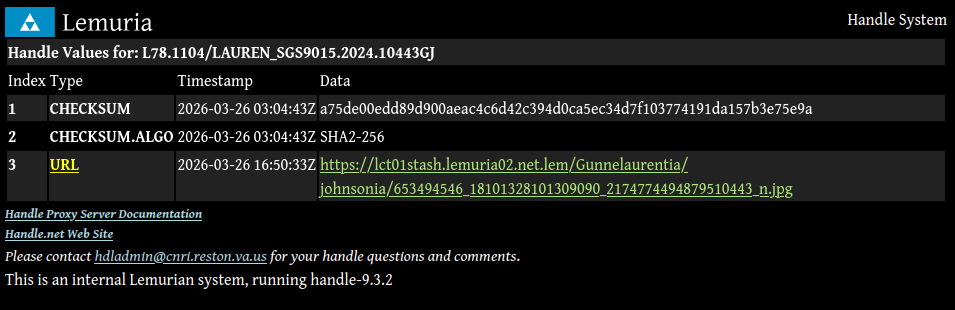

```{=latex}
\tableofcontents
```

# Background
For types, which are objects or data used to define a taxon; two primary classes of types exist; *physical* and *digital*. While biological taxonomy overwhelmingly prefers physical types, the LCT-01 uses digital types more often. The primary physical specimen is the dress itself, while digital specimens are more diverse and include, but are not limited to PDFs, photographs, videos, 3D scans, and in the *sui generis* case of FreeSewing, the source code that automatically drafts sewing patterns from a set of measurements.

## Types of types
There are numerous types of types; the ones that map well to clothing taxonomy are the holotype and paratype. In practice, the difference between a holotype and paratype is very minor; as most images feature the same physical specimen in multiple views. Holotypes are still picked based on their quality; a RAW file from a camera will almost certainly be a holotype while a 360x720 thumbnail will not even be considered except in the most dire of image type scarcity situations.

# Images
Images are the backbone of the LCT-01's archival work. For a variety of reasons, it is exceedingly impractical and even undesirable for the LCT-01 to obtain and collect physical specimens of clothing; especially in sewing pattern taxonomy when a species consists only of a singular make.

Information about a species is considered to originate in the physical holotype; the garment itself. In the case of the LCT-01, the physical holotype is most canonical; physical access to it provides information to all human senses; high information, low accessibility. This canonicality is rooted in the physical holotype, much like how the trust anchor is the root of trust for X.509 PKIs. This canonicality flows down to photographs, videos, 3D scans, and other forms of digital media that act as a substitute for the specimen.

::: {#fig-canonicality-flow}
```{mermaid}
%%| fig-width: 3

flowchart TB
    physical[Physical garment] -->|photography| photo[Photographs of the garment]
    photo -->|collages| photo
    physical -->|indirect| holotype
    photo -->|direct| holotype
    holotype[Holotypes]
    holotype -->|define| taxon[Taxon]
    taxon -->|type taxon for parent| taxon
```

The flow of canonicality from the physical garment to a specific holotype.
:::

Image types will be the focus of this document, as they are the most common, most accessible, and thus, the most important to the LCT-01.

## Considerations
In the use of image types, we hold ourselves to a specific set of criteria; primarily, detail, reproducibility, and integrity. Here, we explain how our archival and citation practices ensure that the criteria are met.

### Image detail
No singular photograph can provide all available detail; for example, a ventral view photograph cannot provide a dorsal view, and vice versa.

We generally seek to find the highest-quality images possible. Tools such as Image Max URL, developed by qsniyg, which support over 10,000 sites and possibly more through generic rules for WordPress and MediaWiki, assist in this.

Raw images; that of unprocessed data directly from a digital camera, is the "gold standard". These files are low-accessibility, yet high detail; they are often not publicly accessible.

### Image reproducibility
While the process of photographing the garment does not need to be reproducible, the final published image itself must be reproducible and distributable, byte-by-byte. The same stream of bytes must be repeatedly and reproducibly retrievable.

### Integrity {#sec-integrity}
When communicating information about image holotypes, integrity is important. Because copyright prevents us from redistributing the vast majority of our holotypes, as detailed in @sec-copyright, we must provide reproducible methodology for readers to obtain the same images themselves.

We adopt a policy of "cite, link, hash, but don't embed". To allow readers to verify that they have retrieved the correct image for an image type, we thus publish cryptographic hashes. This protects against image corruption, quiet alterations to images, or in hypothetical but still plausible cases, deliberate tampering.

SHA2-256 is the hash algorithm of choice for the LCT-01, for its short length which enables printability in PDF documents and HTML, and its availability in the form of the `sha256sum` command-line utility on Linux, and many other operating systems.

We strongly discourage non-cryptographic functions such as MD5.

## Concerns
### Link rot
Link rot is mitigated by the presence of copies both on the Internet Archive and the project's infrastructure.

### Copyright {#sec-copyright}
The vast majority of images used by the LCT-01 as holotypes are copyrighted, all rights reserved by their holders. These images, and other content in general, are hereafter termed "non-free content" (NFC). We generally follow Wikipedia's lead by default, with some exceptions.

While fair use provisions in United States copyright law could theoretically allow the limited use of non-free content, out of an abundance of caution, we entirely refrain from the use of non-free images. Quotations of third-party textual content are not in scope.

As such, we adopt a policy of "cite, link, hash, don't embed"; citations are provided, which link to the original websites; and as detailed in @sec-integrity, cryptographic checksums are provided. To further integrity, we also link to the Internet Archive.

### Morals {#sec-morals}
Moral concerns are mitigated by the fact that the images are public, and that the images were invariably taken with the consent of participating subjects.

We aim to not sexualize subjects. We use anatomical and biological terminology in their medical, scientific, or otherwise academic contexts, with no undue emphasis on body shapes or sizes. We include measurements and sizes when the subjects have voluntarily published them in source material.

## Actual content
Images do not explicitly need to be a singular photograph; for example, the collage *Roseberry Trunkewia-1*, consisting of three panels, has been used to define three taxa (see *Trunkewia* subg. *Illecebrosus*, @lemuria_kew_2026). Images can be thought of more as a binary large object (BLOB) in this case.

A single image can also diverge into multiple differing types; for example, the RAW file generated by a camera may be used to create a JPG file. This JPG file on the photographer's computer is then uploaded to several websites, such as the photographer's personal website and Instagram. These websites then apply their own processing to the images, such as downscaling and EXIF metadata filtering (more often, outright removal). In a more contrived example, these images could then be screenshotted, before being assembled into a single image using collage software, as in the example of *Roseberry Trunkewia-1*. Each state of the image at each step of this process alters the bytestream, making it a new holotype.

## Synonymization
Because there is a one-to-many correspondence between an image and its variants, images can be grouped together. These image groups occupy the same namespace as individual image types.

As explained in @sec-integrity, only cryptographic hash functions are acceptable for defining a specific image type. Cryptographic hash functions have an avalanche effect, a desirable property where a small change in an image affects a disproportionate portion of the hash. Utilities for cryptographic hashing are also more widely available, meeting the criterion of reproducibility. 

Perceptual hashing is more probabilistic, and introduces a risk of false positives; as such, it should not be used in place of a cryptographic hash. Perceptual hashing technology is also significantly less accessible, which is detrimental to reproducibility.

New image types can always be established for a specific taxon, as neotypes. Perceptual hashing, alongside image search engines, are useful to accelerate this work, but should only be used for tracking down specific reproducible bytestreams that can be hashed with a suitable function. Ultimately, it is up to human judgement on whether an image type should be established for a taxon; there must be a human in the loop.

## Schema
Image types and taxa have a many-to-many relationship. As an example, a photograph of five wedding guests can act as the holotype for five taxa, while an album compiled by a wedding photographer meant to highlight the couple marrying can act as the holo- and paratypes of the taxa created to classify their garments.


## Citation format
This section covers the way an image type is cited in the *Journal*. We begin with an example of an image and dissect its parts. The type in question is *Laura 20710.583KG*, the holotype image for *Kewthea glaciesedulis* Lemuria, 2026.

***Laura 20710.583KG*** &mdash;
Photograph. 2560&times;2560.
EXIF metadata stripped.
Ventral view. Outdoors. Hair positioned ventrally, bilaterally obscuring certain parts of neckline. In left hand, subject holding object similar to "ice cream cone"; with a conical cardboard material representing the "cone" and a ball of yarn representing the "ice cream".
*Kewthea glaciesedulis* wb. Laura.Haw., c. 2023.
&copy; Laura Hawkins or unknown photographer, c. 2023, all rights reserved. 
**Page**: See @kewdressexpansion1628; 
**SHA2-256**: `adeab545bfd020f27e3900970327930d25ffb1c51b319bfe752cc209d5d41872`{.hash}; 
**Original**: <https://www.ninalee.co.uk/cdn/shop/products/Laura-Hawkins-Specky-Seamstress-Kew-Expansion-16-28-gathered-skirt-1-scaled.jpg?v=1677871708>; 
**IA**: <https://web.archive.org/web/20260405161421/https://www.ninalee.co.uk/cdn/shop/products/Laura-Hawkins-Specky-Seamstress-Kew-Expansion-16-28-gathered-skirt-1-scaled.jpg?v=1677871708>

We begin by naming the image type. The image name is typically set off in italics, consistent with how the names of photographs are italicized. Italicization also makes the name of the image type more distinct.

We then describe various elements of the image. There is no standardized order, and this image description is provided for convenience; the original image as linked always takes precedence. Important aspects of the image include metadata, lighting conditions, the configuration of the garment, the subject's posture, and the positioning of hair.

We then state the binomial names of the taxa being analyzed in the image, using a wb. (worn by) citation and a standardized set of person abbreviations in the spirit of botany, followed by a year. We then state the copyright of the image, typically "all rights reserved" in the vast majority of cases.

We then provide a citation to the page where the image was found, followed by a SHA2-256 hash set off in a monospace font, followed by links to the original image and to the Internet Archive.

## Naming
In this document, we establish standards for naming image types.

The key words "MUST", "MUST NOT", "REQUIRED", "SHALL", "SHALL NOT", "SHOULD", "SHOULD NOT", "RECOMMENDED",  "MAY", and "OPTIONAL" in this section are to be interpreted as described in RFC 2119.

A new namespace is established for the naming of image types. This namespace shall encompass all photographic holotypes that are named for the purposes of establishing a taxon in the LCT-01.

### Unique naming
All image types MUST be uniquely named. For the purposes of defining uniqueness, two identifiers MUST NOT have an overlapping canonical form. This canonical form MUST be determined by lowercasing all letters and removing all spaces, underscores, and dashes, while preserving dots. Sequences of consecutive dots must be treated as a single dot.

Examples of such canonicalization:

* `Hunter-Moon 23.4877` &rightarrow; `huntermoon23.4877`
* `Hunter Moon 23.4877` &rightarrow; `huntermoon23.4877`
* `Hunter-Moon 23..4877` &rightarrow; `huntermoon23.4877`
* `Eva 3318KE` &rightarrow; `eva3318ke`
* `Morgan 13.57635` &rightarrow; `morgan13.57635`

### Opaqueness
Identifiers in their entirety SHOULD be treated as opaque strings.

### Formats
Image type naming follows many formats; one of the most common is a word followed by an alphanumeric string, e.g. `Eva 3318KE`, the holotype image for *Kewisia evae* Lemuria, 2026.

The word used SHOULD be pronounceable. It often refers to a name for the wearer, in this case, Eva.

The alphanumeric string is derived through a variety of methods.

#### Method 1
One of the many *ad hoc* methods used in the Kew monographs, hereafter method 1, is as follows:

A word is included normally. The alphanumeric string, however, includes a year, followed by a number unique to a species or a particular photoshoot, followed by another number that is invariably discontinuous and monotonically increasing.

For example, *Nina 2017.013.8289KR*, the holotype for *Kewisia roseafolia* Lemuria, 2026. In this case, 2017 indicates the year, 013 is unique either to a photoshoot or the species, and 8289 is the image ID. These numbers are *discontinuous* in the sense that 8288 or 8290 do not exist; and that 013 does not contain 8,200 images of *Kewisia roseafolia*. <!-- It'd be great if it did, but then we would have too much holotype work to do. That might suggest the photographer sucked at culling. -->

In the example, *013* was decided at random; it was not decided and should remain ambiguous under the intent that identifiers be treated as opaque, whether *013* would refer to photographs of *Kewisia roseafolia* from that photoshoot, or of any photograph of *Kewisia roseafolia*.

The final portion of the example is *KR*, the initials of *Kewisia roseafolia*. This convention is not consistently followed. If multiple taxa are present in the same image, these initials are dropped entirely.

### Intent
Ultimately, the intent of image type naming is to provide an easily accessible label that can be used when discussing individual images.

## Typesetting
Identifiers SHOULD be set in italics or a monospace font.

## Distributing image types
In most cases, image types live as three copies; one copy each on the project's infrastructure (encompassing any storage that its lead author may have access to), the Internet Archive, and the original website.

### Wikimedia Commons
Wikimedia Commons is a media repository of free (as in freedom) images, sounds, and videos. It is a Wikimedia Foundation project, and provides image hosting for Wikipedia and the rest of the Wikimedia projects, and countless more MediaWiki sites, even the lead author's personal intranet site.

As of April 2026, it had over 139 million media files. Amongst these files are large numbers of photographs of garments, and people wearing those garments. 

Wikimedia Commons, and the Wikimedia movement in general, share many of the lead author's values pertaining to the dissemination and stockpiling of information. And because files on Commons have compatible licensing, most prominently the Creative Commons licenses, these files are an exception to the "cite, link, hash, don't embed" policy.

One of the earliest papers published in the *Journal*, a description of *Picniflava anaheimensibis* [@lemuria_picniflava_2026], used a photograph from Wikimedia Commons, taken in 2015 by Amy Ratcliffe.

### Internet Archive
The Internet Archive is by far the largest backup for many LCT-01 holotype images. Links to the Internet Archive are standard for image type citations.

The ability to capture almost any URL on the Internet, and store it effectively in perpetuity (still ahead of the original website, despite the many legal challenges faced by the Archive), through its Save Page Now tool is valued.

Furthermore, a group of archivists, the Archive Team, exist. They are distinct from, but work closely with the Internet Archive. They operate a bot that crawls websites on request; many times, the lead author has visited their IRC channels to request archival of a specific site, and the team has been happy to oblige.

The Internet Archive itself does not have a mechanism to request the archiving of an entire website; only individual pages can be archived through Save Page Now. The Archive Team provides this capability; WARCs (web archive files) they upload are accessible through the Wayback Machine, and allow IA links within image citations to function.

The broad scope of the WARCs, covering entire websites as opposed to individual files, also somewhat slows down the taxonomic impediment; if the website of a major pattern company were to disappear, species could still be described based on Internet Archive copies.

## Managing image types
The management of image types is a broad topic; but here, we focus on storing and distributing these image types. In most cases, image types live as three copies; one copy each on the project's infrastructure (encompassing any storage that its lead author may have access to), the Internet Archive, and the original website.

### The Handle System
The design of image identifiers has been done with DOIs and the Handle System in mind; this system is the groundwork for the idea of a database and a standard for image type data that may someday materialize when the scale justifies it.

We have established a new Handle System server on our intranet, as part the nascent Lemurian Handle System. We have chosen to use the internal prefix `L78` within our infrastructure, and have specifically designated the prefix `L78.1104` for LCT-01 digital specimens. So far, it operates entirely independent of the Global Handle Registry (GHR); we do not have any Handle System prefixes from the GHR. This system of handles is not intended for external users.
Though integration with the Global Handle Registry is statistically unlikely, and infeasible given the relative age of the LCT-01 project, and the resources of its author; the system nevertheless remains "DOI-ready".

Under this system, *Eva 3318KE*'s handle would be `L78.1104/EVA_3318KE`.

`L78.1104` can easily be substituted with a DOI prefix or a number outside of the tens; and systems both internal and external rewritten for the new standard. This type of internal setup is possible [@noauthor_handlenet_2018, "Configuring an Independent Handle Service"]; and the Corporation for National Research Initiatives offers a reference implementation in Java, with source code included.

<!-- ::: {#tbl-lauren}
```
1 CHECKSUM      2026-03-26 03:04:43Z a75de00edd89d900aeac4c6d42c394d0
                                     ca5ec34d7f103774191da157b3e75e9a
2 CHECKSUM.ALGO 2026-03-26 03:04:43Z SHA2-256
3 URL           2026-03-26 16:50:33Z https://lct01stash.lemuria02.net.lem/
                                     Gunnelaurentia/johnsonia/653494546_
                                     18101328101309090_2174774494879510443
                                     _n.jpg
``` -->

::: {#fig-lauren}



The Lemurian Handle System record for `L78.1104/Lauren_SGS9015.2024.10443GJ`, as a demonstration of the schema. Note that `lct01stash.lemuria02.net.lem` is an internal domain and not intended for external access or resolution.
:::

#### Keys
Though not yet formalized, we have observed ourselves using the following keys, not described in the base specification or other more common uses of the Handle System.

- **CHECKSUM** &mdash; Checksum, in base16-encoded UTF-8, all lowercase.
- **CHECKSUM.ALGO** &mdash; The name of the algorithm used. Typically `SHA2-256`.

#### URL targets
The matter of where handles should go is also unresolved. Human users will typically want a metadata page, such as a MediaWiki File page listing or other HTML page in a metadata system describing the image, programs will want a way of retrieving raw image data. A standard for providing multiple URLs depending on a specific audience is necessary. 

# Sewing patterns
A sewing pattern is a template that defines the shape of a garment's pieces, that are cut out from the fabric before assembly into the final garment.

The sewing pattern perhaps maps most closely to the body plan, a set of morphological features shared by a significant portion of a phylum of animals. Body plans are often not applied to other kingdoms such as plants and fungi. Sewing patterns are also more "real" than body plans; while body plans can only hypothesize at the actual evolution of animals in the distant past, sewing patterns were created by humans for humans, and cut by humans to make garments.

In the taxonomy, sewing patterns are often the basis for the definitions of many families, such as Kewoidea Lemuria, 2026&mdash;characterized by origin from Version 2 of the Kew pattern with sleeves lateral to the upper arm. 

<!-- The sewing pattern does not map 1:1 to the biological concepts reused and adapted for the LCT-01; it can be considered the body plan, or the "DNA". The sewing pattern itself cannot be considered a taxon, as it is not wearable; yet descent from it is still used to define many of the LCT-01's families. The sewing pattern may be a *sui generis* item. -->

## Pattern distributability
The vast majority of sewing patterns are proprietary, and copyrighted. However, just as Wikimedia Commons offers millions of images that can be used as holotypes (e.g. *Picniflava anaheimensibis*; [@lemuria_picniflava_2026]), free (both *libre*, as in freedom; and *gratis* as in price) patterns exist, primarily through FreeSewing, a website that contains parametrized sewing patterns, and generates patterns on-demand from a list of measurements.^[This further makes FreeSewing a *sui generis* case.]

Distributability is largely not a concern, as sewing pattern PDFs do not need to be distributed to describe families; and will invariably cause moral and legal issues for the taxonomy that it is not prepared to handle.

## Pattern reproducibility
Here, "reproducibility" does not necessarily mean the distribution of sewing pattern PDFs, but rather, the repeatability of the process of purchasing or obtaining a specific pattern through designer-sanctioned channels.

Sewing pattern PDFs typically cannot be downloaded from a single highly accessible URL. As with images, PDF files can be hashed, and citations to the original pattern provided so that those wishing to reproduce any results can purchase the pattern, and support the designers.

Some PDF files are however "stamped" with the details of the pattern's buyer; these watermarking mechanisms can occur in many ways, which are often invisible. This alters the bytestream, and is often irreversible, further harming reproducibility.

Many PDFs are also encrypted and have flags set that "prohibit" certain actions. Software such as Adobe Acrobat Reader will obey these flags and disable actions accordingly, but this does not stop users from using software that alters these flags. Our author uses Okular, which does not obey these flags, though as previously said, these protections are a technical way of expressing a moral and legal wish, and he understands them as such and respects them.

In some cases, PDFs have been revised entirely as part of a "new version"; with no option to download the old one or clear version history. The author has yet to purchase a sewing pattern, but theorizes that this kind of situation has arisen before based on statements on websites.

### `pdfinfo` output
In the case of this PDF pattern, the author has "disabled" copying, changing, and note-taking. "Prohibit" and "disabled" are in quotes as if the data is decrypted, the client is not technically prevented from disobeying these restrictions. These protections are moral and legal, not technical.

Shown below is the output of `pdfinfo` when run on a sewing pattern PDF offered *gratis*.

```
$ pdfinfo pattern.pdf
Title:           [REDACTED]
Creator:         Adobe Illustrator 28.7
                 (Windows)
Producer:        Adobe PDF library 17.00
CreationDate:    Wed Sep 25 17:00:33 2024 PST
ModDate:         Wed Sep 25 18:00:33 2024 PST
Custom Metadata: no
Metadata Stream: yes
Tagged:          no
UserProperties:  no
Suspects:        no
Form:            none
JavaScript:      no
Pages:           51
Encrypted:       yes (print:yes copy:no
                 change:no addNotes:no
                 algorithm:AES)
Page size:       594 x 792 pts
Page rot:        0
File size:       3354030 bytes
Optimized:       no
PDF version:     1.6
```

## Conclusion for sewing patterns
So far, sewing patterns do not need formal standards beyond what is already established in the LCT-01. Storing copies of them on a private file server or a computer may necessitate file organization standards, but these standards are irrelevant to sewing pattern taxonomy and published monographs.

See also @lemuria_general_2026.

# Wearer authority
We further expand on the original explanation of wearer authority in [@lemuria_general_2026, p. 4, "Authority"].

Describer authority works identically to biological taxonomy.

Wearer authority applies to individual image types. These citations, prefixed with the particle *wb.*, meaning "worn by", indicate the name of the person wearing the garment. A year is then added to indicate when the garment within the image was worn.

Wearer authority indirectly applies to species and genera through types; the wearer authority for a species is the wearer authority of that species' holotype. The concept of wearer authority becomes less relevant at higher-level taxa that encompass garments worn by more than one person.

## Abbreviations
Following in botany's footsteps, the LCT-01 uses a system of person abbreviations. We call them *person abbreviations* rather than *author abbreviations* as with wearer authority, not all persons cited in the taxonomy are authors of taxa.

There is no centralized database for person abbreviations in the LCT-01. They are defined on a decentralized basis as new monographs are published.

There is no set of rules uniformly applied in forming person abbreviations. However, some conventions have arisen that we formally document here.

### Given and family names
In the the communities whose clothing we taxonomize, especially the sewing community, it is significantly more common to be identified by a given name and social media handle. Family names are retrievable, and often appended as initials to distinguish people with identical given names.

<!-- SORTED BY LAST NAME -->
* Anna Rifle Bond &rightarrow; Anna.R.B.
* Nina Chang-Smith &rightarrow; Nina
* Lauren Johnson &rightarrow; Lauren.J.
* Tilly Walnes &rightarrow; Tilly

Some people have well-publicized family names or family name equivalents, which are then used as their abbreviation:

<!-- SORTED BY LAST NAME -->
* Bernadette Banner &rightarrow; Banner
* Kate Eva &rightarrow; Eva
* Rachel Maksy &rightarrow; Maksy
* Emilia Wickstead &rightarrow; Wickstead
* Anna Wintour &rightarrow; Wintour

Some people are entirely mononymous.

* Lemuria &rightarrow; Lemuria

Only one person enjoys the privilege of a single letter.

* Carl Linnaeus &rightarrow; L. (in botany)

### Locational genitives
Sometimes, a last name is not available at all. Often, a general location (such as a town or city) is available. In this case, "Person of Location"-style abbreviations are used.

* Emily, author of the blog *Self Assembly Required* &rightarrow; Emily of L. (from *Emily of London*)

### Periods
Periods are placed between truncated forms of proper nouns.

* Elizabeth Baumgart &rightarrow; Eliz.B.
* Eleanor Sews &rightarrow; Eleanor S.

In the case of Eleanor, *Sews* is not a proper noun, but rather a habitual verb that indicates that Eleanor habitually sews. Given that Eleanor has no known family name, abbreviating the verb *Sews*, part of her online handle, is the only option. As such, there is no dot placed between *Eleanor* and *Sews*.

## Identification
The wearer of a garment is identified through a variety of methods, most commonly through the context the post was discovered in. A sewist may be identified by their Instagram username, while on RTW clothing sites, product photos may be attributed to a specific model, with sizing information; e.g. "Model Jane^[Referring to Jane Smith, the feminine equivalent to the placeholder John Smith.] is wearing a size medium."

## The `modf.` particle
We introduce the new particle *modf.*, short for English *modelling for*^[Also spelled *modeling for*.], to allow more context. Thus, a photograph of the hypothetical Jane wearing a dress from the hypothetical Example Company would be cited "wb. Jane modf. Example".

# A formal Code?
The compilation of a code of nomenclature for the LCT-01 is a time-intensive task, and one likely to introduce excessive bureaucracy to the taxonomy, and distract the lead author from the most desirable part of the taxonomy; naming and describing species.

In place of a single unified Code, we instead rely on a mixture of implicit taxonomic convention and small footnotes in monographs when we diverge either from the *International Code of Zoological Nomenclature* or the *International Code of Nomenclature for algae, fungi, and plants*.

By its very nature, the taxonomy is out of scope of the two aforementioned codes. Our lead author has generally not consulted either of the codes, but rather, replicated patterns observed in taxonomic literature and on Wikipedia.

As the sole author of the system, Lemuria, its lead author, is its ultimate authority. Many of the considerations that arise in taxonomic systems used by hundreds of thousands, such as communication, taxonomic vandalism, and priority, simply do not apply, or are less of an issue in a single-author taxonomy.

However, documentation of the LCT-01's divergence from established taxonomic conventions to better suit its subject matter is still valuable. As such, Lemuria, through the *Journal*, intends to publish methodology papers such as this paper itself to explain certain aspects of the system. These methodology papers, compiled together, can incrementally build toward a unified Code.

# Appendix
## Information
*Lemuria's (Informal) Journal of Clothing Taxonomy* is the gray literature journal of the First Lemurian Clothing Taxonomy, a system by Lemuria to assign Latin names to dresses using biological methods. The author, known mononymically as just Lemuria, is an Filipino programmer and independent gray literature researcher from Manila.

**Disclaimer**: *Lemuria's (Informal) Journal of Clothing Taxonomy* is a non-peer-reviewed, single-author, citizen science/gray literature publication with no institutional backing.

<!-- Publisher article ID: 2026.0005 -->

At publication, the journal did not have a DOI prefix.

Work began on the paper on 2026-03-26.
<!--
Descriptions were completed and proofreading began on 2026-03-25. Proofreading was completed and the paper was published the same day. -->

* Visit us at: <https://lct01.lemuria.ph>
* Version control: <https://github.com/a-random-lemurian/lct01.lemuria.ph>
* Zenodo: <https://zenodo.org/communities/lct01>

&copy; Lemuria 2026. All original text and image content by Lemuria is licensed under CC BY-SA 4.0, unless explicitly noted. Linked images and other content are &copy; their respective owners or copyright holders.

## References

::: {#refs}
:::
